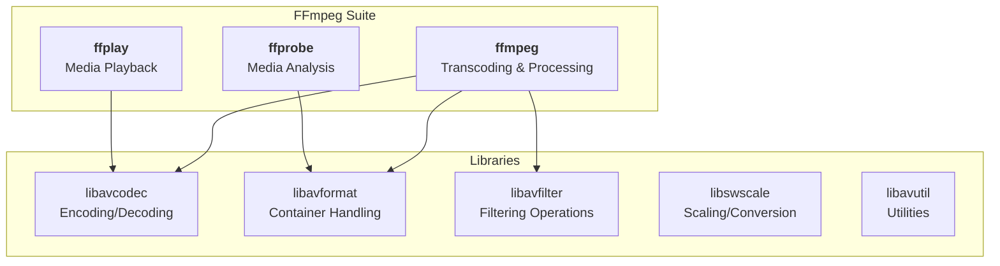
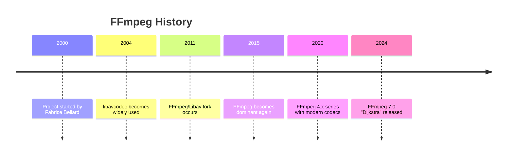
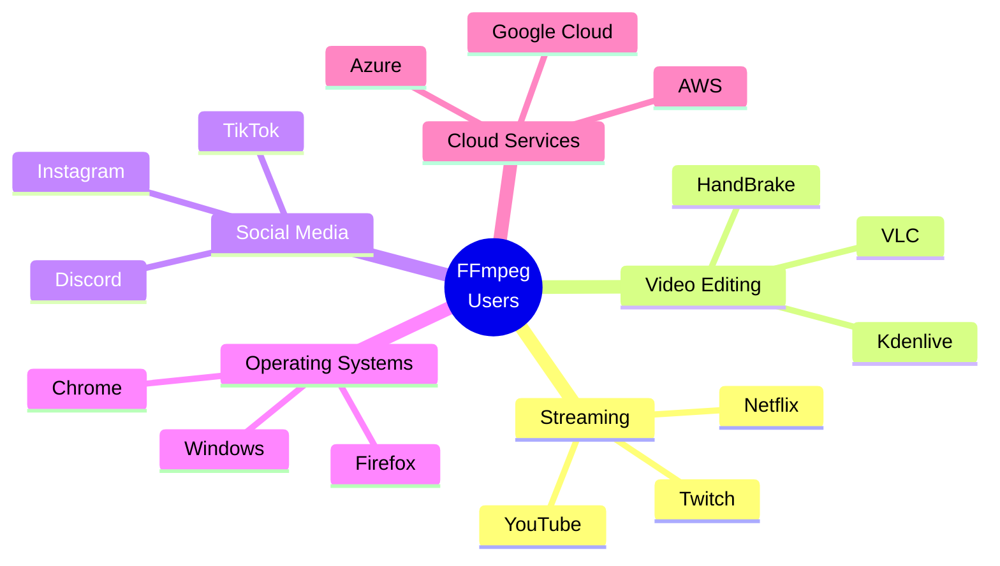

# 1.1 Introduction to FFmpeg

## 🎯 Learning Objectives

By the end of this chapter, you will:
- Understand what FFmpeg is and its role in multimedia processing
- Know the history and evolution of FFmpeg
- Identify the three main FFmpeg tools (ffmpeg, ffprobe, ffplay)
- Recognize common use cases for FFmpeg

---

## 📖 What is FFmpeg?

**FFmpeg** is the leading free, open-source multimedia framework capable of handling virtually any audio and video format. Think of it as the "Swiss Army knife" for multimedia - it can decode, encode, transcode, mux, demux, stream, filter, and play almost anything that humans and machines have created.

### The Name

> **FF** originally stood for "Fast Forward", while **mpeg** refers to the Motion Picture Experts Group video standards. Today, FFmpeg handles far more than just MPEG formats.

### Key Characteristics

| Characteristic | Description |
|----------------|-------------|
| **Open Source** | Licensed under LGPL/GPL, free to use and modify |
| **Cross-Platform** | Runs on Windows, macOS, Linux, BSD, and more |
| **Versatile** | Supports 100+ input/output formats |
| **Command-Line** | Text-based interface for scripting and automation |
| **Library-Based** | Can be integrated into other applications |

---

## 🔧 The FFmpeg Toolkit

FFmpeg is actually a collection of tools and libraries. The three main command-line tools are:



### 1. ffmpeg (The Main Tool)

The primary command-line tool for all transcoding operations:
- Convert between formats
- Change codecs
- Apply filters
- Stream media
- Extract or add tracks

```bash
# Example: Converting a video
ffmpeg -i input.mp4 output.avi
```

### 2. ffprobe (The Analyzer)

Examines media files and provides detailed information:
- Container format
- Stream details (video, audio, subtitles)
- Codec information
- Bitrate, duration, resolution

```bash
# Example: Analyzing a video
ffprobe input.mp4
```

### 3. ffplay (The Player)

A simple media player for quick previews:
- Minimal, no-frills playback
- Supports all FFmpeg-compatible formats
- Useful for testing filters in real-time

```bash
# Example: Playing a video
ffplay input.mp4
```

---

## 📜 Brief History



| Year | Milestone |
|------|-----------|
| 2000 | Fabrice Bellard creates FFmpeg in France |
| 2004 | FFmpeg's libavcodec becomes the go-to codec library |
| 2011 | The Libav fork occurs due to governance disputes |
| 2015 | Most distributions return to FFmpeg |
| 2020+ | Modern codec support (AV1, VVC), hardware acceleration |

---

## 🌍 Who Uses FFmpeg?

FFmpeg is ubiquitous in the multimedia industry. You've likely used applications powered by FFmpeg without knowing it.

### Industry Applications



### Common Use Cases

| Use Case | Example |
|----------|---------|
| **Video Streaming** | YouTube processes uploads with FFmpeg |
| **Format Conversion** | Convert MKV to MP4 for compatibility |
| **Compression** | Reduce file sizes for web delivery |
| **Live Streaming** | Stream to Twitch or YouTube Live |
| **Audio Processing** | Extract audio, change formats, normalize volume |
| **Automated Pipelines** | Media processing in CI/CD workflows |

---

## ✅ Best Practices

> [!TIP]
> **Start Simple**: FFmpeg has thousands of options, but you only need a handful for most tasks. Start with basic commands and add complexity as needed.

> [!IMPORTANT]
> **Always Test First**: When processing important files, test your command on a sample clip first.

> [!NOTE]
> **Check the Documentation**: FFmpeg's official documentation at [ffmpeg.org](https://ffmpeg.org/documentation.html) is comprehensive but dense. Use the `-help` flags for quick reference.

### Do's and Don'ts

| ✅ Do | ❌ Don't |
|-------|---------|
| Back up originals before processing | Overwrite source files accidentally |
| Test on short clips first | Run untested commands on large batches |
| Use the `-n` flag to prevent overwrites | Assume default options are optimal |
| Check ffprobe output before transcoding | Ignore warning messages |

---

## 🏋️ Exercises

### Exercise 1: Explore FFmpeg
1. Open your terminal/command prompt
2. Type `ffmpeg -version` to verify installation
3. Note the version number and build configuration

### Exercise 2: Self-Discovery
Answer these questions:
- What formats do you commonly work with?
- What media processing tasks do you frequently perform?
- What problems are you hoping FFmpeg will solve?

---

## 📝 Summary

| Concept | Key Takeaway |
|---------|--------------|
| FFmpeg | Leading open-source multimedia framework |
| ffmpeg | Main tool for transcoding and processing |
| ffprobe | Analyzes media files and extracts information |
| ffplay | Simple player for previewing media |
| Use Cases | Format conversion, streaming, compression, automation |

---

## ➡️ Next Steps

Now that you understand what FFmpeg is, proceed to [1.2 Installation and Setup](../1.2-installation/) to get FFmpeg running on your system.
