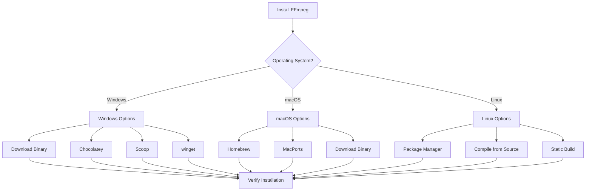
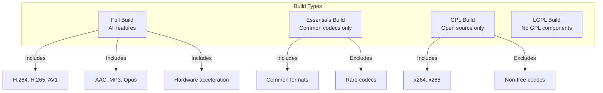

# 1.2 Installation and Setup

## 🎯 Learning Objectives

By the end of this chapter, you will:
- Install FFmpeg on your operating system
- Configure PATH environment variables
- Verify the installation is working correctly
- Understand different FFmpeg build types

---

## 📦 Installation Methods Overview



---

## 🪟 Windows Installation

### Method 1: Direct Download (Recommended for Beginners)

**Step 1: Download FFmpeg**

1. Visit [FFmpeg Official Downloads](https://ffmpeg.org/download.html)
2. Click "Windows builds from gyan.dev" or use [gyan.dev/ffmpeg](https://www.gyan.dev/ffmpeg/builds/)
3. Download the **release full** build (e.g., `ffmpeg-release-full.7z`)

**Step 2: Extract Files**

```powershell
# Extract to C:\ffmpeg (create this folder first)
# Using 7-Zip or Windows Explorer
```

**Step 3: Add to PATH**

```powershell
# Open PowerShell as Administrator
# Add FFmpeg to system PATH
[Environment]::SetEnvironmentVariable(
    "Path",
    [Environment]::GetEnvironmentVariable("Path", [EnvironmentVariableTarget]::Machine) + ";C:\ffmpeg\bin",
    [EnvironmentVariableTarget]::Machine
)
```

Or manually:
1. Press `Win + X` → "System"
2. Click "Advanced system settings"
3. Click "Environment Variables"
4. Under "System variables", select "Path" and click "Edit"
5. Add `C:\ffmpeg\bin`
6. Click OK on all dialogs

**Step 4: Verify Installation**

```powershell
# Open a NEW terminal window
ffmpeg -version
```

### Method 2: Using Package Managers

```powershell
# Using Chocolatey
choco install ffmpeg

# Using Scoop
scoop install ffmpeg

# Using winget
winget install FFmpeg
```

---

## 🍎 macOS Installation

### Method 1: Homebrew (Recommended)

```bash
# Install Homebrew if not already installed
/bin/bash -c "$(curl -fsSL https://raw.githubusercontent.com/Homebrew/install/HEAD/install.sh)"

# Install FFmpeg
brew install ffmpeg

# Verify installation
ffmpeg -version
```

### Method 2: MacPorts

```bash
# Install MacPorts from macports.org first

# Install FFmpeg
sudo port install ffmpeg

# Verify
ffmpeg -version
```

### Build Options for macOS

Homebrew allows customizing the build with additional features:

```bash
# Install with all options
brew install ffmpeg --with-fdk-aac --with-sdl2 --with-freetype

# See all options
brew options ffmpeg
```

---

## 🐧 Linux Installation

### Debian/Ubuntu

```bash
# Update package list
sudo apt update

# Install FFmpeg
sudo apt install ffmpeg

# Verify
ffmpeg -version
```

### Fedora/RHEL/CentOS

```bash
# Enable RPM Fusion repository
sudo dnf install https://download1.rpmfusion.org/free/fedora/rpmfusion-free-release-$(rpm -E %fedora).noarch.rpm

# Install FFmpeg
sudo dnf install ffmpeg

# Verify
ffmpeg -version
```

### Arch Linux

```bash
# Install FFmpeg
sudo pacman -S ffmpeg

# Verify
ffmpeg -version
```

### Static Build (Universal Method)

Works on any Linux distribution:

```bash
# Download static build
wget https://johnvansickle.com/ffmpeg/releases/ffmpeg-release-amd64-static.tar.xz

# Extract
tar xf ffmpeg-release-amd64-static.tar.xz

# Move to /usr/local/bin
sudo mv ffmpeg-*-static/ffmpeg /usr/local/bin/
sudo mv ffmpeg-*-static/ffprobe /usr/local/bin/

# Verify
ffmpeg -version
```

---

## 🔍 Verifying Your Installation

After installation, verify all three tools are working:

```bash
# Check FFmpeg version and configuration
ffmpeg -version

# Check ffprobe
ffprobe -version

# Check ffplay (may not be available in all builds)
ffplay -version
```

### Expected Output

```
ffmpeg version 7.0-full_build Copyright (c) 2000-2024 the FFmpeg developers
built with gcc 13.2.0 (Rev6, Built by MSYS2 project)
configuration: --enable-gpl --enable-version3 --enable-static ...
libavutil      59.  8.100 / 59.  8.100
libavcodec     61.  3.100 / 61.  3.100
libavformat    61.  1.100 / 61.  1.100
...
```

### Quick Functionality Test

```bash
# Test encoding capability
ffmpeg -f lavfi -i testsrc=duration=1:size=320x240:rate=30 -f null -
```

If you see encoding progress without errors, FFmpeg is working correctly.

---

## 📋 Understanding Build Types



| Build Type | Description | Use Case |
|------------|-------------|----------|
| **Full** | All available codecs and features | Personal use, maximum compatibility |
| **Essentials** | Only common, widely-used codecs | Smaller download, covers most needs |
| **GPL** | Only GPL-licensed components | Commercial projects with GPL compliance |
| **LGPL** | Only LGPL components | Commercial projects avoiding GPL |

---

## ⚙️ Configuration Check

To see what features are compiled into your FFmpeg:

```bash
# Show configuration options
ffmpeg -buildconf

# List supported formats
ffmpeg -formats

# List supported codecs
ffmpeg -codecs

# List supported encoders
ffmpeg -encoders

# List supported decoders
ffmpeg -decoders

# List supported filters
ffmpeg -filters
```

---

## ✅ Best Practices

> [!TIP]
> **Use Package Managers**: They make updating FFmpeg easy and handle dependencies automatically.

> [!IMPORTANT]
> **Match Your Needs**: If you need specific codecs (like libfdk-aac for high-quality AAC), ensure your build includes them.

> [!WARNING]
> **PATH Order Matters**: If you have multiple FFmpeg installations, the first one in PATH will be used. Use `which ffmpeg` (Linux/macOS) or `where ffmpeg` (Windows) to check.

### Common Installation Issues

| Issue | Solution |
|-------|----------|
| "ffmpeg is not recognized" | FFmpeg not in PATH; restart terminal after adding |
| Missing codec errors | Your build doesn't include that codec; use a different build |
| Permission denied | Use `sudo` on Linux/macOS or run as Administrator on Windows |

---

## 🏋️ Exercises

### Exercise 1: Complete Installation
1. Install FFmpeg using the method appropriate for your OS
2. Verify all three tools (ffmpeg, ffprobe, ffplay) are working
3. Note your FFmpeg version number

### Exercise 2: Explore Your Build
Run these commands and save the output:
```bash
ffmpeg -version > ffmpeg_info.txt
ffmpeg -encoders >> ffmpeg_info.txt
ffmpeg -decoders >> ffmpeg_info.txt
```

### Exercise 3: Test Encoding
Create a test video:
```bash
ffmpeg -f lavfi -i testsrc=duration=5:size=640x480:rate=30 test_video.mp4
```

---

## 📝 Summary

| Task | Command/Method |
|------|----------------|
| Windows Install | Download from gyan.dev or use `choco install ffmpeg` |
| macOS Install | `brew install ffmpeg` |
| Linux Install | `apt install ffmpeg` / `dnf install ffmpeg` |
| Verify Install | `ffmpeg -version` |
| Check Features | `ffmpeg -encoders`, `ffmpeg -decoders` |

---

## ➡️ Next Steps

With FFmpeg installed, proceed to [1.3 Core Multimedia Concepts](../1.3-multimedia-concepts/) to understand the fundamentals of digital media that FFmpeg works with.
