# 1.3 Core Multimedia Concepts

## 🎯 Learning Objectives

By the end of this chapter, you will:
- Understand the difference between containers and codecs
- Know common video and audio formats
- Grasp concepts like bitrate, resolution, frame rate
- Understand streams and how media files are structured

---

## 📦 Containers vs Codecs

This is the most fundamental concept in digital media. Many beginners confuse these terms.


### Container (Format)

A **container** is like a box that holds multiple streams together:

| Container | Extension | Description |
|-----------|-----------|-------------|
| MP4 | `.mp4` | Most universal, great for web |
| MKV | `.mkv` | Feature-rich, supports any codec |
| AVI | `.avi` | Legacy Windows format |
| MOV | `.mov` | Apple QuickTime format |
| WebM | `.webm` | Open format for web |
| FLV | `.flv` | Flash video (legacy) |

### Codec (Compressor-Decompressor)

A **codec** is the algorithm that compresses and decompresses the actual video or audio data:


#### Common Video Codecs

| Codec | Also Known As | Use Case |
|-------|---------------|----------|
| H.264 | AVC, x264 | Universal compatibility |
| H.265 | HEVC, x265 | Better compression, 4K/8K |
| AV1 | - | Next-gen, open, royalty-free |
| VP9 | - | YouTube, WebM |
| MPEG-4 | Part 2 | Legacy, older devices |
| ProRes | - | Professional video editing |

#### Common Audio Codecs

| Codec | Use Case |
|-------|----------|
| AAC | Modern standard, great quality |
| MP3 | Universal compatibility |
| Opus | Best for streaming, voice |
| FLAC | Lossless audio |
| AC3 | DVDs, surround sound |
| PCM | Uncompressed audio |

---

## 🎬 Video Concepts

### Resolution

Resolution is the number of pixels in each dimension:

```mermaid
graph TD
    subgraph Resolutions
        SD[SD: 640×480<br>480p]
        HD[HD: 1280×720<br>720p]
        FHD[Full HD: 1920×1080<br>1080p]
        QHD[QHD: 2560×1440<br>1440p]
        UHD[4K UHD: 3840×2160<br>2160p]
        K8[8K: 7680×4320<br>4320p]
    end
    
    SD --> HD --> FHD --> QHD --> UHD --> K8
```



| Name | Resolution | Pixels | Typical Use |
|------|------------|--------|-------------|
| SD | 640×480 | 307K | Legacy content |
| HD (720p) | 1280×720 | 921K | Streaming, mobile |
| Full HD (1080p) | 1920×1080 | 2.07M | Standard quality |
| QHD (1440p) | 2560×1440 | 3.69M | Gaming monitors |
| 4K UHD | 3840×2160 | 8.29M | High-end streaming |
| 8K | 7680×4320 | 33.18M | Future-proof |

### Frame Rate (FPS)

Frames Per Second determines how smooth motion appears:

| FPS | Use Case |
|-----|----------|
| 24 | Cinema, films |
| 25 | PAL TV (Europe) |
| 30 | NTSC TV (Americas), web content |
| 60 | Gaming, sports, smooth motion |
| 120+ | High-end gaming, slow-motion |

```bash
# Check frame rate with ffprobe
ffprobe -v error -select_streams v:0 -show_entries stream=r_frame_rate input.mp4
```

### Bitrate

Bitrate is the amount of data used per second of video:


| Type | Description | Typical Range |
|------|-------------|---------------|
| Video | Data for video stream | 1-50 Mbps |
| Audio | Data for audio stream | 64-320 kbps |
| Overall | Combined total | Varies by content |

#### Bitrate Guidelines (H.264)

| Resolution | Low Quality | Standard | High Quality |
|------------|-------------|----------|--------------|
| 480p | 500 kbps | 1 Mbps | 2 Mbps |
| 720p | 1 Mbps | 2.5 Mbps | 5 Mbps |
| 1080p | 2 Mbps | 5 Mbps | 10 Mbps |
| 4K | 10 Mbps | 25 Mbps | 50 Mbps |

---

## 🔊 Audio Concepts

### Sample Rate

How many times per second the audio is measured:

| Sample Rate | Use Case |
|-------------|----------|
| 44.1 kHz | CD quality, music |
| 48 kHz | Video production standard |
| 96 kHz | High-resolution audio |

### Channels

| Configuration | Channels | Description |
|---------------|----------|-------------|
| Mono | 1 | Single channel |
| Stereo | 2 | Left + Right |
| 5.1 Surround | 6 | Front L/C/R + Rear L/R + Sub |
| 7.1 Surround | 8 | 5.1 + Side L/R |

### Audio Bitrate Guidelines

| Quality | MP3 | AAC | Opus |
|---------|-----|-----|------|
| Low | 128 kbps | 96 kbps | 64 kbps |
| Medium | 192 kbps | 128 kbps | 96 kbps |
| High | 320 kbps | 256 kbps | 128 kbps |

---

## 📊 Streams in Media Files

A media file typically contains multiple **streams**:


### Stream Notation

FFmpeg uses a specific notation for streams:

| Notation | Meaning |
|----------|---------|
| `0:0` | First input, first stream |
| `0:v:0` | First input, first video stream |
| `0:a:0` | First input, first audio stream |
| `0:s:0` | First input, first subtitle stream |

```bash
# View all streams in a file
ffprobe -show_streams input.mkv

# Concise view
ffprobe -show_entries stream=index,codec_name,codec_type input.mkv
```

---

## 🔄 Lossy vs Lossless


| Type | Examples | Pros | Cons |
|------|----------|------|------|
| **Lossy** | MP3, H.264, AAC, JPEG | Small files, fast | Permanent quality loss |
| **Lossless** | FLAC, PNG, ProRes | No quality loss | Large files |

---

## 📐 Aspect Ratio

The proportional relationship between width and height:

| Aspect Ratio | Description | Common Use |
|--------------|-------------|------------|
| 4:3 | Standard | Legacy TV, old content |
| 16:9 | Widescreen | Modern TV, YouTube |
| 21:9 | Ultrawide | Cinematic, movies |
| 1:1 | Square | Instagram |
| 9:16 | Vertical | TikTok, Instagram Stories |

```bash
# Check aspect ratio
ffprobe -v error -select_streams v:0 \
  -show_entries stream=display_aspect_ratio input.mp4
```

---

## ✅ Best Practices

> [!TIP]
> **Match Your Purpose**: Choose codecs and settings based on your delivery target (web, mobile, archive, editing).

> [!IMPORTANT]
> **Container-Codec Compatibility**: Not all codecs work in all containers. MP4 works well with H.264/AAC but not with VP9.

> [!NOTE]
> **Quality vs Size Trade-off**: Higher bitrate = better quality but larger files. Find the right balance for your needs.

### Quick Reference

| Purpose | Recommended Container | Video Codec | Audio Codec |
|---------|----------------------|-------------|-------------|
| Web/General | MP4 | H.264 | AAC |
| YouTube Upload | MP4/MOV | H.264/H.265 | AAC |
| Archive | MKV | H.265 | FLAC |
| Streaming | MPEG-TS/fMP4 | H.264 | AAC |
| Editing | MOV | ProRes | PCM |

---

## 🏋️ Exercises

### Exercise 1: Identify Components
For any video file you have:
```bash
ffprobe -v error -show_entries format=format_name:stream=codec_type,codec_name input.mp4
```
Identify: Container, video codec, audio codec

### Exercise 2: Calculate Bitrate
Given a 1 GB file that is 60 minutes long:
- Calculate the average bitrate in Mbps
- Formula: `size_in_bits / duration_in_seconds`

### Exercise 3: Stream Exploration
Analyze a movie file with multiple audio tracks:
```bash
ffprobe -v error -show_entries stream=index,codec_type,codec_name \
  -of csv=p=0 movie.mkv
```

---

## 📝 Summary

| Concept | Key Point |
|---------|-----------|
| Container | The "box" that holds streams (MP4, MKV, AVI) |
| Codec | Algorithm for encoding/decoding (H.264, AAC) |
| Resolution | Pixel dimensions (1920×1080 = 1080p) |
| Frame Rate | Frames per second (24, 30, 60 fps) |
| Bitrate | Data per second (Mbps for video, kbps for audio) |
| Streams | Individual video/audio/subtitle tracks |

---

## ➡️ Next Steps

Now that you understand multimedia fundamentals, proceed to [1.4 Command Line Basics](../1.4-command-line-basics/) to learn the FFmpeg command structure.
