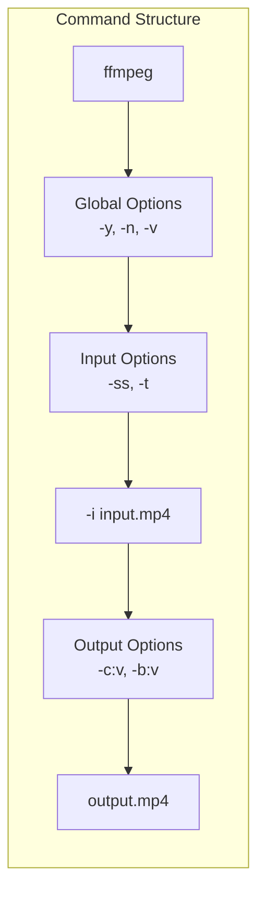
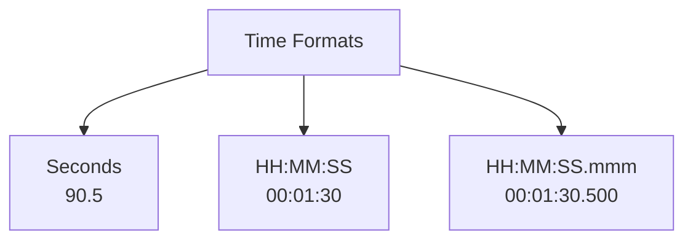
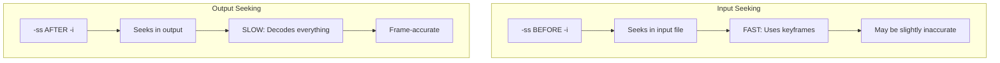
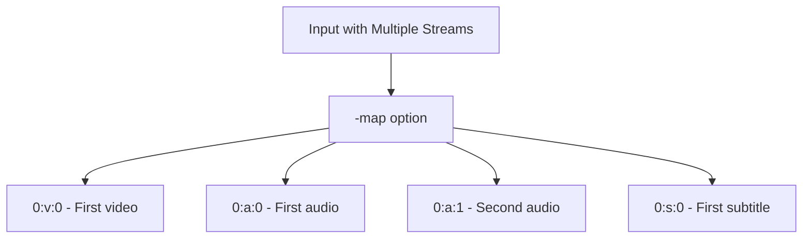
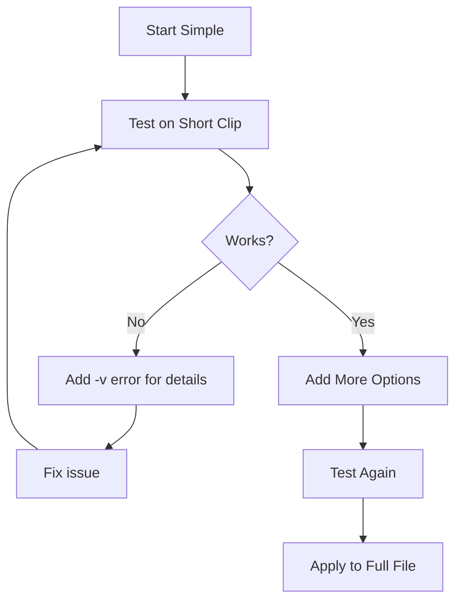

# 1.4 Command Line Basics

## 🎯 Learning Objectives

By the end of this chapter, you will:
- Understand the FFmpeg command structure
- Know essential input/output options
- Use global options effectively
- Read and interpret FFmpeg output messages

---

## 📐 FFmpeg Command Structure

Every FFmpeg command follows this general pattern:

```
ffmpeg [global_options] [input_options] -i input [output_options] output
```



### Component Breakdown

| Component | Position | Purpose | Example |
|-----------|----------|---------|---------|
| `ffmpeg` | Start | The program | `ffmpeg` |
| Global Options | Before `-i` | Affect overall behavior | `-y` (overwrite) |
| Input Options | Before `-i` | Apply to input file | `-ss 10` (start at 10s) |
| `-i input` | After input options | Specify input file | `-i video.mp4` |
| Output Options | After `-i` | Apply to output file | `-c:v libx264` |
| Output | End | Output filename | `output.mp4` |

---

## 🔧 Essential Options

### Global Options

```bash
# These affect the overall FFmpeg behavior

-y                  # Overwrite output file without asking
-n                  # Never overwrite (exit if file exists)
-v quiet           # Suppress output messages
-v error           # Show only errors
-v info            # Default verbosity
-v debug           # Show everything
-stats             # Show encoding statistics
-hide_banner       # Hide FFmpeg version/build info
```

### Input Options (Before -i)

```bash
# These affect how the INPUT is read

-ss 00:01:30       # Seek to position (start time)
-t 60              # Duration to read (seconds)
-to 00:02:30       # End position
-r 30              # Force input framerate
-f format          # Force input format
```

### Output Options (After -i)

```bash
# These affect the OUTPUT file

-c:v libx264       # Video codec
-c:a aac           # Audio codec
-c copy            # Copy all streams without re-encoding
-b:v 5M            # Video bitrate
-b:a 192k          # Audio bitrate
-r 30              # Output framerate
-s 1280x720        # Output resolution
-an                # No audio
-vn                # No video
-sn                # No subtitles
```

---

## 📝 Your First Commands

### 1. Get File Information

```bash
# Using ffmpeg to show input info (then quit)
ffmpeg -i input.mp4

# Better: Use ffprobe for detailed info
ffprobe input.mp4
```

### 2. Simple Format Conversion

```bash
# MP4 to MKV (re-encodes by default)
ffmpeg -i input.mp4 output.mkv

# Preserve quality with stream copy
ffmpeg -i input.mp4 -c copy output.mkv
```

### 3. Convert with Specific Codec

```bash
# Convert to H.264 video and AAC audio
ffmpeg -i input.avi -c:v libx264 -c:a aac output.mp4
```

### 4. Extract Audio

```bash
# Extract audio to MP3
ffmpeg -i input.mp4 -vn -c:a libmp3lame -q:a 2 output.mp3
```

### 5. Create a Clip

```bash
# Extract 30 seconds starting at 1 minute
ffmpeg -i input.mp4 -ss 00:01:00 -t 30 -c copy clip.mp4
```

---

## ⏱️ Time Specification

FFmpeg accepts time in multiple formats:



| Format | Example | Meaning |
|--------|---------|---------|
| Seconds | `90` | 90 seconds |
| Seconds (decimal) | `90.5` | 90.5 seconds |
| HH:MM:SS | `00:01:30` | 1 minute 30 seconds |
| HH:MM:SS.mmm | `00:01:30.500` | 1 minute 30.5 seconds |

### Seeking: Input vs Output Position

The position of `-ss` matters significantly:



```bash
# Fast seek (recommended for most cases)
ffmpeg -ss 00:01:00 -i input.mp4 -t 30 -c copy output.mp4

# Accurate seek (slower, use when precision matters)
ffmpeg -i input.mp4 -ss 00:01:00 -t 30 output.mp4

# Combined approach (fast seek + accurate output)
ffmpeg -ss 00:00:55 -i input.mp4 -ss 5 -t 30 output.mp4
```

---

## 🎛️ Stream Selection

### Basic Stream Specifiers

```bash
-c:v        # Video codec setting
-c:a        # Audio codec setting
-c:s        # Subtitle codec setting
-b:v        # Video bitrate
-b:a        # Audio bitrate
```

### Selecting Specific Streams



```bash
# Map specific streams
ffmpeg -i input.mkv -map 0:v:0 -map 0:a:1 output.mp4
#                         ↑          ↑
#                   First video  Second audio

# Map all streams
ffmpeg -i input.mkv -map 0 output.mkv

# Exclude stream types
ffmpeg -i input.mkv -map 0 -map -0:s output.mp4
#                              ↑ Exclude all subtitles
```

---

## 📊 Reading FFmpeg Output

When FFmpeg runs, it shows progress information:

```
frame= 1234 fps= 45 q=23.0 size=   15360kB time=00:00:41.13 bitrate=3059.4kbits/s speed=1.5x
```

| Field | Meaning |
|-------|---------|
| `frame` | Number of frames processed |
| `fps` | Frames being processed per second |
| `q` | Quality factor (lower = better for x264) |
| `size` | Current output file size |
| `time` | Current position in the output |
| `bitrate` | Current encoding bitrate |
| `speed` | Encoding speed (1x = real-time) |

---

## 🛑 Common Error Messages

| Error | Meaning | Solution |
|-------|---------|----------|
| "No such file" | Input file not found | Check path and filename |
| "Invalid data" | Corrupted or unsupported input | Try different decoder |
| "Unknown encoder" | Codec not available | Use `ffmpeg -encoders` to list available |
| "Already exists" | Output file exists | Use `-y` to overwrite or choose new name |
| "Avi does not support" | Container doesn't support codec | Use compatible container |

---

## ✅ Best Practices

> [!TIP]
> **Use `-hide_banner`**: Add this to reduce clutter in the output.
> ```bash
> ffmpeg -hide_banner -i input.mp4 output.mp4
> ```

> [!IMPORTANT]
> **Order Matters**: Options before `-i` apply to input, options after `-i` apply to output. Getting this wrong causes issues.

> [!WARNING]
> **Avoid `-y` in Scripts Initially**: Test your commands first before adding `-y` to prevent accidental data loss.

### Command Building Strategy



---

## 🏋️ Exercises

### Exercise 1: Basic Conversion
Convert any video to MP4 with H.264:
```bash
ffmpeg -i input.mp4 -c:v libx264 -c:a aac output_h264.mp4
```

### Exercise 2: Create a Preview
Create a 10-second preview starting at 30 seconds:
```bash
ffmpeg -ss 30 -i input.mp4 -t 10 -c copy preview.mp4
```

### Exercise 3: Silent Video
Remove audio from a video:
```bash
ffmpeg -i input.mp4 -an -c:v copy silent_video.mp4
```

### Exercise 4: Interpret Output
Run a conversion and identify:
- Current frame count
- Encoding speed
- Output bitrate

---

## 📝 Summary

| Concept | Key Point |
|---------|-----------|
| Command Structure | `ffmpeg [global] [input_opts] -i input [output_opts] output` |
| Option Position | Before `-i` = input options, After `-i` = output options |
| `-c:v` / `-c:a` | Set video/audio codec |
| `-c copy` | Copy streams without re-encoding (fast) |
| `-ss` / `-t` / `-to` | Time-based operations |
| `-map` | Select specific streams |

### Quick Reference Card

```bash
# Copy everything (fast, no quality loss)
ffmpeg -i input.mp4 -c copy output.mkv

# Re-encode to H.264/AAC
ffmpeg -i input.avi -c:v libx264 -c:a aac output.mp4

# Extract clip (fast)
ffmpeg -ss 60 -i input.mp4 -t 30 -c copy clip.mp4

# Remove audio
ffmpeg -i input.mp4 -an -c:v copy no_audio.mp4

# Extract audio only
ffmpeg -i input.mp4 -vn audio.mp3
```

---

## ➡️ Next Steps

Now that you understand FFmpeg commands, proceed to [1.5 Using ffprobe and ffplay](../1.5-ffprobe-ffplay/) to learn how to analyze and preview media files.
