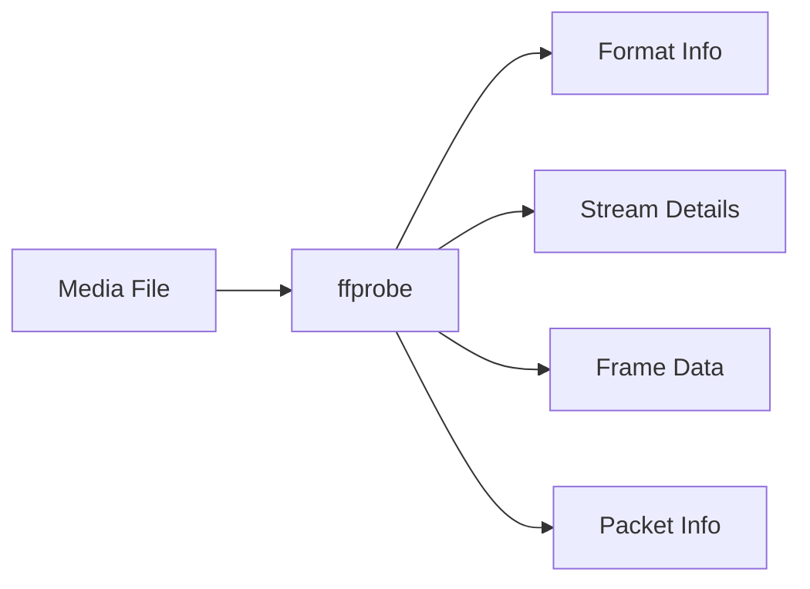
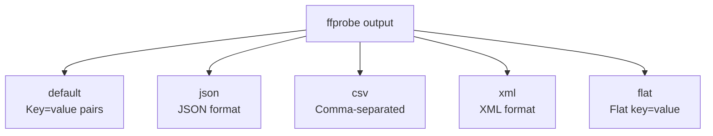
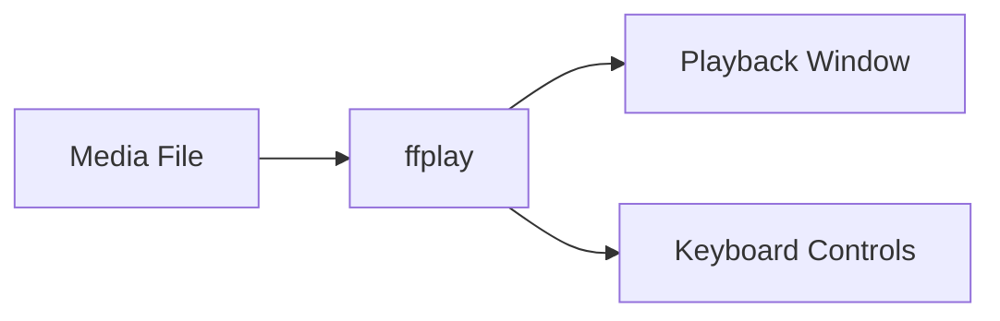
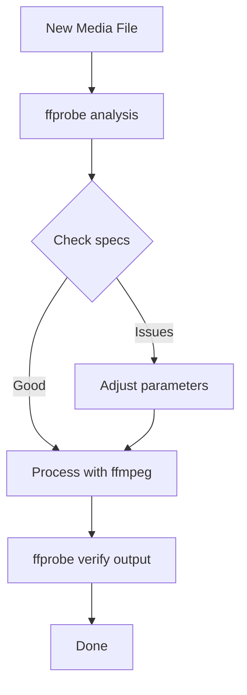

# 1.5 Using ffprobe and ffplay

## 🎯 Learning Objectives

By the end of this chapter, you will:
- Use ffprobe to analyze media files in detail
- Extract specific information with format options
- Use ffplay for quick media previews
- Combine these tools in practical workflows

---

## 🔍 ffprobe: The Media Analyzer

ffprobe is your go-to tool for understanding what's inside a media file without modifying it.



### Basic Usage

```bash
# Default output (lots of info)
ffprobe video.mp4

# Cleaner output (hide banner)
ffprobe -hide_banner video.mp4

# Only show errors/warnings
ffprobe -v error video.mp4
```

### Essential ffprobe Options

| Option | Description |
|--------|-------------|
| `-v quiet` | Suppress all output except explicitly requested |
| `-show_format` | Display container format information |
| `-show_streams` | Display stream information |
| `-show_entries` | Show specific data fields only |
| `-of` / `-print_format` | Set output format (json, csv, flat, xml) |

---

## 📊 Getting File Information

### Container Format Details

```bash
ffprobe -v error -show_format video.mp4
```

Output includes:
- Filename and format name
- Duration and size
- Bit rate
- Number of streams

### Stream Information

```bash
# Show all streams
ffprobe -v error -show_streams video.mp4

# Show specific stream types
ffprobe -v error -select_streams v -show_streams video.mp4  # Video only
ffprobe -v error -select_streams a -show_streams video.mp4  # Audio only
```

### Common Information Queries

```bash
# Get duration
ffprobe -v error -show_entries format=duration \
  -of default=noprint_wrappers=1:nokey=1 video.mp4
# Output: 120.500000

# Get resolution
ffprobe -v error -select_streams v:0 \
  -show_entries stream=width,height \
  -of csv=s=x:p=0 video.mp4
# Output: 1920x1080

# Get codec names
ffprobe -v error -select_streams v:0 \
  -show_entries stream=codec_name \
  -of default=noprint_wrappers=1:nokey=1 video.mp4
# Output: h264

# Get frame rate
ffprobe -v error -select_streams v:0 \
  -show_entries stream=r_frame_rate \
  -of default=noprint_wrappers=1:nokey=1 video.mp4
# Output: 30/1

# Get bit rate
ffprobe -v error -select_streams v:0 \
  -show_entries stream=bit_rate \
  -of default=noprint_wrappers=1:nokey=1 video.mp4
# Output: 5000000
```

---

## 📋 Output Formats

ffprobe can output data in various formats for different use cases:



### JSON Output (Great for Scripts)

```bash
ffprobe -v error -show_format -show_streams \
  -of json video.mp4

# Output:
# {
#     "streams": [
#         {
#             "index": 0,
#             "codec_name": "h264",
#             "codec_type": "video",
#             "width": 1920,
#             "height": 1080,
#             ...
#         }
#     ],
#     "format": {
#         "filename": "video.mp4",
#         "duration": "120.500000",
#         ...
#     }
# }
```

### CSV Output (For Spreadsheets)

```bash
ffprobe -v error -select_streams v:0 \
  -show_entries stream=width,height,codec_name \
  -of csv=p=0 video.mp4
# Output: 1920,1080,h264
```

### Flat Output (For Parsing)

```bash
ffprobe -v error -show_entries format=duration,size \
  -of flat video.mp4
# Output:
# format.duration="120.500000"
# format.size="75000000"
```

---

## 📁 Complete File Analysis Script

Here's a comprehensive analysis command:

```bash
# Full file summary in JSON
ffprobe -v error \
  -show_entries format=filename,format_name,duration,size,bit_rate \
  -show_entries stream=index,codec_type,codec_name,width,height,sample_rate,channels \
  -of json video.mp4
```

### Practical Examples

```bash
# Check if file has audio
ffprobe -v error -select_streams a \
  -show_entries stream=index \
  -of csv=p=0 video.mp4 | head -1
# Empty output = no audio

# Count number of streams
ffprobe -v error -show_entries format=nb_streams \
  -of default=noprint_wrappers=1:nokey=1 video.mp4
# Output: 2

# Get all stream types
ffprobe -v error \
  -show_entries stream=codec_type \
  -of csv=p=0 video.mp4
# Output:
# video
# audio
```

---

## ▶️ ffplay: The Media Player

ffplay is a simple, minimalistic media player. It's perfect for quick previews and testing.



### Basic Usage

```bash
# Play a video
ffplay video.mp4

# Play audio
ffplay audio.mp3

# Play with no window decorations
ffplay -noborder video.mp4

# Autostart without waiting
ffplay -autoexit video.mp4
```

### Keyboard Controls

| Key | Action |
|-----|--------|
| `Space` / `p` | Pause/Resume |
| `q` / `Esc` | Quit |
| `f` | Toggle fullscreen |
| `←` / `→` | Seek backward/forward 10 seconds |
| `↓` / `↑` | Seek backward/forward 1 minute |
| `Mouse click` | Seek to position |
| `w` | Cycle video filters |
| `s` | Step to next frame (while paused) |

### Useful Options

```bash
# Start at specific time
ffplay -ss 60 video.mp4

# Loop playback
ffplay -loop 0 video.mp4  # 0 = infinite loop

# Set window size
ffplay -x 640 -y 480 video.mp4

# Play at specific volume
ffplay -volume 50 video.mp4  # 0-100

# Disable audio
ffplay -an video.mp4

# Disable video (audio only)
ffplay -vn video.mp4

# Show audio waveform
ffplay -showmode 1 audio.mp3
```

---

## 🎨 Testing Filters with ffplay

ffplay is excellent for previewing filters in real-time before applying them with ffmpeg:

```bash
# Test a crop filter
ffplay -vf "crop=640:480:100:50" video.mp4

# Test color adjustments
ffplay -vf "eq=brightness=0.1:saturation=1.5" video.mp4

# Test scaling
ffplay -vf "scale=640:-1" video.mp4

# Test multiple filters
ffplay -vf "scale=640:-1,eq=brightness=0.1" video.mp4

# Test audio filter
ffplay -af "volume=2.0" audio.mp3
```

### Common Filter Previews

```bash
# Mirror effect
ffplay -vf "hflip" video.mp4

# Blur effect
ffplay -vf "boxblur=5:5" video.mp4

# Grayscale
ffplay -vf "colorchannelmixer=.3:.4:.3:0:.3:.4:.3:0:.3:.4:.3" video.mp4

# Add text overlay
ffplay -vf "drawtext=text='Preview':fontsize=48:fontcolor=white:x=10:y=10" video.mp4
```

---

## 🔄 Practical Workflows

### Workflow 1: Analyze Before Processing



```bash
# Step 1: Analyze input
ffprobe -v error -show_entries \
  format=duration:stream=codec_name,width,height,bit_rate \
  -of json input.mp4

# Step 2: Process based on analysis
ffmpeg -i input.mp4 -c:v libx264 -b:v 5M output.mp4

# Step 3: Verify output
ffprobe -v error -show_entries \
  format=duration:stream=codec_name,width,height,bit_rate \
  -of json output.mp4
```

### Workflow 2: Batch Analysis

```bash
# PowerShell: Analyze all MP4 files in a directory
Get-ChildItem *.mp4 | ForEach-Object {
    Write-Host "File: $($_.Name)"
    ffprobe -v error -show_entries format=duration -of default=noprint_wrappers=1 $_.FullName
    Write-Host ""
}

# Bash: Same for Linux/macOS
for f in *.mp4; do
    echo "File: $f"
    ffprobe -v error -show_entries format=duration -of default=noprint_wrappers=1 "$f"
    echo ""
done
```

### Workflow 3: Quick Quality Check

```bash
# Compare input and output quality
echo "=== INPUT ===" && \
ffprobe -v error -select_streams v:0 \
  -show_entries stream=codec_name,width,height,bit_rate \
  -of default=noprint_wrappers=1 input.mp4 && \
echo "=== OUTPUT ===" && \
ffprobe -v error -select_streams v:0 \
  -show_entries stream=codec_name,width,height,bit_rate \
  -of default=noprint_wrappers=1 output.mp4
```

---

## ✅ Best Practices

> [!TIP]
> **Use JSON for Scripts**: When parsing ffprobe output programmatically, use `-of json` for reliable parsing.

> [!TIP]
> **Always Verify Outputs**: After any ffmpeg operation, run ffprobe on the output to ensure it matches expectations.

> [!IMPORTANT]
> **ffplay for Filter Testing**: Always test filters with ffplay before running long ffmpeg encodes. It saves time.

### Quick Reference

| Task | Command |
|------|---------|
| Get duration | `ffprobe -v error -show_entries format=duration -of default=noprint_wrappers=1:nokey=1 file.mp4` |
| Get resolution | `ffprobe -v error -select_streams v:0 -show_entries stream=width,height -of csv=s=x:p=0 file.mp4` |
| Get codec | `ffprobe -v error -select_streams v:0 -show_entries stream=codec_name -of default=noprint_wrappers=1:nokey=1 file.mp4` |
| Full JSON analysis | `ffprobe -v error -show_format -show_streams -of json file.mp4` |
| Quick preview | `ffplay file.mp4` |
| Test filter | `ffplay -vf "filtername=params" file.mp4` |

---

## 🏋️ Exercises

### Exercise 1: Complete File Analysis
Create a shell function that prints a summary of any media file:
```bash
# Should output:
# File: example.mp4
# Duration: 120.5s
# Video: h264, 1920x1080
# Audio: aac, 48000Hz, stereo
```

### Exercise 2: Batch Information
Write a script to list duration and resolution of all videos in a folder.

### Exercise 3: Filter Preview
Use ffplay to preview these filters on any video:
1. Crop to 4:3 aspect ratio
2. Add a blur effect
3. Change to grayscale

### Exercise 4: JSON Parsing
Use ffprobe to output JSON and extract:
- Total number of streams
- Video codec name
- Audio sample rate

---

## 📝 Summary

| Tool | Purpose | Key Usage |
|------|---------|-----------|
| **ffprobe** | Analyze media files | `ffprobe -v error -show_format -show_streams file.mp4` |
| **ffplay** | Preview media | `ffplay file.mp4` |
| **-show_entries** | Get specific data | `-show_entries format=duration` |
| **-of json** | JSON output | `-of json` for script parsing |
| **Filter testing** | Preview filters | `ffplay -vf "filter" file.mp4` |

---

## 🎉 Module 1 Complete!

Congratulations! You've completed Module 1: FFmpeg Fundamentals. You now understand:
- What FFmpeg is and its ecosystem
- How to install and configure FFmpeg
- Core multimedia concepts (codecs, containers, streams)
- FFmpeg command structure and syntax
- How to use ffprobe and ffplay

## ➡️ Next Module

Proceed to [Module 2: Basic Operations](../../2-basic-operations/) to learn practical FFmpeg commands for everyday media processing tasks.
