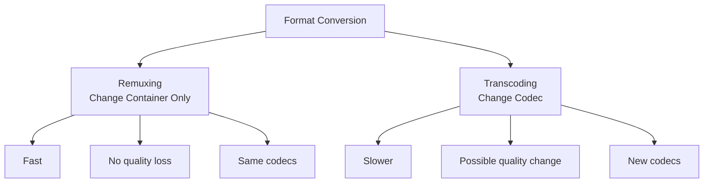
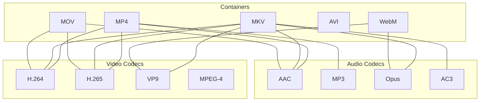

# 2.1 Format Conversion

## 🎯 Learning Objectives

By the end of this chapter, you will:
- Convert between common video formats (MP4, MKV, AVI, WebM)
- Convert between audio formats (MP3, AAC, WAV, FLAC)
- Understand when to use stream copy vs. re-encoding
- Handle format-specific compatibility issues

---

## 🔄 Understanding Format Conversion

Format conversion can mean two different things:



| Type | Speed | Quality | Use Case |
|------|-------|---------|----------|
| **Remuxing** | Very fast | No loss | MKV → MP4 (same codecs) |
| **Transcoding** | Slow | Depends | AVI → MP4 (different codecs) |

---

## 📦 Basic Video Conversion

### The Simplest Conversion

```bash
# Basic conversion (FFmpeg chooses codecs automatically)
ffmpeg -i input.avi output.mp4
```

> [!NOTE]
> FFmpeg automatically selects appropriate codecs based on the output container. However, it's better to be explicit about codec choices.

### Stream Copy (Remuxing) - Fastest Method

```bash
# Copy streams without re-encoding (instant, no quality loss)
ffmpeg -i input.mkv -c copy output.mp4
```

When stream copy works:
- ✅ MKV → MP4 (if using H.264/AAC)
- ✅ AVI → MKV (any codecs)
- ❌ WebM (VP9) → MP4 (incompatible codecs)

### Explicit Codec Selection

```bash
# Convert to H.264 video and AAC audio
ffmpeg -i input.avi -c:v libx264 -c:a aac output.mp4

# Convert video only, copy audio
ffmpeg -i input.mkv -c:v libx264 -c:a copy output.mp4

# Copy video, convert audio only
ffmpeg -i input.mkv -c:v copy -c:a aac output.mp4
```

---

## 🎬 Common Video Conversions

### Conversion Reference Table

| From | To | Command |
|------|-----|---------|
| AVI → MP4 | Universal | `ffmpeg -i input.avi -c:v libx264 -c:a aac output.mp4` |
| MKV → MP4 | Stream copy | `ffmpeg -i input.mkv -c copy output.mp4` |
| MP4 → WebM | Web | `ffmpeg -i input.mp4 -c:v libvpx-vp9 -c:a libopus output.webm` |
| MP4 → GIF | Animation | `ffmpeg -i input.mp4 -vf "fps=10,scale=320:-1" output.gif` |
| MOV → MP4 | Apple → Universal | `ffmpeg -i input.mov -c:v libx264 -c:a aac output.mp4` |
| WMV → MP4 | Windows → Universal | `ffmpeg -i input.wmv -c:v libx264 -c:a aac output.mp4` |

### To MP4 (Most Universal)

```bash
# Standard quality
ffmpeg -i input.avi -c:v libx264 -preset medium -crf 23 -c:a aac -b:a 128k output.mp4

# High quality
ffmpeg -i input.avi -c:v libx264 -preset slow -crf 18 -c:a aac -b:a 192k output.mp4

# Fast encoding
ffmpeg -i input.avi -c:v libx264 -preset fast -crf 23 -c:a aac output.mp4
```

### To MKV (Most Flexible)

```bash
# MKV accepts almost any codec, usually use copy
ffmpeg -i input.mp4 -c copy output.mkv

# Or with specific codecs
ffmpeg -i input.avi -c:v libx264 -c:a aac output.mkv
```

### To WebM (For Web)

```bash
# VP9 + Opus (modern, efficient)
ffmpeg -i input.mp4 -c:v libvpx-vp9 -crf 30 -b:v 0 -c:a libopus -b:a 128k output.webm

# VP8 + Vorbis (wider compatibility)
ffmpeg -i input.mp4 -c:v libvpx -c:a libvorbis output.webm
```

### To MOV (Apple Compatible)

```bash
# For Apple devices
ffmpeg -i input.mp4 -c:v libx264 -c:a aac -movflags +faststart output.mov

# ProRes for editing (high quality, large files)
ffmpeg -i input.mp4 -c:v prores_ks -profile:v 3 -c:a pcm_s16le output.mov
```

---

## 🎵 Audio Conversions

### Audio Format Reference

| From | To | Command |
|------|-----|---------|
| WAV → MP3 | Compressed | `ffmpeg -i input.wav -c:a libmp3lame -q:a 2 output.mp3` |
| FLAC → MP3 | Lossy | `ffmpeg -i input.flac -c:a libmp3lame -b:a 320k output.mp3` |
| MP3 → AAC | Modern | `ffmpeg -i input.mp3 -c:a aac -b:a 192k output.aac` |
| WAV → FLAC | Lossless | `ffmpeg -i input.wav -c:a flac output.flac` |
| AAC → MP3 | Universal | `ffmpeg -i input.aac -c:a libmp3lame -q:a 2 output.mp3` |
| OGG → MP3 | Universal | `ffmpeg -i input.ogg -c:a libmp3lame -q:a 2 output.mp3` |

### To MP3

```bash
# Variable bitrate (recommended, -q:a 0 is best, 9 is worst)
ffmpeg -i input.wav -c:a libmp3lame -q:a 2 output.mp3

# Constant bitrate
ffmpeg -i input.wav -c:a libmp3lame -b:a 320k output.mp3

# 192 kbps standard quality
ffmpeg -i input.wav -c:a libmp3lame -b:a 192k output.mp3
```

### To AAC

```bash
# Native AAC encoder
ffmpeg -i input.wav -c:a aac -b:a 192k output.m4a

# High quality
ffmpeg -i input.wav -c:a aac -b:a 256k output.m4a
```

### To FLAC (Lossless)

```bash
# Lossless compression
ffmpeg -i input.wav -c:a flac output.flac

# With compression level (0-12, higher = smaller but slower)
ffmpeg -i input.wav -c:a flac -compression_level 8 output.flac
```

### To WAV (Uncompressed)

```bash
# Standard WAV
ffmpeg -i input.mp3 -c:a pcm_s16le output.wav

# 24-bit WAV
ffmpeg -i input.flac -c:a pcm_s24le output.wav
```

---

## 🔀 Container Compatibility Matrix



| Container | Video Codecs | Audio Codecs |
|-----------|--------------|--------------|
| **MP4** | H.264, H.265, MPEG-4 | AAC, MP3 |
| **MKV** | Almost anything | Almost anything |
| **WebM** | VP8, VP9, AV1 | Vorbis, Opus |
| **AVI** | Most legacy codecs | MP3, PCM, AC3 |
| **MOV** | H.264, H.265, ProRes | AAC, PCM |

---

## ⚡ Batch Conversion

### Windows PowerShell

```powershell
# Convert all AVI files to MP4
Get-ChildItem *.avi | ForEach-Object {
    $output = $_.BaseName + ".mp4"
    ffmpeg -i $_.FullName -c:v libx264 -c:a aac $output
}

# Convert all files in subdirectories
Get-ChildItem -Recurse *.avi | ForEach-Object {
    $output = $_.DirectoryName + "\" + $_.BaseName + ".mp4"
    ffmpeg -i $_.FullName -c:v libx264 -c:a aac $output
}
```

### Linux/macOS Bash

```bash
# Convert all AVI files to MP4
for f in *.avi; do
    ffmpeg -i "$f" -c:v libx264 -c:a aac "${f%.avi}.mp4"
done

# Using find for recursive conversion
find . -name "*.avi" -exec sh -c 'ffmpeg -i "$0" -c:v libx264 -c:a aac "${0%.avi}.mp4"' {} \;
```

---

## ✅ Best Practices

> [!TIP]
> **Use Stream Copy When Possible**: If you're just changing containers and the codecs are compatible, use `-c copy` for instant, lossless conversion.

> [!IMPORTANT]
> **Match Codec to Container**: Not all codecs work in all containers. Check compatibility before converting.

> [!WARNING]
> **Avoid Re-encoding Chains**: Each re-encode loses quality. Convert from the original source when possible, not from a previously compressed version.

### Quality Preservation Tips

| Goal | Approach |
|------|----------|
| Keep original quality | Use `-c copy` or lossless codec |
| Minimal quality loss | Use low CRF (18-20) |
| Good balance | Use CRF 23 (H.264 default) |
| Smaller files | Use higher CRF (26-28) |

---

## 🏋️ Exercises

### Exercise 1: Simple Conversions
Convert these using appropriate methods:
1. An MKV with H.264 to MP4 (should be instant)
2. An AVI to WebM (requires transcoding)
3. A WAV to MP3 at 192 kbps

### Exercise 2: Quality Comparison
Convert the same video with different CRF values:
```bash
ffmpeg -i input.mp4 -c:v libx264 -crf 18 output_crf18.mp4
ffmpeg -i input.mp4 -c:v libx264 -crf 23 output_crf23.mp4
ffmpeg -i input.mp4 -c:v libx264 -crf 28 output_crf28.mp4
```
Compare file sizes and quality.

### Exercise 3: Batch Processing
Write a script to convert all video files in a folder to MP4.

---

## 📝 Summary

| Task | Command Example |
|------|-----------------|
| Simple conversion | `ffmpeg -i input.avi output.mp4` |
| Stream copy (fast) | `ffmpeg -i input.mkv -c copy output.mp4` |
| Explicit codecs | `ffmpeg -i input.avi -c:v libx264 -c:a aac output.mp4` |
| Audio to MP3 | `ffmpeg -i input.wav -c:a libmp3lame -q:a 2 output.mp3` |
| To WebM | `ffmpeg -i input.mp4 -c:v libvpx-vp9 -c:a libopus output.webm` |

---

## ➡️ Next Steps

Proceed to [2.2 Audio Extraction & Merging](../2.2-audio-extraction/) to learn how to work with audio tracks in video files.
