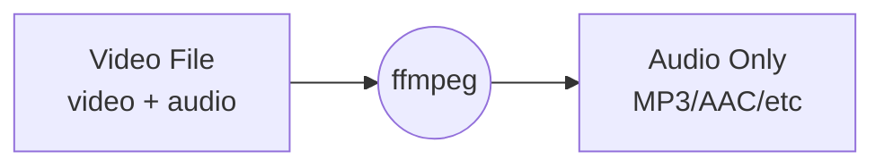
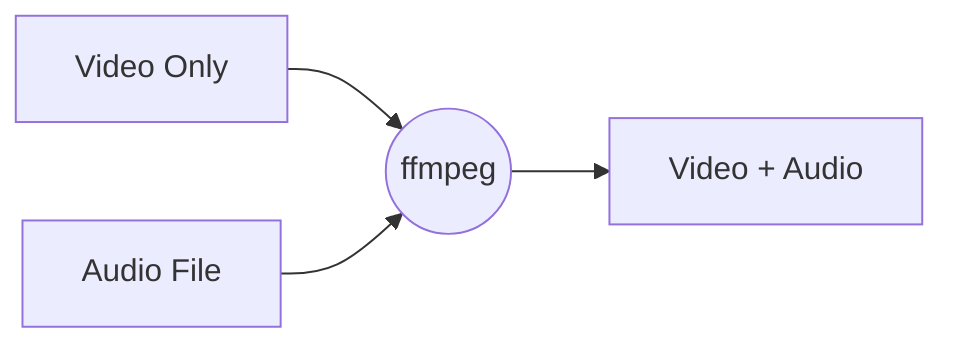
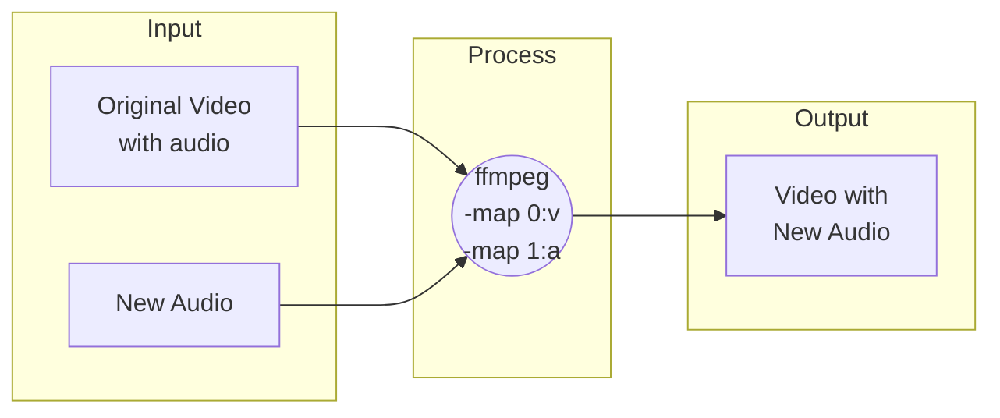
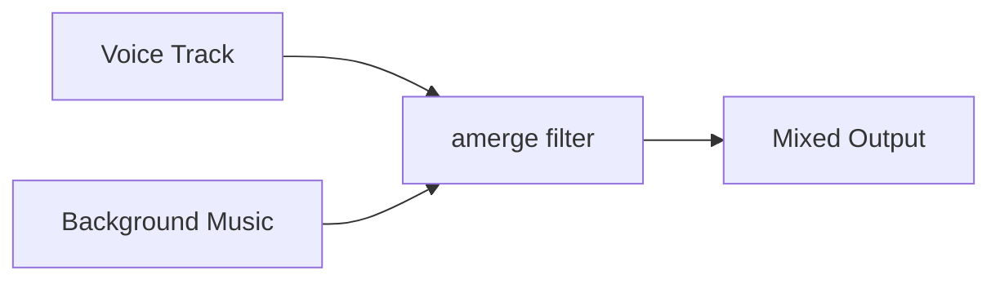

# 2.2 Audio Extraction and Merging

## 🎯 Learning Objectives

By the end of this chapter, you will:
- Extract audio tracks from video files
- Merge audio and video streams
- Replace audio tracks in videos
- Add multiple audio tracks
- Work with audio channel layouts

---

## 🎵 Extracting Audio from Video

### Basic Audio Extraction



```bash
# Extract audio and re-encode to MP3
ffmpeg -i video.mp4 -vn -c:a libmp3lame -q:a 2 audio.mp3

# Extract audio and re-encode to AAC
ffmpeg -i video.mp4 -vn -c:a aac -b:a 192k audio.m4a

# Copy audio without re-encoding (fastest)
ffmpeg -i video.mp4 -vn -c:a copy audio.aac
```

### Key Options Explained

| Option | Purpose |
|--------|---------|
| `-vn` | No video (discard video stream) |
| `-c:a copy` | Copy audio as-is (no re-encoding) |
| `-c:a libmp3lame` | Encode to MP3 |
| `-c:a aac` | Encode to AAC |
| `-q:a 2` | Quality for MP3 (0-9, lower is better) |
| `-b:a 192k` | Audio bitrate |

### Extract Original Audio Format

To keep the original format without re-encoding:

```bash
# Check original audio format first
ffprobe -v error -select_streams a:0 \
  -show_entries stream=codec_name \
  -of default=noprint_wrappers=1:nokey=1 video.mp4
# Output: aac

# Extract with correct extension
ffmpeg -i video.mp4 -vn -c:a copy audio.aac

# For FLAC audio in MKV
ffmpeg -i video.mkv -vn -c:a copy audio.flac
```

---

## 🔗 Merging Audio and Video

### Basic Merge



```bash
# Merge video and audio (copy both)
ffmpeg -i video_only.mp4 -i audio.mp3 -c copy output.mp4

# Merge with specific codec settings
ffmpeg -i video_only.mp4 -i audio.wav \
  -c:v copy -c:a aac -b:a 192k output.mp4

# Merge and trim to shortest stream
ffmpeg -i video.mp4 -i audio.mp3 -c copy -shortest output.mp4
```

### Map Specific Streams

```bash
# Explicitly map video from first input, audio from second
ffmpeg -i video.mp4 -i audio.mp3 \
  -map 0:v:0 -map 1:a:0 \
  -c copy output.mp4
```

---

## 🔄 Replacing Audio Tracks

### Replace All Audio



```bash
# Replace audio completely
ffmpeg -i video.mp4 -i new_audio.mp3 \
  -map 0:v -map 1:a \
  -c:v copy -c:a aac output.mp4

# With loop for short audio
ffmpeg -i video.mp4 -stream_loop -1 -i short_audio.mp3 \
  -map 0:v -map 1:a \
  -c:v copy -c:a aac -shortest output.mp4
```

### Keep Original + Add New

```bash
# Add new audio track alongside original
ffmpeg -i video.mp4 -i commentary.mp3 \
  -map 0 -map 1:a \
  -c copy output.mp4
```

---

## 🎚️ Multiple Audio Tracks

### Add Multiple Languages

```bash
# Add English and Spanish audio tracks
ffmpeg -i video.mp4 -i english.mp3 -i spanish.mp3 \
  -map 0:v -map 1:a -map 2:a \
  -c:v copy -c:a aac \
  -metadata:s:a:0 language=eng \
  -metadata:s:a:1 language=spa \
  output.mkv
```

### Extract Specific Track

```bash
# List all audio tracks
ffprobe -v error -select_streams a \
  -show_entries stream=index,codec_name:stream_tags=language \
  -of csv input.mkv

# Extract second audio track only
ffmpeg -i input.mkv -map 0:a:1 -c:a copy second_audio.aac
```

---

## 🔊 Audio Adjustments During Merge

### Adjust Volume

```bash
# Increase volume by 1.5x
ffmpeg -i video.mp4 -i audio.mp3 \
  -map 0:v -map 1:a \
  -c:v copy -af "volume=1.5" output.mp4

# Decrease to 50%
ffmpeg -i video.mp4 -i audio.mp3 \
  -map 0:v -map 1:a \
  -c:v copy -af "volume=0.5" output.mp4

# Volume in decibels
ffmpeg -i video.mp4 -i audio.mp3 \
  -map 0:v -map 1:a \
  -c:v copy -af "volume=3dB" output.mp4
```

### Delay Audio

```bash
# Delay audio by 1 second (1000ms)
ffmpeg -i video.mp4 -i audio.mp3 \
  -map 0:v -map 1:a \
  -c:v copy -af "adelay=1000|1000" output.mp4

# Delay audio using itsoffset (preferred)
ffmpeg -i video.mp4 -itsoffset 1 -i audio.mp3 \
  -map 0:v -map 1:a \
  -c copy output.mp4
```

### Fade In/Out

```bash
# Fade in first 3 seconds, fade out last 3 seconds
ffmpeg -i video.mp4 -i audio.mp3 \
  -map 0:v -map 1:a \
  -c:v copy -af "afade=t=in:st=0:d=3,afade=t=out:st=57:d=3" output.mp4
```

---

## 🔀 Mix Multiple Audio Sources

### Audio Mixing



```bash
# Mix two audio sources
ffmpeg -i voice.mp3 -i background_music.mp3 \
  -filter_complex "[0:a][1:a]amerge=inputs=2[aout]" \
  -map "[aout]" -c:a aac mixed.m4a

# Mix with volume adjustment (voice louder, music softer)
ffmpeg -i voice.mp3 -i music.mp3 \
  -filter_complex "[0:a]volume=1.0[v];[1:a]volume=0.3[m];[v][m]amix=inputs=2[aout]" \
  -map "[aout]" -c:a aac mixed.m4a

# Add background music to video
ffmpeg -i video.mp4 -i background.mp3 \
  -filter_complex "[0:a]volume=1.0[v];[1:a]volume=0.2[m];[v][m]amix=inputs=2[aout]" \
  -map 0:v -map "[aout]" -c:v copy -c:a aac output.mp4
```

---

## 📊 Channel Layout Operations

### Stereo ↔ Mono Conversion

```bash
# Stereo to Mono
ffmpeg -i stereo.mp3 -ac 1 mono.mp3

# Mono to Stereo (duplicate channel)
ffmpeg -i mono.mp3 -ac 2 stereo.mp3

# Specific channel layout
ffmpeg -i input.wav -af "channelmap=0-0|0-1" stereo.wav
```

### Extract Left/Right Channel

```bash
# Extract left channel only
ffmpeg -i stereo.mp3 -af "pan=mono|c0=c0" left.mp3

# Extract right channel only
ffmpeg -i stereo.mp3 -af "pan=mono|c0=c1" right.mp3
```

---

## ✅ Best Practices

> [!TIP]
> **Use `-c:a copy` When Possible**: If you don't need to change the audio format, copy it to avoid quality loss.

> [!IMPORTANT]
> **Sync Check**: After merging, always verify audio-video sync, especially when using different sources.

> [!WARNING]
> **Sample Rate Matching**: When mixing audio, ensure sample rates match or FFmpeg may fail. Use `-ar 48000` to standardize.

### Common Patterns

| Task | Command Pattern |
|------|-----------------|
| Extract audio | `ffmpeg -i video.mp4 -vn -c:a copy audio.aac` |
| Merge video+audio | `ffmpeg -i video.mp4 -i audio.mp3 -c copy output.mp4` |
| Replace audio | `ffmpeg -i video.mp4 -i audio.mp3 -map 0:v -map 1:a -c copy output.mp4` |
| Adjust volume | `ffmpeg -i input.mp4 -af "volume=1.5" output.mp4` |

---

## 🏋️ Exercises

### Exercise 1: Extract and Convert
Extract audio from a video and save as:
1. MP3 at 320 kbps
2. AAC at 192 kbps
3. Original format (copy)

### Exercise 2: Audio Replacement
Take a video and replace its audio with a music track.

### Exercise 3: Multi-track Audio
Create a video with two audio tracks (original + commentary).

### Exercise 4: Volume Mixing
Mix a voice recording with background music at 30% volume.

---

## 📝 Summary

| Operation | Key Command |
|-----------|-------------|
| Extract audio | `ffmpeg -i video.mp4 -vn -c:a copy audio.aac` |
| Merge audio+video | `ffmpeg -i video.mp4 -i audio.mp3 -c copy output.mp4` |
| Replace audio | `-map 0:v -map 1:a` (video from first, audio from second) |
| Volume adjust | `-af "volume=1.5"` or `-af "volume=3dB"` |
| Mix audio | `-filter_complex "amix=inputs=2"` |
| Add delay | `-itsoffset 1 -i audio.mp3` |

---

## ➡️ Next Steps

Proceed to [2.3 Trimming & Cutting](../2.3-trimming-cutting/) to learn how to extract specific segments from media files.
