# 2.3 Trimming and Cutting

## 🎯 Learning Objectives

By the end of this chapter, you will:
- Cut segments from video and audio files
- Understand seeking methods (fast vs. accurate)
- Split files into multiple parts
- Remove unwanted sections from media

---

## ⏱️ Time-Based Cutting

### Basic Cutting Command


```bash
# Cut from 30 seconds for 30 seconds duration
ffmpeg -i input.mp4 -ss 00:00:30 -t 30 -c copy output.mp4

# Cut from start position to end position
ffmpeg -i input.mp4 -ss 00:00:30 -to 00:01:00 -c copy output.mp4
```

### Essential Time Options

| Option | Description | Example |
|--------|-------------|---------|
| `-ss` | Start position (seek) | `-ss 00:01:30` or `-ss 90` |
| `-t` | Duration | `-t 30` (30 seconds) |
| `-to` | End position | `-to 00:02:00` |

---

## 🎯 Seeking Methods: Fast vs. Accurate

The position of `-ss` critically affects speed and accuracy:

```mermaid
flowchart TD
    subgraph "Input Seeking (Fast)"
        A1["-ss BEFORE -i"] --> A2[Seeks to nearest keyframe]
        A2 --> A3[❌ May not be frame-accurate]
        A2 --> A4[✅ Very fast]
    end
    
    subgraph "Output Seeking (Accurate)"
        B1["-ss AFTER -i"] --> B2[Decodes from beginning]
        B2 --> B3[✅ Frame-accurate]
        B2 --> B4[❌ Slow for late positions]
    end
```



### Input Seeking (Fast - Default Choice)

```bash
# Fast: -ss before -i (seeks to nearest keyframe in input)
ffmpeg -ss 00:01:00 -i input.mp4 -t 30 -c copy output.mp4
```

- ✅ Very fast, even for late positions
- ❌ May start a few frames before/after target
- Best for: Most use cases, long videos

### Output Seeking (Accurate)

```bash
# Accurate: -ss after -i (decodes everything first)
ffmpeg -i input.mp4 -ss 00:01:00 -t 30 output.mp4
```

- ✅ Frame-accurate
- ❌ Slow (must decode from start to seek position)
- ❌ Requires re-encoding
- Best for: When precision is critical

### Combined Approach (Fast + Accurate)

```bash
# Best of both: Fast seek, then fine-tune
ffmpeg -ss 00:00:55 -i input.mp4 -ss 5 -t 30 -c copy output.mp4
#      ↑ Fast seek to 55s     ↑ Fine-tune 5s more (reaching 60s)
```

This approach:
1. Fast seeks to 5 seconds before target
2. Accurately seeks the remaining 5 seconds
3. Still uses stream copy for speed

---

## ✂️ Cutting Examples

### Extract a Clip

```bash
# First 60 seconds
ffmpeg -i input.mp4 -t 60 -c copy first_minute.mp4

# Last 60 seconds (requires knowing duration)
# If video is 5:00 (300s), start at 4:00 (240s)
ffmpeg -ss 00:04:00 -i input.mp4 -c copy last_minute.mp4

# Using negative positioning (from end)
ffmpeg -sseof -60 -i input.mp4 -c copy last_minute.mp4
```

### Cut Without Re-encoding

```bash
# Stream copy (fastest, but may have keyframe issues)
ffmpeg -ss 00:01:00 -i input.mp4 -t 30 -c copy clip.mp4

# If you get black frames at start, re-encode:
ffmpeg -ss 00:01:00 -i input.mp4 -t 30 -c:v libx264 -c:a aac clip.mp4
```

### Accurate Frame Cutting

```bash
# Force keyframe at cut point by re-encoding
ffmpeg -i input.mp4 -ss 00:01:00 -t 30 \
  -c:v libx264 -c:a aac \
  -avoid_negative_ts make_zero \
  output.mp4
```

---

## 🔪 Splitting Files

### Split into Parts


```bash
# Split manually
ffmpeg -ss 0 -i input.mp4 -t 180 -c copy part1.mp4
ffmpeg -ss 180 -i input.mp4 -t 180 -c copy part2.mp4
ffmpeg -ss 360 -i input.mp4 -c copy part3.mp4

# Using segment muxer (automatic splitting)
ffmpeg -i input.mp4 -c copy -map 0 \
  -segment_time 180 -f segment \
  -reset_timestamps 1 output_%03d.mp4
```

### Split by Size

```bash
# Approximately split to 100MB segments
ffmpeg -i input.mp4 -c copy -map 0 \
  -f segment -segment_time 300 \
  -strftime 1 output_%Y%m%d_%H%M%S.mp4
```

### Split at Specific Times

```bash
# Split at specific timestamps using segment_times
ffmpeg -i input.mp4 -c copy -map 0 \
  -f segment -segment_times "60,120,300" \
  output_%03d.mp4
```

---

## 🚫 Removing Sections

### Remove Beginning

```bash
# Remove first 30 seconds
ffmpeg -ss 30 -i input.mp4 -c copy output.mp4
```

### Remove End

```bash
# Keep only first 2 minutes (remove everything after)
ffmpeg -i input.mp4 -t 120 -c copy output.mp4
```

### Remove Middle Section

To remove a section from the middle, you need to:
1. Extract before the section
2. Extract after the section
3. Concatenate them

```bash
# Remove 1:00-1:30 from a video
# Step 1: Extract 0:00-1:00
ffmpeg -i input.mp4 -t 60 -c copy part1.mp4

# Step 2: Extract 1:30 to end
ffmpeg -ss 90 -i input.mp4 -c copy part2.mp4

# Step 3: Create file list
echo "file 'part1.mp4'" > files.txt
echo "file 'part2.mp4'" >> files.txt

# Step 4: Concatenate
ffmpeg -f concat -safe 0 -i files.txt -c copy output.mp4
```

---

## 🎵 Audio Trimming

### Cut Audio Files

```bash
# Cut MP3 from 1:00 to 2:00
ffmpeg -ss 00:01:00 -i input.mp3 -to 00:02:00 -c copy output.mp3

# Cut with fade out at end
ffmpeg -ss 00:01:00 -i input.mp3 -t 60 \
  -af "afade=t=out:st=55:d=5" output.mp3
```

### Trim Silence

```bash
# Remove silence from beginning and end
ffmpeg -i input.mp3 \
  -af "silenceremove=start_periods=1:start_silence=0.5:start_threshold=-50dB,\
       areverse,silenceremove=start_periods=1:start_silence=0.5:start_threshold=-50dB,\
       areverse" \
  output.mp3
```

---

## 📋 Batch Trimming Script

### Windows PowerShell

```powershell
# Trim first 10 seconds from all MP4 files
Get-ChildItem *.mp4 | ForEach-Object {
    $output = "trimmed_" + $_.Name
    ffmpeg -ss 10 -i $_.FullName -c copy $output
}
```

### Linux/macOS Bash

```bash
# Trim first 10 seconds from all MP4 files
for f in *.mp4; do
    ffmpeg -ss 10 -i "$f" -c copy "trimmed_$f"
done
```

---

## ✅ Best Practices

> [!TIP]
> **Use Input Seeking for Long Videos**: Place `-ss` before `-i` for fast seeking in long videos.

> [!IMPORTANT]
> **Keyframe Consideration**: When using `-c copy`, cuts may not be frame-accurate because they align to keyframes. Re-encode for precise cuts.

> [!WARNING]
> **Avoid Negative Timestamps**: Use `-avoid_negative_ts make_zero` when cutting to prevent playback issues.

### Quick Reference

| Goal | Method |
|------|--------|
| Fast, approximate cut | `-ss TIME -i input.mp4 -c copy output.mp4` |
| Accurate cut | `-i input.mp4 -ss TIME -c:v libx264 output.mp4` |
| Duration-based | `-t SECONDS` or `-t HH:MM:SS` |
| End position | `-to HH:MM:SS` |
| From end | `-sseof -60` (last 60 seconds) |

---

## 🏋️ Exercises

### Exercise 1: Basic Cuts
From any video file:
1. Extract the first 30 seconds
2. Extract a 1-minute clip starting at 2:00
3. Extract the last 45 seconds

### Exercise 2: Compare Methods
Cut the same segment using:
1. Input seeking with stream copy
2. Output seeking with re-encoding
Compare: file sizes, quality, and seek accuracy.

### Exercise 3: Split a Video
Split a video into 1-minute segments using the segment muxer.

### Exercise 4: Remove Section
Remove a 30-second section from the middle of a video (requires concatenation).

---

## 📝 Summary

| Operation | Command |
|-----------|---------|
| Cut from position | `ffmpeg -ss 00:01:00 -i input.mp4 -t 30 -c copy output.mp4` |
| Cut to position | `ffmpeg -i input.mp4 -ss 00:01:00 -to 00:01:30 output.mp4` |
| First N seconds | `ffmpeg -i input.mp4 -t 60 -c copy output.mp4` |
| Last N seconds | `ffmpeg -sseof -60 -i input.mp4 -c copy output.mp4` |
| Split by time | `-f segment -segment_time 180` |
| Fast seek | `-ss` before `-i` |
| Accurate seek | `-ss` after `-i` (requires re-encode) |

---

## ➡️ Next Steps

Proceed to [2.4 Resizing & Scaling](../2.4-resizing-scaling/) to learn how to change video dimensions.
