# 2.4 Resizing and Scaling

## 🎯 Learning Objectives

By the end of this chapter, you will:
- Scale videos to specific resolutions
- Maintain aspect ratios correctly
- Add padding (letterbox/pillarbox)
- Use scaling filters effectively

---

## 📐 The Scale Filter

The `scale` filter is FFmpeg's tool for changing video dimensions.


### Basic Syntax

```bash
ffmpeg -i input.mp4 -vf "scale=WIDTH:HEIGHT" output.mp4
```

### Common Scaling Examples

```bash
# Scale to 1280x720
ffmpeg -i input.mp4 -vf "scale=1280:720" output.mp4

# Scale to 720p (width automatic based on aspect ratio)
ffmpeg -i input.mp4 -vf "scale=-1:720" output.mp4

# Scale to width 1280 (height automatic)
ffmpeg -i input.mp4 -vf "scale=1280:-1" output.mp4

# Scale to 50% of original
ffmpeg -i input.mp4 -vf "scale=iw/2:ih/2" output.mp4
```

---

## 🔢 Automatic Dimension Calculation

### Using -1 for Automatic Sizing


```bash
# Width fixed, height auto (maintains aspect ratio)
ffmpeg -i input.mp4 -vf "scale=1280:-1" output.mp4

# Height fixed, width auto
ffmpeg -i input.mp4 -vf "scale=-1:720" output.mp4
```

> [!WARNING]
> Using `-1` can result in odd dimensions that some codecs don't support. Use `-2` instead for even numbers.

### Using -2 for Even Dimensions

```bash
# Height auto, rounded to nearest even number
ffmpeg -i input.mp4 -vf "scale=1280:-2" output.mp4

# Width auto, rounded to even
ffmpeg -i input.mp4 -vf "scale=-2:720" output.mp4
```

---

## 📊 Common Resolutions


| Resolution | Dimensions | Aspect Ratio | Command |
|------------|------------|--------------|---------|
| 480p SD | 640×480 | 4:3 | `scale=640:480` |
| 720p HD | 1280×720 | 16:9 | `scale=1280:720` |
| 1080p FHD | 1920×1080 | 16:9 | `scale=1920:1080` |
| 1440p QHD | 2560×1440 | 16:9 | `scale=2560:1440` |
| 4K UHD | 3840×2160 | 16:9 | `scale=3840:2160` |

### Scale to Standard Resolutions

```bash
# Scale to 720p
ffmpeg -i input.mp4 -vf "scale=1280:720" -c:a copy output_720p.mp4

# Scale to 1080p
ffmpeg -i input.mp4 -vf "scale=1920:1080" -c:a copy output_1080p.mp4

# Scale to 4K
ffmpeg -i input.mp4 -vf "scale=3840:2160" -c:a copy output_4k.mp4
```

---

## 🔄 Preserving Aspect Ratio

### Force Aspect Ratio with Padding

When the source aspect ratio doesn't match the target, you have options:

```mermaid
flowchart TD
    SOURCE["Source: 4:3<br>(640x480)"] --> OPTIONS{Target: 16:9?}
    OPTIONS --> STRETCH["Stretch (Distort)"]
    OPTIONS --> CROP["Crop (Lose content)"]
    OPTIONS --> PAD["Pad (Add bars)"]
    
    STRETCH --> D1["😕 Distorted"]
    CROP --> D2["⚠️ Content lost"]
    PAD --> D3["✅ Full content, bars added"]
```



### Add Padding (Letterbox/Pillarbox)

```bash
# Scale and add black bars to fit 16:9
ffmpeg -i input.mp4 -vf "scale=1920:1080:force_original_aspect_ratio=decrease,\
pad=1920:1080:-1:-1:color=black" output.mp4

# Explanation:
# - scale with force_original_aspect_ratio=decrease: scale down to fit
# - pad to exact dimensions, centered (-1:-1), with black color
```

### Scale to Fit (Decrease)

```bash
# Scale to fit within 1920x1080, maintaining aspect ratio
ffmpeg -i input.mp4 -vf "scale=1920:1080:force_original_aspect_ratio=decrease" output.mp4
```

### Scale to Cover (Increase then Crop)

```bash
# Scale to cover 1920x1080, then crop excess
ffmpeg -i input.mp4 -vf "scale=1920:1080:force_original_aspect_ratio=increase,\
crop=1920:1080" output.mp4
```

---

## 🎨 Advanced Scaling Options

### Scaling Algorithms

| Algorithm | Quality | Speed | Use Case |
|-----------|---------|-------|----------|
| `fast_bilinear` | Low | Fast | Preview, real-time |
| `bilinear` | Medium | Fast | General use |
| `bicubic` | Good | Medium | Default |
| `lanczos` | Excellent | Slow | Best quality |
| `spline` | Excellent | Slow | High quality |

```bash
# High quality scaling with lanczos
ffmpeg -i input.mp4 -vf "scale=1920:1080:flags=lanczos" output.mp4

# Fast scaling for preview
ffmpeg -i input.mp4 -vf "scale=1920:1080:flags=fast_bilinear" output.mp4
```

### Upscaling vs Downscaling

```bash
# Downscale (usually safe)
ffmpeg -i input_4k.mp4 -vf "scale=1920:1080:flags=lanczos" output_1080p.mp4

# Upscale (use lanczos for best results)
ffmpeg -i input_720p.mp4 -vf "scale=1920:1080:flags=lanczos" output_1080p.mp4
```

---

## 📱 Platform-Specific Scaling

### YouTube/General Web

```bash
# 1080p for YouTube
ffmpeg -i input.mp4 -vf "scale=1920:1080:force_original_aspect_ratio=decrease,\
pad=1920:1080:-1:-1" -c:v libx264 -c:a aac output.mp4
```

### Instagram

```bash
# Square (1:1) for Instagram feed
ffmpeg -i input.mp4 -vf "scale=1080:1080:force_original_aspect_ratio=decrease,\
pad=1080:1080:-1:-1:color=white" output.mp4

# Portrait (4:5) for Instagram
ffmpeg -i input.mp4 -vf "scale=1080:1350:force_original_aspect_ratio=decrease,\
pad=1080:1350:-1:-1" output.mp4

# Stories (9:16)
ffmpeg -i input.mp4 -vf "scale=1080:1920:force_original_aspect_ratio=decrease,\
pad=1080:1920:-1:-1" output.mp4
```

### TikTok/Shorts (Vertical)

```bash
# 9:16 vertical video
ffmpeg -i input.mp4 -vf "scale=1080:1920:force_original_aspect_ratio=decrease,\
pad=1080:1920:-1:-1" output.mp4
```

### Twitter

```bash
# 16:9 or 1:1 (both supported)
ffmpeg -i input.mp4 -vf "scale=1280:720:force_original_aspect_ratio=decrease,\
pad=1280:720:-1:-1" output.mp4
```

---

## 🔲 Cropping and Scaling Combined

### Crop then Scale

```bash
# Crop center, then scale
ffmpeg -i input.mp4 -vf "crop=ih*16/9:ih,scale=1920:1080" output.mp4
```

### Scale then Crop

```bash
# Scale to larger, then crop to exact
ffmpeg -i input.mp4 -vf "scale=2000:-2,crop=1920:1080" output.mp4
```

---

## 📦 Batch Scaling

### Windows PowerShell

```powershell
# Scale all MP4 files to 720p
Get-ChildItem *.mp4 | ForEach-Object {
    $output = "720p_" + $_.Name
    ffmpeg -i $_.FullName -vf "scale=-2:720" -c:a copy $output
}
```

### Linux/macOS Bash

```bash
# Scale all MP4 files to 720p
for f in *.mp4; do
    ffmpeg -i "$f" -vf "scale=-2:720" -c:a copy "720p_$f"
done
```

---

## ✅ Best Practices

> [!TIP]
> **Use -2 Instead of -1**: Using `-2` ensures dimensions are even, which is required by most codecs.

> [!IMPORTANT]
> **Don't Upscale if Possible**: Upscaling doesn't add detail; it just makes pixels bigger. Keep original resolution when distributing.

> [!WARNING]
> **Scaling Requires Re-encoding**: Unlike trimming with `-c copy`, scaling must re-encode the video. Plan for processing time.

### Quality Preservation Guide

| Scaling Direction | Recommendation |
|-------------------|----------------|
| Downscaling | Use `lanczos` for best quality |
| Upscaling | Avoid if possible; use `lanczos` if needed |
| Same size | Don't scale (use `-c:v copy`) |

---

## 🏋️ Exercises

### Exercise 1: Basic Scaling
Convert a video to these resolutions:
1. 720p (1280×720)
2. 480p (854×480)
3. Half the original size

### Exercise 2: Aspect Ratio Handling
Take a 4:3 video and:
1. Stretch to 16:9 (notice distortion)
2. Letterbox to 16:9 (add black bars)
3. Crop to 16:9 (center crop)

### Exercise 3: Platform Export
Create versions of a video for:
1. YouTube (1080p 16:9)
2. Instagram Stories (1080×1920)
3. Instagram Feed (1080×1080)

### Exercise 4: Quality Comparison
Scale the same video using:
1. `fast_bilinear`
2. `bicubic`
3. `lanczos`
Compare the visual quality.

---

## 📝 Summary

| Task | Command |
|------|---------|
| Scale to exact size | `-vf "scale=1920:1080"` |
| Scale width, auto height | `-vf "scale=1280:-2"` |
| Scale height, auto width | `-vf "scale=-2:720"` |
| Fit and pad | `-vf "scale=W:H:force_original_aspect_ratio=decrease,pad=W:H:-1:-1"` |
| High quality | `-vf "scale=W:H:flags=lanczos"` |
| Half size | `-vf "scale=iw/2:ih/2"` |

---

## ➡️ Next Steps

Proceed to [2.5 Basic Compression](../2.5-compression/) to learn how to reduce file sizes while maintaining quality.
