# 2.5 Basic Compression

## 🎯 Learning Objectives

By the end of this chapter, you will:
- Understand video and audio compression fundamentals
- Use CRF mode for quality-controlled encoding
- Choose appropriate bitrates for different use cases
- Balance quality with file size effectively

---

## 📊 Understanding Compression


### The Quality-Size Triangle

| Priority | Result |
|----------|--------|
| High Quality + Small Size | Slow encoding |
| High Quality + Fast | Large files |
| Small Size + Fast | Lower quality |

---

## 🎚️ Bitrate Control Methods

FFmpeg offers several ways to control output quality and file size:


---

## ⭐ CRF Mode (Recommended)

**CRF (Constant Rate Factor)** is the best mode for encoding to files where quality matters.

### How CRF Works


### H.264 CRF Scale

| CRF | Quality | Use Case |
|-----|---------|----------|
| 0 | Lossless | Archival |
| 17-18 | Visually lossless | Master copies |
| 19-23 | High quality | General use |
| 24-28 | Medium quality | Web delivery |
| 29-35 | Low quality | Previews |
| 51 | Worst | Extreme compression |

### CRF Examples

```bash
# High quality (CRF 18)
ffmpeg -i input.mp4 -c:v libx264 -crf 18 -c:a copy output.mp4

# Standard quality (CRF 23 - default)
ffmpeg -i input.mp4 -c:v libx264 -crf 23 -c:a copy output.mp4

# Smaller files (CRF 28)
ffmpeg -i input.mp4 -c:v libx264 -crf 28 -c:a copy output.mp4

# H.265/HEVC (note: CRF values differ slightly)
ffmpeg -i input.mp4 -c:v libx265 -crf 28 -c:a copy output.mp4
```

### CRF for Different Codecs

| Codec | Encoder | "Transparent" CRF | Range |
|-------|---------|-------------------|-------|
| H.264 | libx264 | 18-20 | 0-51 |
| H.265 | libx265 | 24-28 | 0-51 |
| VP9 | libvpx-vp9 | 31-34 | 0-63 |
| AV1 | libaom-av1 | 30-35 | 0-63 |

---

## ⚡ Encoding Presets

Presets control encoding speed vs. compression efficiency:


| Preset | Speed | Compression | Use Case |
|--------|-------|-------------|----------|
| `ultrafast` | 10x | Poor | Real-time streaming |
| `veryfast` | 5x | OK | Quick encodes |
| `fast` | 2x | Good | General use |
| `medium` | 1x | Better | Default, balanced |
| `slow` | 0.5x | Great | Final delivery |
| `veryslow` | 0.25x | Best | Archival |

### Preset Examples

```bash
# Fast encoding (larger file)
ffmpeg -i input.mp4 -c:v libx264 -preset fast -crf 23 -c:a copy output.mp4

# Slow encoding (smaller file, same quality)
ffmpeg -i input.mp4 -c:v libx264 -preset slow -crf 23 -c:a copy output.mp4

# Balanced (default)
ffmpeg -i input.mp4 -c:v libx264 -preset medium -crf 23 -c:a copy output.mp4
```

---

## 🎯 Target Bitrate Mode

When you need a specific file size, use bitrate targeting:

### Constant Bitrate (CBR)

```bash
# 5 Mbps video bitrate
ffmpeg -i input.mp4 -c:v libx264 -b:v 5M -c:a aac -b:a 128k output.mp4
```

### Two-Pass Encoding (Best Quality at Target Size)

```bash
# Pass 1: Analyze
ffmpeg -i input.mp4 -c:v libx264 -b:v 5M -pass 1 -f null NUL

# Pass 2: Encode
ffmpeg -i input.mp4 -c:v libx264 -b:v 5M -pass 2 -c:a aac output.mp4

# Combined (Windows PowerShell)
ffmpeg -i input.mp4 -c:v libx264 -b:v 5M -pass 1 -f null NUL; `
ffmpeg -i input.mp4 -c:v libx264 -b:v 5M -pass 2 -c:a aac output.mp4
```

### Calculate Bitrate for Target Size

```
Video Bitrate = (Target Size in bits - Audio bits) / Duration in seconds

Example: 100MB file, 60 seconds, 128kbps audio
- Target: 100 * 8 * 1024 * 1024 = 838,860,800 bits
- Audio: 128 * 1000 * 60 = 7,680,000 bits
- Video: (838,860,800 - 7,680,000) / 60 = 13,853,013 bps ≈ 13.8 Mbps
```

```bash
# Target approximately 100MB for 60-second video
ffmpeg -i input.mp4 -c:v libx264 -b:v 13.8M -c:a aac -b:a 128k output.mp4
```

---

## 🔊 Audio Compression

### Audio Bitrate Guidelines

| Quality | MP3 | AAC | Opus |
|---------|-----|-----|------|
| Low | 96-128k | 64-96k | 32-64k |
| Medium | 160-192k | 128-160k | 64-96k |
| High | 256-320k | 192-256k | 128-160k |
| Transparent | 320k | 256k+ | 160k+ |

### Audio Compression Examples

```bash
# Compress audio to AAC 128k
ffmpeg -i input.mp4 -c:v copy -c:a aac -b:a 128k output.mp4

# Compress audio to MP3 VBR
ffmpeg -i input.mp4 -c:v copy -c:a libmp3lame -q:a 4 output.mp4

# Reduce to mono (halves audio size)
ffmpeg -i input.mp4 -c:v copy -c:a aac -ac 1 -b:a 64k output.mp4
```

---

## 📐 Resolution and Compression

Lowering resolution significantly reduces file size:

```mermaid
graph TD
    R1["4K (3840×2160)"] --> S1["25-50 Mbps"]
    R2["1080p (1920×1080)"] --> S2["5-10 Mbps"]
    R3["720p (1280×720)"] --> S3["2.5-5 Mbps"]
    R4["480p (854×480)"] --> S4["1-2.5 Mbps"]
```



### Combined Scaling and Compression

```bash
# Scale to 720p and compress
ffmpeg -i input_4k.mp4 -vf "scale=-2:720" \
  -c:v libx264 -crf 23 -preset medium \
  -c:a aac -b:a 128k output_720p.mp4

# Aggressive compression for mobile
ffmpeg -i input.mp4 -vf "scale=-2:480" \
  -c:v libx264 -crf 28 -preset fast \
  -c:a aac -b:a 64k -ac 1 output_mobile.mp4
```

---

## 📋 Recommended Settings by Use Case

### YouTube Upload

```bash
ffmpeg -i input.mp4 \
  -c:v libx264 -preset slow -crf 18 \
  -c:a aac -b:a 192k \
  -movflags +faststart \
  youtube_upload.mp4
```

### Web Embedding

```bash
ffmpeg -i input.mp4 \
  -vf "scale=-2:720" \
  -c:v libx264 -preset medium -crf 23 \
  -c:a aac -b:a 128k \
  -movflags +faststart \
  web_video.mp4
```

### Email/Messaging

```bash
ffmpeg -i input.mp4 \
  -vf "scale=-2:480" \
  -c:v libx264 -preset fast -crf 28 \
  -c:a aac -b:a 64k -ac 1 \
  email_video.mp4
```

### Archival (Maximum Quality)

```bash
ffmpeg -i input.mp4 \
  -c:v libx264 -preset veryslow -crf 17 \
  -c:a flac \
  archive.mkv
```

### Quick Preview

```bash
ffmpeg -i input.mp4 \
  -vf "scale=-2:360" \
  -c:v libx264 -preset ultrafast -crf 35 \
  -an preview.mp4
```

---

## 📊 Compression Comparison

Test different settings on a sample clip:

```bash
# Create test samples
ffmpeg -i input.mp4 -ss 60 -t 10 -c copy sample.mp4

# Test different CRF values
ffmpeg -i sample.mp4 -c:v libx264 -crf 18 sample_crf18.mp4
ffmpeg -i sample.mp4 -c:v libx264 -crf 23 sample_crf23.mp4
ffmpeg -i sample.mp4 -c:v libx264 -crf 28 sample_crf28.mp4

# Compare file sizes
dir sample*.mp4
```

---

## ✅ Best Practices

> [!TIP]
> **Use CRF for Quality**: When quality is the priority and file size can vary, use CRF mode. It gives the best quality per bit.

> [!TIP]
> **Use Slow Presets for Final Delivery**: For final output, use `slow` or `slower` preset. The extra time pays off in smaller files.

> [!IMPORTANT]
> **Don't Re-compress Compressed Video**: Each re-encoding loses quality. Always work from the original source when possible.

> [!WARNING]
> **Test Before Full Encode**: Always test your settings on a short sample before encoding a large file.

### Quick Decision Guide

| Goal | Settings |
|------|----------|
| Best quality | CRF 18, slow preset |
| Balanced | CRF 23, medium preset |
| Smaller files | CRF 26-28, medium preset |
| Fast encode | CRF 23, fast preset |
| Specific size | Two-pass with target bitrate |

---

## 🏋️ Exercises

### Exercise 1: CRF Comparison
Encode the same video at CRF 18, 23, and 28. Compare:
- File sizes
- Visual quality differences
- Encoding time

### Exercise 2: Preset Comparison
Encode with CRF 23 using `fast`, `medium`, and `slow` presets. Compare:
- File sizes (should be similar quality but different sizes)
- Encoding time

### Exercise 3: Target Size
Calculate and encode a video to be approximately 50MB.

### Exercise 4: Platform Optimization
Create optimized versions for:
1. YouTube (high quality)
2. Twitter (balanced)
3. WhatsApp (small file)

---

## 📝 Summary

| Method | Command | Use Case |
|--------|---------|----------|
| CRF Mode | `-c:v libx264 -crf 23` | Quality-priority encoding |
| Preset | `-preset slow` | Speed vs compression |
| Bitrate | `-b:v 5M` | Bandwidth-limited delivery |
| Two-pass | `-pass 1` / `-pass 2` | Target file size |
| Audio | `-c:a aac -b:a 128k` | Audio compression |

### CRF Quick Reference

| CRF | Quality Level |
|-----|---------------|
| 17-18 | Visually lossless |
| 19-23 | High quality |
| 24-27 | Medium quality |
| 28-32 | Low quality |

---

## 🎉 Module 2 Complete!

Congratulations! You've mastered the essential FFmpeg operations:
- Format conversion
- Audio extraction and merging
- Trimming and cutting
- Resizing and scaling
- Compression techniques

## ➡️ Next Module

Proceed to [Module 3: Intermediate Techniques](../../3-intermediate/) to learn about FFmpeg architecture, transcoding, and filter graphs.
