# 3.1 FFmpeg Architecture Deep Dive

## 🎯 Learning Objectives

By the end of this chapter, you will:
- Understand FFmpeg's internal processing pipeline
- Know the role of each library component
- Trace data flow from input to output
- Understand demuxing, decoding, encoding, and muxing

---

## 🏗️ FFmpeg Processing Pipeline

FFmpeg follows a clear pipeline when processing media:

```mermaid
flowchart LR
    subgraph Input
        FILE[Input File] --> PROTO[Protocol Layer<br>file/http/rtmp]
    end
    
    subgraph Demux
        PROTO --> DEMUX[Demuxer<br>MP4/MKV/AVI]
        DEMUX --> PACKETS1[Encoded Packets]
    end
    
    subgraph Decode
        PACKETS1 --> DECODER[Decoder<br>H.264/AAC]
        DECODER --> FRAMES[Raw Frames]
    end
    
    subgraph Filter
        FRAMES --> FILTER[Filter Graph<br>scale/crop/etc]
        FILTER --> FRAMES2[Filtered Frames]
    end
    
    subgraph Encode
        FRAMES2 --> ENCODER[Encoder<br>libx264/aac]
        ENCODER --> PACKETS2[Encoded Packets]
    end
    
    subgraph Mux
        PACKETS2 --> MUXER[Muxer<br>MP4/MKV]
        MUXER --> OUTPUT[Output File]
    end
```

### Pipeline Stages Explained

| Stage | Library | Purpose |
|-------|---------|---------|
| **Protocol** | libavformat | Handle file protocols (file, http, rtmp) |
| **Demuxing** | libavformat | Extract streams from container |
| **Decoding** | libavcodec | Decompress to raw frames |
| **Filtering** | libavfilter | Transform frames (optional) |
| **Encoding** | libavcodec | Compress frames to packets |
| **Muxing** | libavformat | Package streams into container |

---

## 📦 Core Libraries

FFmpeg is built from several interconnected libraries:

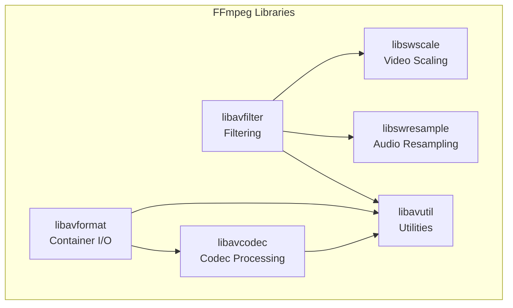

### Library Details

| Library | Purpose | Examples |
|---------|---------|----------|
| **libavformat** | Muxing/demuxing | MP4, MKV, WebM, RTMP |
| **libavcodec** | Encoding/decoding | H.264, H.265, AAC, MP3 |
| **libavfilter** | Audio/video filters | scale, crop, overlay |
| **libswscale** | Video scaling/conversion | Pixel format changes |
| **libswresample** | Audio resampling | Sample rate conversion |
| **libavutil** | Common utilities | Memory, math, logging |

---

## 🔄 Data Flow: Step by Step

### 1. Protocol Layer

Handles reading from various sources:

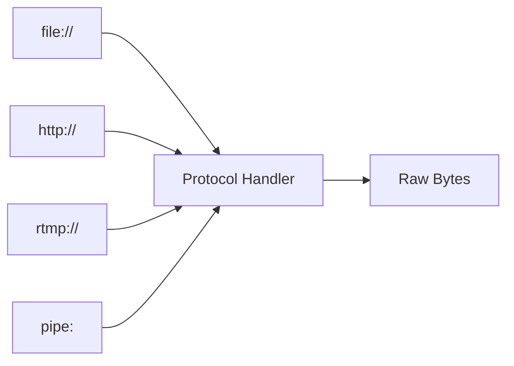

```bash
# Local file
ffmpeg -i video.mp4 ...

# HTTP URL
ffmpeg -i http://example.com/video.mp4 ...

# RTMP stream
ffmpeg -i rtmp://server/live/stream ...

# Pipe input
cat video.mp4 | ffmpeg -i pipe:0 ...
```

### 2. Demuxing

The demuxer splits the container into separate streams:

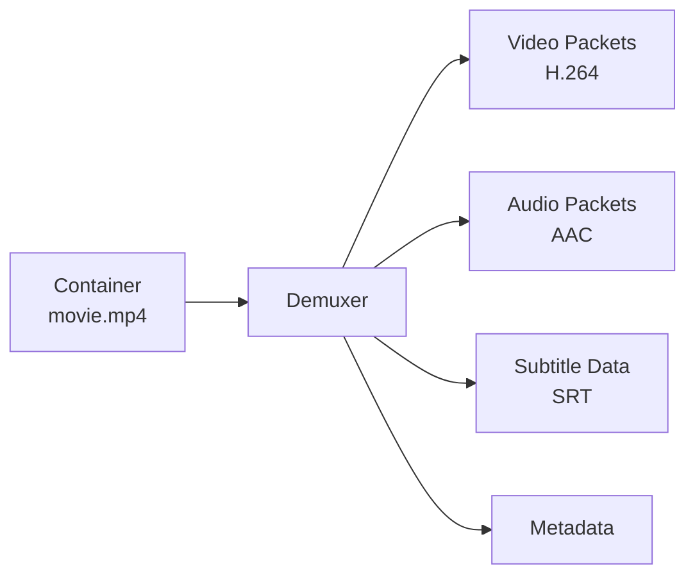

```bash
# See what the demuxer extracts
ffprobe -show_streams video.mp4
```

### 3. Decoding

Decoders convert compressed packets to raw frames:

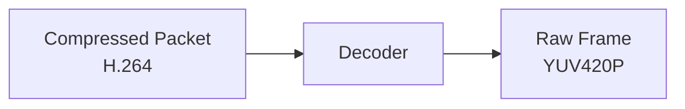

- **Video**: Compressed → Pixel data (YUV, RGB)
- **Audio**: Compressed → Sample data (PCM)

### 4. Filtering (Optional)

Filters transform raw frames:

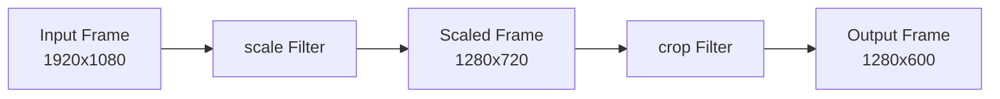

```bash
# Filter chain example
ffmpeg -i input.mp4 -vf "scale=1280:720,crop=1280:600" output.mp4
```

### 5. Encoding

Encoders compress raw frames back to packets:

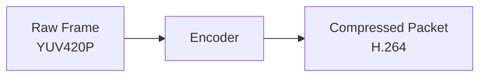

### 6. Muxing

The muxer combines streams into the output container:

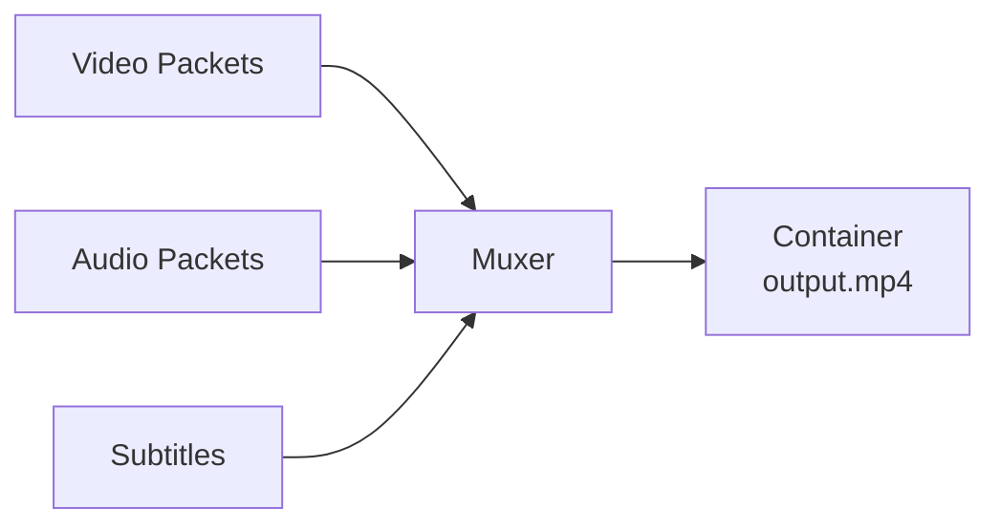

---

## 📊 Packets vs Frames

Understanding the difference is crucial:

| Concept | Description | State |
|---------|-------------|-------|
| **Packet** | Compressed data unit | What's stored in files |
| **Frame** | Uncompressed data | What filters work on |

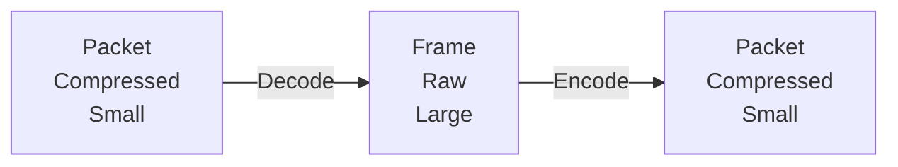

### Size Comparison

| Type | 1080p Video | Audio (1s) |
|------|-------------|------------|
| Raw Frame | ~6 MB | ~200 KB |
| Encoded Packet | ~50 KB | ~15 KB |

---

## 🔀 Stream Copy vs. Re-encoding

When you use `-c copy`, the pipeline shortcuts:

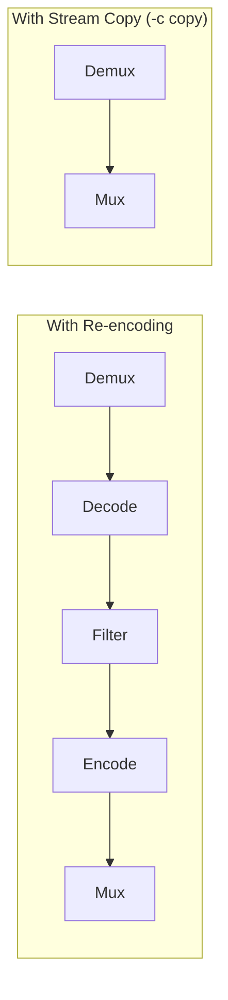

```bash
# Full pipeline (decode + encode)
ffmpeg -i input.mp4 -c:v libx264 output.mp4

# Shortened pipeline (stream copy)
ffmpeg -i input.mp4 -c copy output.mp4
```

---

## 🕐 Timestamps and Timing

FFmpeg uses timestamps to synchronize streams:

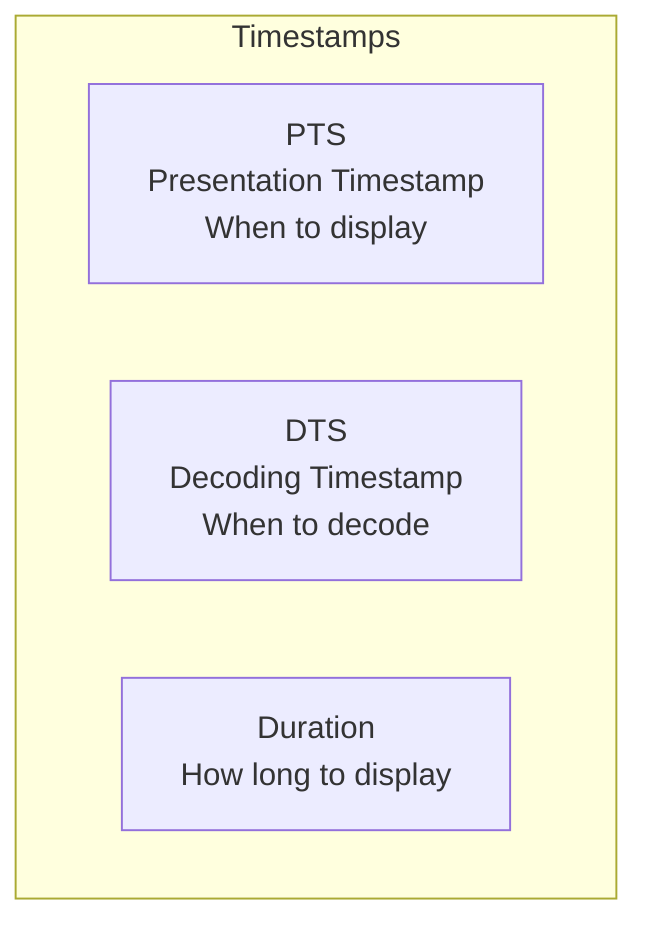

| Timestamp | Purpose |
|-----------|---------|
| **PTS** | When frame should be displayed |
| **DTS** | When frame should be decoded (for B-frames) |
| **Duration** | Frame display duration |

```bash
# Show frame timestamps
ffprobe -show_packets -select_streams v input.mp4 | grep pts_time
```

---

## 📋 Viewing Pipeline Information

### Debug Output

```bash
# Show detailed processing info
ffmpeg -v debug -i input.mp4 -c copy output.mp4

# Show graph of filters
ffmpeg -v info -i input.mp4 -vf "scale=1280:720" -f null -
```

### Check Supported Features

```bash
# List supported formats
ffmpeg -formats

# List supported codecs
ffmpeg -codecs

# List supported encoders
ffmpeg -encoders

# List supported decoders
ffmpeg -decoders

# List supported filters
ffmpeg -filters

# List protocols
ffmpeg -protocols
```

---

## ✅ Best Practices

> [!TIP]
> **Use Stream Copy When Possible**: Skip decoding/encoding for maximum speed and quality preservation.

> [!IMPORTANT]
> **Filtering Requires Decoding**: You cannot apply filters with `-c copy`. Filters work on raw frames, not packets.

> [!NOTE]
> **Pipeline Order Matters**: FFmpeg processes in order: demux → decode → filter → encode → mux.

### Common Pipeline Patterns

| Pattern | Use Case | Command |
|---------|----------|---------|
| Stream copy | Container change | `-c copy` |
| Filter only | Effects | `-vf "filter" -c:a copy` |
| Full transcode | Codec change | `-c:v libx264 -c:a aac` |
| Video only | Process video | `-c:v libx264 -an` |

---

## 🏋️ Exercises

### Exercise 1: Trace the Pipeline
Run this command and identify each stage:
```bash
ffmpeg -v verbose -i input.mp4 -vf "scale=720:-2" -c:v libx264 -c:a copy output.mp4
```

### Exercise 2: Compare Stream Copy vs Transcode
Time these two commands:
```bash
# Stream copy
time ffmpeg -i input.mp4 -c copy output1.mp4

# Transcode
time ffmpeg -i input.mp4 -c:v libx264 -c:a aac output2.mp4
```

### Exercise 3: Explore Libraries
Use ffprobe to examine:
1. Container format
2. Video codec
3. Audio codec
4. Frame count

---

## 📝 Summary

| Component | Function |
|-----------|----------|
| libavformat | Container handling (demux/mux) |
| libavcodec | Codec processing (decode/encode) |
| libavfilter | Frame transformation |
| Pipeline | Demux → Decode → Filter → Encode → Mux |
| Stream Copy | Skips decode/encode for speed |
| Packets | Compressed data units |
| Frames | Raw, uncompressed data |

---

## ➡️ Next Steps

Proceed to [3.2 Transcoding vs Remuxing](../3.2-transcoding-remuxing/) to learn when to use each approach.
