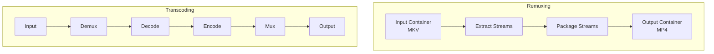
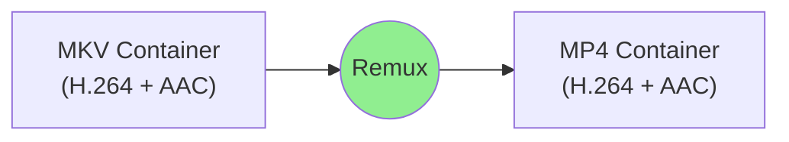
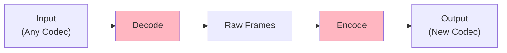
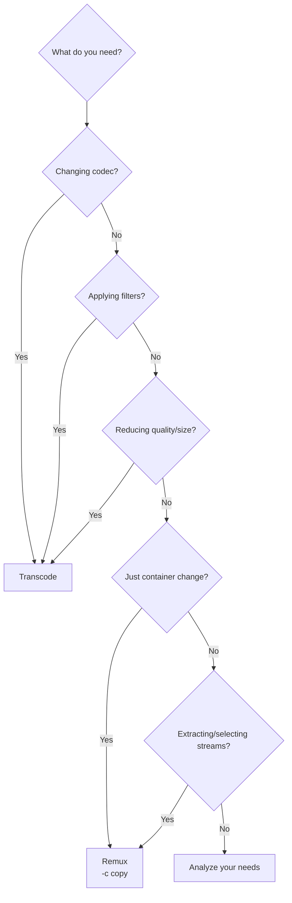

# 3.2 Transcoding vs Remuxing

## 🎯 Learning Objectives

By the end of this chapter, you will:
- Clearly understand the difference between transcoding and remuxing
- Know when to use each approach
- Avoid common pitfalls that cause quality loss
- Make informed decisions for your workflow

---

## 📊 The Core Difference



| Aspect | Remuxing | Transcoding |
|--------|----------|-------------|
| **What changes** | Container only | Codec/quality |
| **Speed** | Very fast (seconds) | Slow (minutes/hours) |
| **Quality** | No loss | Potential loss |
| **File size** | Same | Changes |
| **Command** | `-c copy` | `-c:v libx264` |

---

## 📦 Remuxing (Stream Copy)

Remuxing simply repackages streams without re-encoding:



### When to Remux

- ✅ Changing container format (MKV → MP4)
- ✅ Extracting specific streams
- ✅ Fast processing needed
- ✅ Quality preservation is critical

### Remux Commands

```bash
# MKV to MP4 (container change only)
ffmpeg -i input.mkv -c copy output.mp4

# AVI to MKV
ffmpeg -i input.avi -c copy output.mkv

# Extract video stream only
ffmpeg -i input.mkv -c:v copy -an output.mp4
```

### Remux Limitations

> [!WARNING]
> Stream copy only works when the target container supports the source codecs!

```bash
# ❌ This will FAIL - MP4 doesn't support VP9
ffmpeg -i vp9_video.mkv -c copy output.mp4

# ✅ Use MKV or WebM for VP9
ffmpeg -i vp9_video.mkv -c copy output.webm
```

---

## 🔄 Transcoding

Transcoding decodes and re-encodes the media:



### When to Transcode

- ✅ Changing codecs (H.264 → H.265)
- ✅ Applying filters
- ✅ Reducing file size
- ✅ Changing quality/bitrate
- ✅ Target device compatibility

### Transcode Commands

```bash
# Change to H.265
ffmpeg -i input.mp4 -c:v libx265 -c:a copy output.mp4

# Apply filter (requires decode/encode)
ffmpeg -i input.mp4 -vf "scale=1280:720" -c:a copy output.mp4

# Reduce quality/size
ffmpeg -i input.mp4 -c:v libx264 -crf 28 -c:a copy output.mp4
```

---

## 🎯 Decision Tree



---

## ⚡ Performance Comparison

Testing on a 1-hour 1080p video:

| Operation | Time | Output Size | Quality |
|-----------|------|-------------|---------|
| Remux (MKV→MP4) | ~5 seconds | Same | No change |
| Transcode (medium) | ~30 minutes | Variable | Depends on CRF |
| Transcode (slow) | ~90 minutes | Smaller | Same as medium |

---

## 🔀 Hybrid Approach

You can mix remuxing and transcoding for different streams:

```bash
# Transcode video, copy audio
ffmpeg -i input.mkv -c:v libx264 -crf 23 -c:a copy output.mp4

# Copy video, transcode audio
ffmpeg -i input.mkv -c:v copy -c:a aac -b:a 192k output.mp4

# Transcode video with filter, copy audio
ffmpeg -i input.mkv -vf "scale=1280:720" -c:v libx264 -c:a copy output.mp4
```

---

## ⚠️ Common Pitfalls

### 1. Unnecessary Transcoding

```bash
# ❌ BAD: Transcodes when not needed
ffmpeg -i input.mp4 output.mp4

# ✅ GOOD: Use copy if just changing container
ffmpeg -i input.mp4 -c copy output.mkv
```

### 2. Incompatible Codec-Container

```bash
# ❌ FAILS: VP9 not supported in MP4
ffmpeg -i vp9.webm -c copy output.mp4

# ✅ WORKS: WebM supports VP9
ffmpeg -i vp9.webm -c copy output_copy.webm

# ✅ OR transcode to compatible codec
ffmpeg -i vp9.webm -c:v libx264 -c:a aac output.mp4
```

### 3. Quality Loss from Chain Transcoding

```bash
# ❌ BAD: Multiple transcodes = quality degradation
ffmpeg -i original.mp4 -c:v libx264 step1.mp4
ffmpeg -i step1.mp4 -c:v libx264 step2.mp4
ffmpeg -i step2.mp4 -c:v libx264 step3.mp4

# ✅ GOOD: Single transcode from original
ffmpeg -i original.mp4 -c:v libx264 final.mp4
```

---

## 📋 Compatibility Matrix

### Container-Codec Compatibility

| Container | H.264 | H.265 | VP9 | AV1 | AAC | MP3 | Opus |
|-----------|:-----:|:-----:|:---:|:---:|:---:|:---:|:----:|
| MP4 | ✅ | ✅ | ❌ | ✅ | ✅ | ✅ | ❌ |
| MKV | ✅ | ✅ | ✅ | ✅ | ✅ | ✅ | ✅ |
| WebM | ❌ | ❌ | ✅ | ✅ | ❌ | ❌ | ✅ |
| MOV | ✅ | ✅ | ❌ | ❌ | ✅ | ✅ | ❌ |
| AVI | ✅ | ❌ | ❌ | ❌ | ❌ | ✅ | ❌ |

---

## 🧪 Testing Before Committing

Always test your approach on a short sample:

```bash
# Create a 10-second sample
ffmpeg -ss 60 -i input.mp4 -t 10 -c copy sample.mp4

# Test remux
ffmpeg -i sample.mp4 -c copy test_remux.mkv

# Test transcode
ffmpeg -i sample.mp4 -c:v libx264 -crf 23 test_transcode.mp4

# Compare results
ffprobe test_remux.mkv
ffprobe test_transcode.mp4
```

---

## ✅ Best Practices

> [!TIP]
> **Default to Remux**: When in doubt, try `-c copy` first. It's fast and lossless.

> [!IMPORTANT]
> **Preserve Originals**: Keep original files until you've verified the output is correct.

> [!WARNING]
> **Avoid Multiple Transcodes**: Each transcode loses quality. Always work from the original source.

### Quick Reference

| Goal | Method | Command |
|------|--------|---------|
| Change container | Remux | `-c copy` |
| Change codec | Transcode | `-c:v libx264` |
| Apply filter | Transcode | `-vf "filter"` |
| Reduce size | Transcode | `-c:v libx264 -crf 28` |
| Fast processing | Remux | `-c copy` |
| Maximum quality | Remux (or high-quality transcode) | `-c copy` or `-crf 17` |

---

## 🏋️ Exercises

### Exercise 1: Identify the Need
For each scenario, decide if you should remux or transcode:
1. Convert MKV (H.264/AAC) to MP4
2. Make a video smaller
3. Add blur effect
4. Change FLAC audio to AAC
5. Extract video from WebM (VP9)

### Exercise 2: Speed Test
Compare remux vs transcode times on the same video.

### Exercise 3: Compatibility Check
Try remuxing a VP9/Opus WebM to MP4. Observe the error and fix it.

---

## 📝 Summary

| Concept | Remuxing | Transcoding |
|---------|----------|-------------|
| Command | `-c copy` | `-c:v libx264` |
| Speed | Instant | Slow |
| Quality | Preserved | May change |
| Use when | Container change | Codec/quality change |
| CPU usage | Minimal | High |

---

## ➡️ Next Steps

Proceed to [3.3 Advanced Encoding Options](../3.3-encoding-options/) to learn how to optimize transcoding settings.
