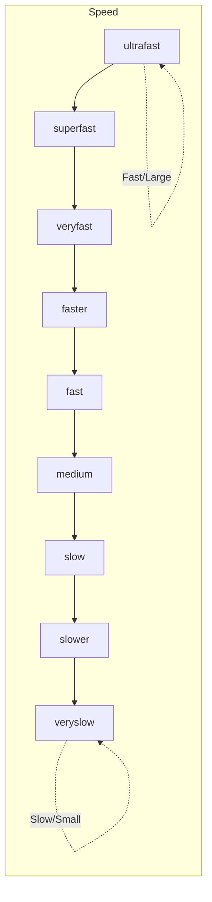
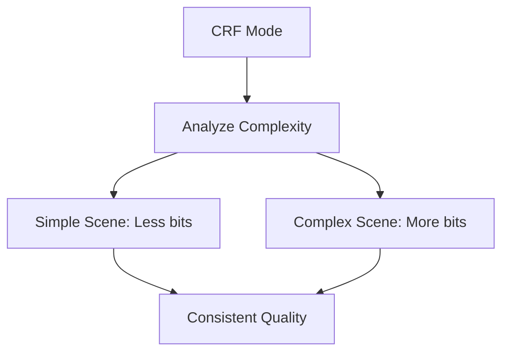

# 3.3 Advanced Encoding Options

## 🎯 Learning Objectives

By the end of this chapter, you will:
- Configure H.264/H.265 encoders for optimal results
- Understand presets, profiles, and levels
- Master rate control methods
- Tune encoders for specific content types

---

## 🎛️ H.264 (x264) Configuration

H.264 remains the most widely compatible video codec.

### Presets

Presets balance encoding speed vs. compression efficiency:



| Preset | Speed | File Size | Use Case |
|--------|-------|-----------|----------|
| `ultrafast` | 10x | Largest | Live streaming |
| `veryfast` | 5x | Large | Quick previews |
| `fast` | 2x | Medium | General encoding |
| `medium` | 1x (default) | Balanced | Most uses |
| `slow` | 0.5x | Small | Final delivery |
| `veryslow` | 0.25x | Smallest | Archival |

```bash
# Using presets
ffmpeg -i input.mp4 -c:v libx264 -preset fast -crf 23 output.mp4
ffmpeg -i input.mp4 -c:v libx264 -preset slow -crf 23 output.mp4
```

### Profiles

Profiles define feature sets for device compatibility:

| Profile | Features | Compatibility |
|---------|----------|---------------|
| `baseline` | No B-frames, no CABAC | Old devices, live streaming |
| `main` | B-frames, CABAC | Most devices |
| `high` | 8x8 transform, more ref frames | Modern devices |
| `high10` | 10-bit color | HDR content |

```bash
# Maximum compatibility
ffmpeg -i input.mp4 -c:v libx264 -profile:v baseline -level 3.0 output.mp4

# Best quality (default)
ffmpeg -i input.mp4 -c:v libx264 -profile:v high -level 4.1 output.mp4
```

### Levels

Levels define maximum parameters based on resolution and bitrate:

| Level | Max Resolution | Max Bitrate | Example Use |
|-------|----------------|-------------|-------------|
| 3.0 | 720×576 | 10 Mbps | DVD |
| 3.1 | 1280×720 | 14 Mbps | 720p streaming |
| 4.0 | 1920×1080 | 20 Mbps | 1080p streaming |
| 4.1 | 1920×1080 | 50 Mbps | Blu-ray |
| 5.1 | 4096×2160 | 300 Mbps | 4K |

```bash
# Set specific level
ffmpeg -i input.mp4 -c:v libx264 -profile:v high -level:v 4.1 output.mp4
```

---

## 🎚️ Rate Control Methods

### CRF (Constant Rate Factor)

Best for file-based output where quality is priority:



```bash
# CRF 0-51 (lower = better quality, larger files)
ffmpeg -i input.mp4 -c:v libx264 -crf 18 output.mp4   # High quality
ffmpeg -i input.mp4 -c:v libx264 -crf 23 output.mp4   # Default
ffmpeg -i input.mp4 -c:v libx264 -crf 28 output.mp4   # Smaller
```

### CBR (Constant Bitrate)

Fixed bitrate output, essential for streaming:

```bash
# 5 Mbps constant bitrate
ffmpeg -i input.mp4 -c:v libx264 -b:v 5M -minrate 5M -maxrate 5M -bufsize 10M output.mp4
```

### VBR (Variable Bitrate)

Target average with flexibility:

```bash
# Target 5 Mbps with 1.5x peak allowed
ffmpeg -i input.mp4 -c:v libx264 -b:v 5M -maxrate 7.5M -bufsize 10M output.mp4
```

### Two-Pass Encoding

Best accuracy for target file size:

```bash
# Pass 1: Analyze
ffmpeg -i input.mp4 -c:v libx264 -b:v 5M -pass 1 -f null NUL

# Pass 2: Encode
ffmpeg -i input.mp4 -c:v libx264 -b:v 5M -pass 2 output.mp4
```

---

## 🎬 H.265/HEVC Configuration

H.265 offers ~50% better compression than H.264:

```bash
# Basic H.265
ffmpeg -i input.mp4 -c:v libx265 -crf 28 output.mp4

# H.265 with preset
ffmpeg -i input.mp4 -c:v libx265 -preset medium -crf 28 output.mp4
```

### H.265 CRF Values

| CRF | Equivalent H.264 | Quality |
|-----|------------------|---------|
| 22-24 | 18-20 | High |
| 26-28 | 22-24 | Good |
| 30-32 | 26-28 | Medium |
| 34+ | 30+ | Low |

### x265 Tune Options

```bash
# Optimize for specific content
ffmpeg -i input.mp4 -c:v libx265 -crf 28 -tune grain output.mp4
ffmpeg -i input.mp4 -c:v libx265 -crf 28 -tune animation output.mp4
```

---

## 🎭 Tune Options

Optimize encoder for content type:

| Tune | Use Case |
|------|----------|
| `film` | High-quality movie content |
| `animation` | Animated content (flat areas) |
| `grain` | Preserve film grain |
| `stillimage` | Slideshow content |
| `fastdecode` | Low-power devices |
| `zerolatency` | Real-time streaming |

```bash
# Film content
ffmpeg -i input.mp4 -c:v libx264 -crf 20 -tune film output.mp4

# Animation
ffmpeg -i anime.mp4 -c:v libx264 -crf 20 -tune animation output.mp4

# Low-latency streaming
ffmpeg -i input.mp4 -c:v libx264 -preset veryfast -tune zerolatency output.mp4
```

---

## 🎨 Advanced x264 Options

### Reference Frames

More reference frames = better compression, slower encoding:

```bash
ffmpeg -i input.mp4 -c:v libx264 -refs 6 output.mp4
```

### B-Frames

Bidirectional frames for better compression:

```bash
# Maximum 3 consecutive B-frames (default)
ffmpeg -i input.mp4 -c:v libx264 -bf 3 output.mp4

# Disable B-frames (for compatibility)
ffmpeg -i input.mp4 -c:v libx264 -bf 0 output.mp4
```

### GOP Size (Keyframe Interval)

```bash
# Keyframe every 2 seconds at 30fps
ffmpeg -i input.mp4 -c:v libx264 -g 60 output.mp4

# Force keyframe at scene changes
ffmpeg -i input.mp4 -c:v libx264 -g 250 -sc_threshold 40 output.mp4
```

### Motion Estimation

```bash
# Higher quality motion estimation
ffmpeg -i input.mp4 -c:v libx264 -me_method umh output.mp4
```

---

## 📊 Recommended Settings

### High Quality Archival

```bash
ffmpeg -i input.mp4 \
  -c:v libx264 \
  -preset veryslow \
  -crf 17 \
  -profile:v high \
  -level:v 4.1 \
  -c:a flac \
  archive.mkv
```

### YouTube/Streaming Upload

```bash
ffmpeg -i input.mp4 \
  -c:v libx264 \
  -preset slow \
  -crf 18 \
  -profile:v high \
  -level:v 4.0 \
  -movflags +faststart \
  -c:a aac -b:a 192k \
  youtube.mp4
```

### Web Delivery

```bash
ffmpeg -i input.mp4 \
  -c:v libx264 \
  -preset medium \
  -crf 23 \
  -profile:v main \
  -level:v 3.1 \
  -movflags +faststart \
  -c:a aac -b:a 128k \
  web.mp4
```

### Live Streaming

```bash
ffmpeg -i input \
  -c:v libx264 \
  -preset veryfast \
  -tune zerolatency \
  -b:v 3M \
  -maxrate 3M \
  -bufsize 6M \
  -g 60 \
  -c:a aac -b:a 128k \
  -f flv rtmp://server/live/stream
```

---

## ⚡ VP9 and AV1

### VP9 Configuration

```bash
# VP9 with constrained quality
ffmpeg -i input.mp4 \
  -c:v libvpx-vp9 \
  -crf 30 -b:v 0 \
  -c:a libopus -b:a 128k \
  output.webm
```

### AV1 Configuration

```bash
# AV1 with libaom (slow but efficient)
ffmpeg -i input.mp4 \
  -c:v libaom-av1 \
  -crf 30 \
  -cpu-used 4 \
  -c:a libopus \
  output.webm

# AV1 with SVT-AV1 (faster)
ffmpeg -i input.mp4 \
  -c:v libsvtav1 \
  -crf 30 \
  -preset 6 \
  output.mp4
```

---

## ✅ Best Practices

> [!TIP]
> **Start with CRF**: For most file encoding, CRF gives the best quality-per-bit.

> [!TIP]
> **Match Profile to Target**: Use `baseline` for maximum compatibility, `high` for quality.

> [!IMPORTANT]
> **Two-Pass for Size Targets**: When you need a specific file size, two-pass encoding is most accurate.

> [!WARNING]
> **Slow Presets Are Slow**: `veryslow` can take 10x longer than `medium`. Balance quality needs with time constraints.

---

## 🏋️ Exercises

### Exercise 1: Preset Comparison
Encode the same video with `fast`, `medium`, and `slow` presets at CRF 23. Compare:
- Encoding time
- File size
- Visual quality

### Exercise 2: CRF Ladder
Create encodes at CRF 18, 23, 28. Note the quality vs size tradeoff.

### Exercise 3: Two-Pass Encoding
Use two-pass to hit a specific target file size.

---

## 📝 Summary

| Setting | Purpose | Example |
|---------|---------|---------|
| Preset | Speed/size balance | `-preset slow` |
| CRF | Quality control | `-crf 23` |
| Profile | Feature set | `-profile:v high` |
| Level | Resolution/bitrate limits | `-level:v 4.1` |
| Tune | Content optimization | `-tune film` |
| Bitrate | Target file size | `-b:v 5M` |

---

## ➡️ Next Steps

Proceed to [3.4 Filter Graphs Introduction](../3.4-filter-graphs/) to learn the FFmpeg filter system.
