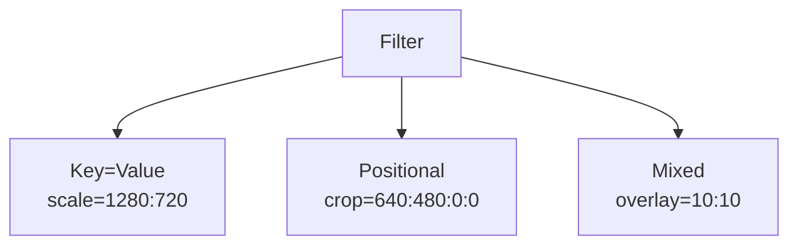
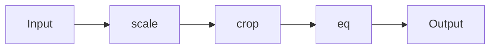
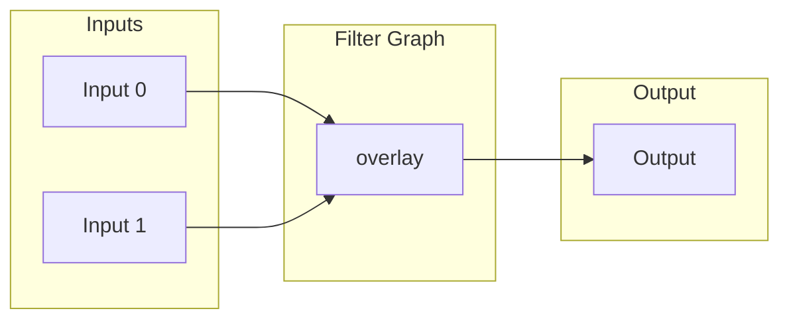
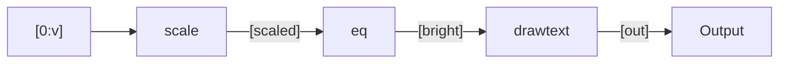

# 3.4 Filter Graphs Introduction

## 🎯 Learning Objectives

By the end of this chapter, you will:
- Understand FFmpeg filter graph syntax
- Build simple and complex filter chains
- Use named streams for multi-input filters
- Chain multiple filters effectively

---

## 🔗 What Are Filter Graphs?

Filter graphs are chains of processing operations applied to raw frames:


### Types of Filter Graphs

| Type | Option | Description |
|------|--------|-------------|
| Simple | `-vf` / `-af` | Single input, single output |
| Complex | `-filter_complex` | Multiple inputs/outputs |

---

## 📝 Simple Filter Syntax

### Video Filters (-vf)

```bash
# Single filter
ffmpeg -i input.mp4 -vf "scale=1280:720" output.mp4

# Multiple filters (chained with comma)
ffmpeg -i input.mp4 -vf "scale=1280:720,eq=brightness=0.1" output.mp4
```

### Audio Filters (-af)

```bash
# Single audio filter
ffmpeg -i input.mp4 -af "volume=1.5" output.mp4

# Multiple audio filters
ffmpeg -i input.mp4 -af "volume=1.5,equalizer=f=1000:t=h:w=200:g=3" output.mp4
```

---

## 🧩 Filter Parameters

Filters accept parameters in different formats:



```bash
# Key-value format
ffmpeg -i input.mp4 -vf "scale=width=1280:height=720" output.mp4

# Positional format
ffmpeg -i input.mp4 -vf "scale=1280:720" output.mp4

# Shorthand
ffmpeg -i input.mp4 -vf "scale=1280:-1" output.mp4
```

### Parameter Escaping

When parameters contain special characters:

```bash
# Text with spaces (quote the parameter)
ffmpeg -i input.mp4 -vf "drawtext=text='Hello World':fontsize=48" output.mp4

# Use escape characters
ffmpeg -i input.mp4 -vf "drawtext=text=Hello\ World:fontsize=48" output.mp4
```

---

## 🔄 Filter Chains

Chain multiple filters with commas:



```bash
# Chain syntax: filter1,filter2,filter3
ffmpeg -i input.mp4 -vf "scale=1280:720,crop=1280:600,eq=brightness=0.1" output.mp4
```

### Order Matters!

```bash
# Crop THEN Scale (different result)
ffmpeg -i input.mp4 -vf "crop=960:540,scale=1280:720" output.mp4

# Scale THEN Crop (different result)
ffmpeg -i input.mp4 -vf "scale=1280:720,crop=1280:600" output.mp4
```

---

## 🔀 Complex Filter Graphs

For operations with multiple inputs or outputs, use `-filter_complex`:



### Stream Labels

Complex filters use labeled streams:

```
[input_label]filter[output_label]
```

```bash
# Basic overlay with labels
ffmpeg -i video.mp4 -i logo.png \
  -filter_complex "[0:v][1:v]overlay=10:10[out]" \
  -map "[out]" -map 0:a \
  output.mp4
```

### Label Conventions

| Label | Meaning |
|-------|---------|
| `[0:v]` | Video stream from first input |
| `[0:a]` | Audio stream from first input |
| `[1:v]` | Video stream from second input |
| `[out]` | Custom output label |
| `[v]`, `[a]` | Custom labels |

---

## 📊 Complex Filter Examples

### Overlay (Picture-in-Picture)

```bash
# Main video with logo overlay
ffmpeg -i main.mp4 -i logo.png \
  -filter_complex "[0:v][1:v]overlay=W-w-10:H-h-10[out]" \
  -map "[out]" -map 0:a -c:a copy \
  output.mp4

# W = main video width, w = overlay width
# H = main video height, h = overlay height
```

### Side-by-Side

```bash
# Two videos side by side
ffmpeg -i left.mp4 -i right.mp4 \
  -filter_complex "[0:v]scale=640:-1[l];[1:v]scale=640:-1[r];[l][r]hstack[out]" \
  -map "[out]" \
  output.mp4
```

### Split and Process Differently

```bash
# Split video, process each path, recombine
ffmpeg -i input.mp4 \
  -filter_complex "[0:v]split=2[a][b];[a]crop=640:360[ca];[b]crop=640:360:640:0[cb];[ca][cb]hstack[out]" \
  -map "[out]" \
  output.mp4
```

---

## 🎨 Filter Graph Visualization

### Reading Complex Filters

```
[0:v]scale=1280:720[scaled];[scaled]eq=brightness=0.1[bright];[bright]drawtext=text='Title'[out]
```

Breaks down to:



### Multi-line Format (Readable)

```bash
ffmpeg -i input.mp4 -filter_complex "
  [0:v]scale=1280:720[scaled];
  [scaled]eq=brightness=0.1[bright];
  [bright]drawtext=text='Title'[out]
" -map "[out]" output.mp4
```

---

## 📋 Common Filter Graph Patterns

### Pattern 1: Simple Chain

```bash
-vf "filter1,filter2,filter3"
```

### Pattern 2: Named Streams

```bash
-filter_complex "[0:v]filter1[tmp];[tmp]filter2[out]" -map "[out]"
```

### Pattern 3: Multiple Inputs

```bash
-filter_complex "[0:v][1:v]overlay[out]" -map "[out]"
```

### Pattern 4: Split and Merge

```bash
-filter_complex "[0:v]split=2[a][b];[a]filter1[a1];[b]filter2[b1];[a1][b1]hstack[out]"
```

---

## ✅ Best Practices

> [!TIP]
> **Start Simple**: Build filter graphs incrementally. Test each filter before adding the next.

> [!TIP]
> **Use ffplay for Testing**: Preview filters in real-time before committing to long encodes.
> ```bash
> ffplay -vf "scale=720:-1,eq=brightness=0.1" input.mp4
> ```

> [!IMPORTANT]
> **Always Map Complex Outputs**: When using `-filter_complex`, explicitly `-map` your output streams.

> [!WARNING]
> **Mind the Order**: Filter order significantly affects output. Scale, then crop, is different from crop, then scale.

---

## 🏋️ Exercises

### Exercise 1: Simple Filter Chain
Create a chain that: scales to 720p → adds brightness → adds text overlay.

### Exercise 2: Two-Input Blend
Overlay a logo on a video in the bottom-right corner.

### Exercise 3: Split Processing
Split a video, apply different color adjustments to each half, rejoin them side by side.

---

## 📝 Summary

| Concept | Syntax | Use Case |
|---------|--------|----------|
| Simple filter | `-vf "filter"` | Single stream |
| Chain | `-vf "f1,f2,f3"` | Sequential processing |
| Complex | `-filter_complex` | Multiple inputs/outputs |
| Labels | `[0:v]`, `[out]` | Stream identification |
| Split | `split=2[a][b]` | Duplicate stream |

---

## ➡️ Next Steps

Proceed to [3.5 Video Filters](../3.5-video-filters/) for a comprehensive guide to video filter operations.
