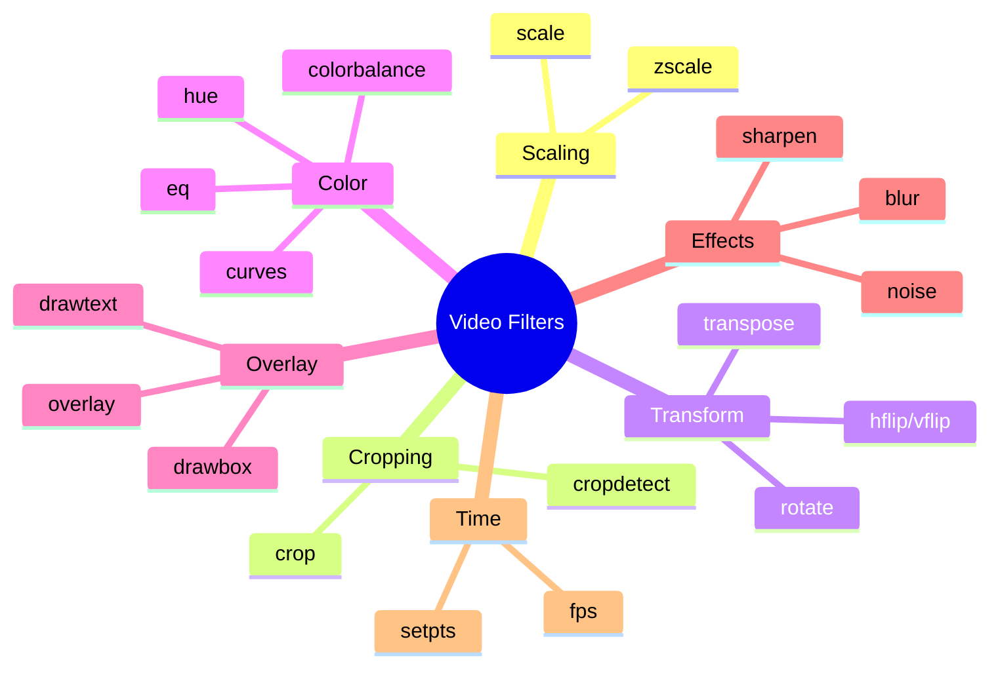

# 3.5 Video Filters

## 🎯 Learning Objectives

By the end of this chapter, you will:
- Apply essential video filters confidently
- Chain multiple filters for complex effects
- Understand filter parameters and options
- Create professional-looking video modifications

---

## 📊 Filter Categories



---

## 📐 Scaling Filters

### scale

The most-used filter for resizing:

```bash
# Specific dimensions
ffmpeg -i input.mp4 -vf "scale=1280:720" output.mp4

# Width auto (maintain aspect ratio)
ffmpeg -i input.mp4 -vf "scale=-2:720" output.mp4

# Height auto
ffmpeg -i input.mp4 -vf "scale=1280:-2" output.mp4

# Percentage
ffmpeg -i input.mp4 -vf "scale=iw/2:ih/2" output.mp4

# High quality scaling
ffmpeg -i input.mp4 -vf "scale=1920:1080:flags=lanczos" output.mp4
```

### Fit and Pad

```bash
# Scale to fit within frame, add padding
ffmpeg -i input.mp4 -vf "scale=1920:1080:force_original_aspect_ratio=decrease,pad=1920:1080:-1:-1:black" output.mp4
```

---

## ✂️ Cropping Filters

### crop

Remove parts of the video frame:

```bash
# Syntax: crop=width:height:x:y
ffmpeg -i input.mp4 -vf "crop=640:480:100:50" output.mp4

# Center crop
ffmpeg -i input.mp4 -vf "crop=ih*16/9:ih" output.mp4

# Remove edges (10 pixels from each side)
ffmpeg -i input.mp4 -vf "crop=iw-20:ih-20:10:10" output.mp4
```

### Dynamic Cropping Expressions

```bash
# Center 50% of frame
ffmpeg -i input.mp4 -vf "crop=iw/2:ih/2" output.mp4

# 16:9 center crop
ffmpeg -i input.mp4 -vf "crop=min(iw\,ih*16/9):min(ih\,iw*9/16)" output.mp4
```

### cropdetect

Auto-detect black bars:

```bash
# Detect crop values
ffmpeg -i input.mp4 -vf "cropdetect" -f null -

# Then apply detected values
ffmpeg -i input.mp4 -vf "crop=1920:800:0:140" output.mp4
```

---

## 🔄 Transform Filters

### rotate

```bash
# Rotate 45 degrees (radians)
ffmpeg -i input.mp4 -vf "rotate=PI/4" output.mp4

# Rotate with fill color
ffmpeg -i input.mp4 -vf "rotate=PI/4:fillcolor=black" output.mp4
```

### transpose

```bash
# 90° clockwise
ffmpeg -i input.mp4 -vf "transpose=1" output.mp4

# 90° counter-clockwise
ffmpeg -i input.mp4 -vf "transpose=2" output.mp4

# 180° (flip + transpose)
ffmpeg -i input.mp4 -vf "transpose=1,transpose=1" output.mp4
```

| Value | Direction |
|-------|-----------|
| 0 | 90° CCW + vertical flip |
| 1 | 90° clockwise |
| 2 | 90° counter-clockwise |
| 3 | 90° CW + vertical flip |

### Flip

```bash
# Horizontal mirror
ffmpeg -i input.mp4 -vf "hflip" output.mp4

# Vertical flip
ffmpeg -i input.mp4 -vf "vflip" output.mp4

# Both (180° rotation)
ffmpeg -i input.mp4 -vf "hflip,vflip" output.mp4
```

---

## 🎨 Color Adjustment Filters

### eq (Equalizer)

```bash
# Brightness (-1 to 1, default 0)
ffmpeg -i input.mp4 -vf "eq=brightness=0.1" output.mp4

# Contrast (0 to 2, default 1)
ffmpeg -i input.mp4 -vf "eq=contrast=1.2" output.mp4

# Saturation (0 to 3, default 1)
ffmpeg -i input.mp4 -vf "eq=saturation=1.5" output.mp4

# Combined
ffmpeg -i input.mp4 -vf "eq=brightness=0.1:contrast=1.1:saturation=1.2" output.mp4

# Gamma
ffmpeg -i input.mp4 -vf "eq=gamma=1.5" output.mp4
```

### hue

```bash
# Rotate hue (degrees)
ffmpeg -i input.mp4 -vf "hue=h=90" output.mp4

# Adjust saturation via hue
ffmpeg -i input.mp4 -vf "hue=s=2" output.mp4
```

### colorbalance

```bash
# Warm up shadows, cool down highlights
ffmpeg -i input.mp4 -vf "colorbalance=rs=0.3:gs=-0.1:bs=-0.1" output.mp4
```

### Grayscale/Monochrome

```bash
# Convert to grayscale
ffmpeg -i input.mp4 -vf "colorchannelmixer=.3:.4:.3:0:.3:.4:.3:0:.3:.4:.3" output.mp4

# Or using format filter
ffmpeg -i input.mp4 -vf "format=gray" output.mp4
```

---

## 📝 Text and Overlay Filters

### drawtext

```bash
# Basic text
ffmpeg -i input.mp4 -vf "drawtext=text='Hello World':fontsize=48:fontcolor=white:x=10:y=10" output.mp4

# Centered text
ffmpeg -i input.mp4 -vf "drawtext=text='Title':fontsize=72:fontcolor=white:x=(w-text_w)/2:y=(h-text_h)/2" output.mp4

# With font file
ffmpeg -i input.mp4 -vf "drawtext=text='Custom Font':fontfile='C\\:/Windows/Fonts/Arial.ttf':fontsize=48" output.mp4

# Timestamp
ffmpeg -i input.mp4 -vf "drawtext=text='%{pts\\:hms}':fontsize=24:x=10:y=10:fontcolor=white:box=1:boxcolor=black@0.5" output.mp4

# Frame number
ffmpeg -i input.mp4 -vf "drawtext=text='%{n}':fontsize=48:x=10:y=10" output.mp4
```

### drawbox

```bash
# Draw rectangle
ffmpeg -i input.mp4 -vf "drawbox=x=100:y=100:w=200:h=100:color=red@0.5:t=fill" output.mp4

# Border box
ffmpeg -i input.mp4 -vf "drawbox=x=100:y=100:w=200:h=100:color=red:t=5" output.mp4
```

### overlay

```bash
# Basic overlay (logo in corner)
ffmpeg -i video.mp4 -i logo.png \
  -filter_complex "[0:v][1:v]overlay=W-w-10:H-h-10" \
  output.mp4

# Center overlay
ffmpeg -i video.mp4 -i watermark.png \
  -filter_complex "[0:v][1:v]overlay=(W-w)/2:(H-h)/2" \
  output.mp4

# Fade in overlay
ffmpeg -i video.mp4 -i logo.png \
  -filter_complex "[1:v]fade=in:st=0:d=1[logo];[0:v][logo]overlay=10:10:enable='between(t,0,5)'" \
  output.mp4
```

---

## 🌫️ Blur and Sharpen

### boxblur

```bash
# Simple blur
ffmpeg -i input.mp4 -vf "boxblur=5:1" output.mp4

# Stronger blur
ffmpeg -i input.mp4 -vf "boxblur=10:2" output.mp4
```

### gblur (Gaussian blur)

```bash
ffmpeg -i input.mp4 -vf "gblur=sigma=10" output.mp4
```

### unsharp (Sharpen)

```bash
# Default sharpening
ffmpeg -i input.mp4 -vf "unsharp=5:5:1.0" output.mp4

# Strong sharpening
ffmpeg -i input.mp4 -vf "unsharp=7:7:1.5" output.mp4
```

### Blur Specific Area

```bash
# Blur bottom region (for privacy)
ffmpeg -i input.mp4 \
  -filter_complex "[0:v]crop=iw:100:0:ih-100,gblur=sigma=20[blurred];[0:v][blurred]overlay=0:H-100" \
  output.mp4
```

---

## ⏱️ Time-Based Filters

### setpts (Change Speed)

```bash
# Half speed (slow motion)
ffmpeg -i input.mp4 -vf "setpts=2.0*PTS" output.mp4

# Double speed
ffmpeg -i input.mp4 -vf "setpts=0.5*PTS" output.mp4
```

### fps (Change Frame Rate)

```bash
# Convert to 30 fps
ffmpeg -i input.mp4 -vf "fps=30" output.mp4

# Convert to 24 fps (cinematic)
ffmpeg -i input.mp4 -vf "fps=24" output.mp4
```

### reverse

```bash
# Reverse video
ffmpeg -i input.mp4 -vf "reverse" output.mp4
```

---

## 🎭 Effects and Transitions

### fade

```bash
# Fade in (first 2 seconds)
ffmpeg -i input.mp4 -vf "fade=in:st=0:d=2" output.mp4

# Fade out (last 2 seconds of 60s video)
ffmpeg -i input.mp4 -vf "fade=out:st=58:d=2" output.mp4

# Both fades
ffmpeg -i input.mp4 -vf "fade=in:st=0:d=2,fade=out:st=58:d=2" output.mp4

# Fade to black
ffmpeg -i input.mp4 -vf "fade=in:st=0:d=2:color=black" output.mp4
```

### noise

```bash
# Add film grain
ffmpeg -i input.mp4 -vf "noise=alls=20:allf=t+u" output.mp4
```

### vignette

```bash
# Add vignette effect
ffmpeg -i input.mp4 -vf "vignette=PI/4" output.mp4
```

---

## 📋 Practical Examples

### YouTube Thumbnail Style

```bash
ffmpeg -i input.mp4 -vf "
  scale=1280:720,
  eq=contrast=1.2:saturation=1.3,
  drawtext=text='CLICK ME':fontsize=72:fontcolor=yellow:borderw=3:bordercolor=black:x=(w-text_w)/2:y=(h-text_h)/2
" -frames:v 1 thumbnail.jpg
```

### Social Media Ready

```bash
ffmpeg -i input.mp4 -vf "
  scale=1080:1920:force_original_aspect_ratio=decrease,
  pad=1080:1920:-1:-1:white,
  drawtext=text='@username':fontsize=36:fontcolor=black:x=(w-text_w)/2:y=h-50
" vertical.mp4
```

### Cinematic Look

```bash
ffmpeg -i input.mp4 -vf "
  scale=1920:800,
  eq=gamma=1.1:contrast=1.1:saturation=0.9,
  vignette=PI/5
" cinematic.mp4
```

---

## ✅ Best Practices

> [!TIP]
> **Test with ffplay First**: Preview filters before encoding.
> ```bash
> ffplay -vf "eq=brightness=0.1" input.mp4
> ```

> [!TIP]
> **Order Matters**: Scale before adding text; crop before scaling for efficiency.

> [!IMPORTANT]
> **Use -2 for Dimensions**: Avoid odd numbers that break encoders.

---

## 🏋️ Exercises

### Exercise 1: Basic Adjustments
Apply brightness, contrast, and saturation adjustments to improve a dark video.

### Exercise 2: Title Card
Add a centered title with background box on the first 3 seconds.

### Exercise 3: Watermark
Add a semi-transparent logo in the corner.

---

## 📝 Summary

| Filter | Purpose | Example |
|--------|---------|---------|
| scale | Resize | `scale=1280:720` |
| crop | Remove areas | `crop=640:480:0:0` |
| transpose | Rotate 90° | `transpose=1` |
| eq | Color adjust | `eq=brightness=0.1` |
| drawtext | Add text | `drawtext=text='Hi'` |
| overlay | Composite | `overlay=10:10` |
| boxblur | Blur | `boxblur=5:1` |
| fade | Transitions | `fade=in:d=2` |

---

## ➡️ Next Steps

Proceed to [3.6 Audio Filters](../3.6-audio-filters/) to learn audio processing techniques.
