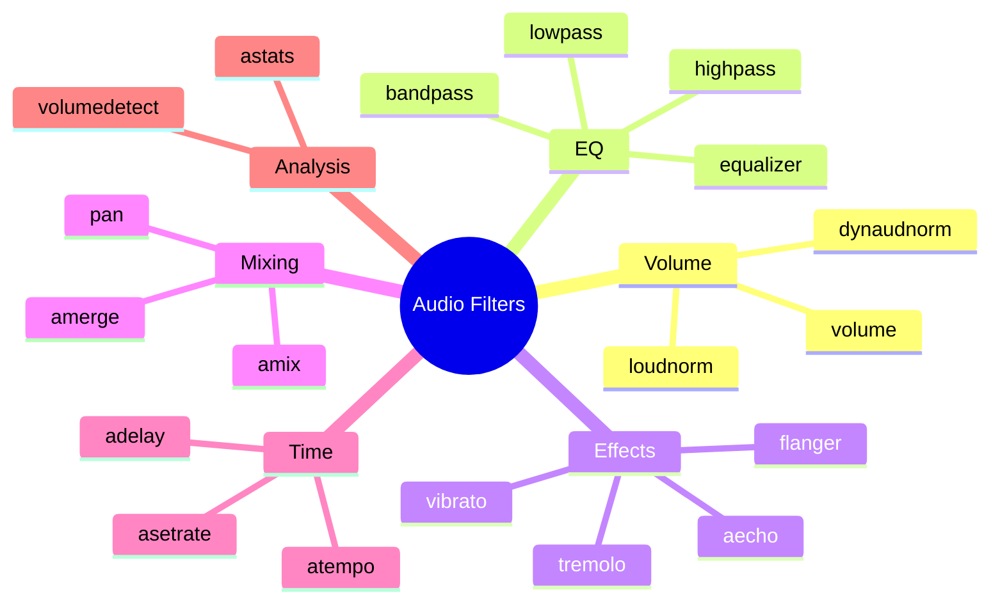

# 3.6 Audio Filters

## 🎯 Learning Objectives

By the end of this chapter, you will:
- Apply essential audio filters for common tasks
- Adjust volume and normalize audio
- Apply EQ, compression, and effects
- Combine audio from multiple sources

---

## 📊 Audio Filter Categories



---

## 🔊 Volume Control

### volume

The most basic audio adjustment:

```bash
# Increase by 50%
ffmpeg -i input.mp4 -af "volume=1.5" output.mp4

# Decrease to 50%
ffmpeg -i input.mp4 -af "volume=0.5" output.mp4

# Using decibels
ffmpeg -i input.mp4 -af "volume=3dB" output.mp4
ffmpeg -i input.mp4 -af "volume=-3dB" output.mp4
```

### Dynamic Volume Changes

```bash
# Volume ramp (quiet to loud over 10 seconds)
ffmpeg -i input.mp4 -af "volume='if(lt(t,10),t/10,1)':eval=frame" output.mp4
```

---

## 📈 Normalization

### loudnorm (EBU R128)

Industry-standard loudness normalization:

```bash
# Normalize to broadcast standard (-14 LUFS)
ffmpeg -i input.mp4 -af "loudnorm=I=-14:TP=-1:LRA=11" output.mp4

# Two-pass for best results
# Pass 1: Analyze
ffmpeg -i input.mp4 -af "loudnorm=I=-14:TP=-1:LRA=11:print_format=json" -f null -

# Pass 2: Apply (use values from pass 1)
ffmpeg -i input.mp4 -af "loudnorm=I=-14:TP=-1:LRA=11:measured_I=-24:measured_TP=-2:measured_LRA=9:measured_thresh=-35:linear=true" output.mp4
```

### dynaudnorm (Dynamic Normalization)

Smoothly normalizes varying audio levels:

```bash
# Basic dynamic normalization
ffmpeg -i input.mp4 -af "dynaudnorm" output.mp4

# With parameters
ffmpeg -i input.mp4 -af "dynaudnorm=p=0.95:m=10:s=5" output.mp4
```

### volumedetect

Analyze volume levels before processing:

```bash
ffmpeg -i input.mp4 -af "volumedetect" -f null -

# Output shows:
# mean_volume: -20.5 dB
# max_volume: -0.3 dB
```

---

## 🎚️ Equalization

### highpass / lowpass

Remove frequencies above or below a threshold:

```bash
# Remove low rumble (below 100 Hz)
ffmpeg -i input.mp4 -af "highpass=f=100" output.mp4

# Remove high frequencies (above 8000 Hz)
ffmpeg -i input.mp4 -af "lowpass=f=8000" output.mp4

# Combined (telephone effect)
ffmpeg -i input.mp4 -af "highpass=f=300,lowpass=f=3400" output.mp4
```

### bandpass / bandreject

```bash
# Pass only frequencies around 1000 Hz
ffmpeg -i input.mp4 -af "bandpass=f=1000:w=500" output.mp4

# Remove 50/60 Hz hum
ffmpeg -i input.mp4 -af "bandreject=f=60:w=1" output.mp4
```

### equalizer (Parametric EQ)

```bash
# Boost bass at 100 Hz
ffmpeg -i input.mp4 -af "equalizer=f=100:t=q:w=2:g=5" output.mp4

# Cut problem frequency
ffmpeg -i input.mp4 -af "equalizer=f=3000:t=q:w=1:g=-6" output.mp4

# Multiple bands
ffmpeg -i input.mp4 -af "equalizer=f=100:t=q:w=2:g=3,equalizer=f=1000:t=q:w=2:g=-2,equalizer=f=8000:t=q:w=2:g=2" output.mp4
```

| Parameter | Description |
|-----------|-------------|
| `f` | Center frequency (Hz) |
| `w` | Width (bandwidth) |
| `g` | Gain (dB) |
| `t` | Width type (q/h/o) |

---

## 🔉 Compression and Limiting

### acompressor

Dynamic range compression:

```bash
# Basic compression
ffmpeg -i input.mp4 -af "acompressor" output.mp4

# Voice leveling
ffmpeg -i input.mp4 -af "acompressor=threshold=-20dB:ratio=4:attack=5:release=50" output.mp4

# Heavy compression (podcast style)
ffmpeg -i input.mp4 -af "acompressor=threshold=-25dB:ratio=8:attack=5:release=100:makeup=5dB" output.mp4
```

### alimiter

Prevent clipping:

```bash
# Limit peaks to -1 dB
ffmpeg -i input.mp4 -af "alimiter=limit=0.9" output.mp4
```

---

## 🎵 Effects

### aecho

Add echo/reverb:

```bash
# Simple echo
ffmpeg -i input.mp4 -af "aecho=0.8:0.9:60:0.3" output.mp4

# Multiple echoes
ffmpeg -i input.mp4 -af "aecho=0.8:0.9:60|120|180:0.3|0.25|0.2" output.mp4
```

### areverse

Reverse audio:

```bash
ffmpeg -i input.mp4 -af "areverse" output.mp4
```

### afade

Fade in/out:

```bash
# Fade in first 3 seconds
ffmpeg -i input.mp4 -af "afade=t=in:st=0:d=3" output.mp4

# Fade out last 3 seconds
ffmpeg -i input.mp4 -af "afade=t=out:st=57:d=3" output.mp4

# Both fades
ffmpeg -i input.mp4 -af "afade=t=in:st=0:d=3,afade=t=out:st=57:d=3" output.mp4
```

### silenceremove

Remove silent sections:

```bash
# Remove silence from start and end
ffmpeg -i input.mp4 -af "silenceremove=start_periods=1:start_silence=0.5:start_threshold=-50dB,areverse,silenceremove=start_periods=1:start_silence=0.5:start_threshold=-50dB,areverse" output.mp4
```

---

## ⏱️ Time and Speed

### atempo

Change audio speed without changing pitch:

```bash
# Speed up 25%
ffmpeg -i input.mp4 -af "atempo=1.25" output.mp4

# Slow down 25%
ffmpeg -i input.mp4 -af "atempo=0.75" output.mp4

# Double speed (chain for values > 2 or < 0.5)
ffmpeg -i input.mp4 -af "atempo=2.0" output.mp4

# 4x speed (chain required)
ffmpeg -i input.mp4 -af "atempo=2.0,atempo=2.0" output.mp4
```

### adelay

Add delay to audio:

```bash
# Delay both channels by 1 second
ffmpeg -i input.mp4 -af "adelay=1000|1000" output.mp4

# Delay left channel only
ffmpeg -i input.mp4 -af "adelay=500|0" output.mp4
```

---

## 🔀 Mixing and Channels

### amix

Mix multiple audio sources:

```bash
# Mix two audio files
ffmpeg -i audio1.mp3 -i audio2.mp3 \
  -filter_complex "amix=inputs=2:duration=longest" \
  output.mp3

# Mix with different volumes
ffmpeg -i voice.mp3 -i music.mp3 \
  -filter_complex "[0:a]volume=1.0[v];[1:a]volume=0.3[m];[v][m]amix=inputs=2" \
  output.mp3
```

### amerge

Merge separate channels into one stream:

```bash
# Merge mono tracks to stereo
ffmpeg -i left.wav -i right.wav \
  -filter_complex "[0:a][1:a]amerge=inputs=2[out]" \
  -map "[out]" stereo.wav
```

### pan

Control channel mixing:

```bash
# Stereo to mono (average)
ffmpeg -i input.mp4 -af "pan=mono|c0=0.5*c0+0.5*c1" output.mp4

# Extract left channel only
ffmpeg -i input.mp4 -af "pan=mono|c0=c0" left.mp3

# Extract right channel
ffmpeg -i input.mp4 -af "pan=mono|c0=c1" right.mp3

# Swap channels
ffmpeg -i input.mp4 -af "pan=stereo|c0=c1|c1=c0" swapped.mp4
```

### Channel Count

```bash
# Stereo to mono
ffmpeg -i input.mp4 -ac 1 output.mp4

# Mono to stereo (duplicate)
ffmpeg -i input.mp4 -ac 2 output.mp4
```

---

## 📊 Audio Analysis

### astats

Get detailed audio statistics:

```bash
ffmpeg -i input.mp4 -af "astats" -f null -
```

### ebur128

EBU R128 loudness measurement:

```bash
ffmpeg -i input.mp4 -af "ebur128" -f null -
```

---

## 📋 Practical Examples

### Podcast Processing Chain

```bash
ffmpeg -i raw_podcast.wav -af "
  highpass=f=80,
  acompressor=threshold=-18dB:ratio=3:attack=5:release=50,
  loudnorm=I=-16:TP=-1:LRA=11,
  afade=t=in:d=1,
  afade=t=out:st=3599:d=1
" podcast_final.mp3
```

### Background Music Mix

```bash
ffmpeg -i voice.wav -i music.mp3 \
  -filter_complex "
    [1:a]volume=0.15[music];
    [0:a][music]amix=inputs=2:duration=first[out]
  " \
  -map "[out]" -c:a aac -b:a 192k 
  output.m4a
```

### Voice Enhancement

```bash
ffmpeg -i raw_voice.wav -af "
  highpass=f=100,
  lowpass=f=8000,
  equalizer=f=3000:t=q:w=2:g=3,
  acompressor=threshold=-20dB:ratio=4:attack=5:release=50,
  volume=1.2
" enhanced_voice.wav
```

### Remove Background Noise (Simple)

```bash
# High-pass + noise gate (basic noise reduction)
ffmpeg -i noisy.mp4 -af "
  highpass=f=200,
  anlmdn=s=7:p=0.002:r=0.002
" cleaned.mp4
```

---

## ✅ Best Practices

> [!TIP]
> **Use loudnorm for Final Delivery**: Ensures consistent volume across platforms.

> [!TIP]
> **High-pass at 80-100 Hz**: Removes low-frequency rumble from most voice recordings.

> [!IMPORTANT]
> **Order Matters**: Generally: Clean (EQ) → Compress → Normalize → Effects

> [!WARNING]
> **Check for Clipping**: Use `volumedetect` after processing to ensure peaks don't exceed 0 dB.

---

## 🏋️ Exercises

### Exercise 1: Volume Normalization
Take a quiet audio file and normalize it to -14 LUFS.

### Exercise 2: Voice Processing
Apply high-pass, compression, and normalization to a voice recording.

### Exercise 3: Audio Mixing
Mix a voice track with background music at 20% volume.

### Exercise 4: Speed Change
Create a 1.25x speed version without pitch change.

---

## 📝 Summary

| Filter | Purpose | Example |
|--------|---------|---------|
| volume | Adjust level | `volume=1.5` |
| loudnorm | Normalize | `loudnorm=I=-14` |
| highpass | Remove bass | `highpass=f=100` |
| acompressor | Dynamic range | `acompressor` |
| afade | Fade in/out | `afade=t=in:d=2` |
| atempo | Speed change | `atempo=1.25` |
| amix | Mix sources | `amix=inputs=2` |

---

## 🎉 Module 3 Complete!

Congratulations! You've mastered intermediate FFmpeg techniques:
- FFmpeg architecture and pipeline
- Transcoding vs remuxing decisions
- Advanced encoding options
- Filter graph system
- Video and audio filters

## ➡️ Next Module

Proceed to [Module 4: Advanced Processing](../../4-advanced-processing/) for complex media workflows like concatenation and batch processing.
