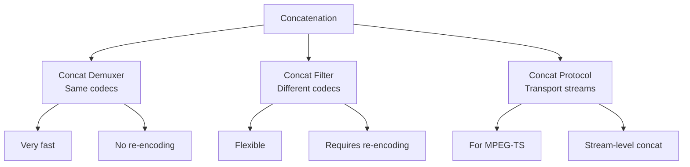
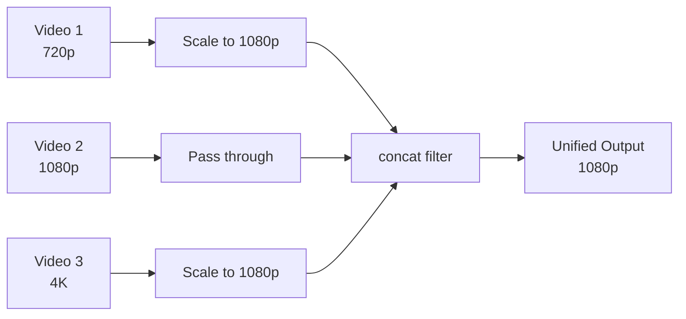
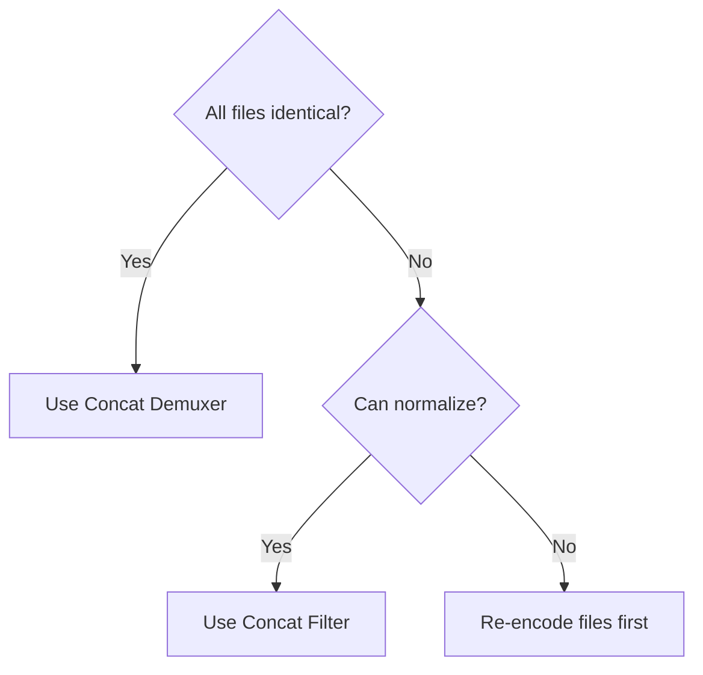

# 4.1 Concatenation Techniques

## 🎯 Learning Objectives

By the end of this chapter, you will:
- Join multiple videos into one
- Choose the right concatenation method
- Handle mismatched formats gracefully
- Create seamless transitions between clips

---

## 📊 Concatenation Methods

FFmpeg offers several ways to join files:



| Method | Speed | Re-encode | Use When |
|--------|-------|-----------|----------|
| Demuxer | Fast | No | Same codecs, containers |
| Filter | Slow | Yes | Different properties |
| Protocol | Fast | No | MPEG-TS files |

---

## 📋 Concat Demuxer (Recommended)

The fastest method when all files have identical properties:

### Step 1: Create File List

Create a text file listing all videos:

```text
# files.txt
file 'video1.mp4'
file 'video2.mp4'
file 'video3.mp4'
```

### Step 2: Concatenate

```bash
ffmpeg -f concat -safe 0 -i files.txt -c copy output.mp4
```

### Key Options

| Option | Purpose |
|--------|---------|
| `-f concat` | Use concat demuxer |
| `-safe 0` | Allow absolute/relative paths |
| `-c copy` | Copy without re-encoding |

### One-Liner (PowerShell)

```powershell
# Generate file list and concatenate
(Get-ChildItem *.mp4 | ForEach-Object { "file '$($_.Name)'" }) | Out-File -Encoding ASCII files.txt
ffmpeg -f concat -safe 0 -i files.txt -c copy output.mp4
```

### One-Liner (Bash)

```bash
# Generate file list and concatenate
for f in *.mp4; do echo "file '$f'"; done > files.txt
ffmpeg -f concat -safe 0 -i files.txt -c copy output.mp4
```

---

## 🔗 Concat Filter

For files with different codecs or properties:



### Basic Concat Filter

```bash
# Two inputs
ffmpeg -i video1.mp4 -i video2.mp4 \
  -filter_complex "[0:v][0:a][1:v][1:a]concat=n=2:v=1:a=1[outv][outa]" \
  -map "[outv]" -map "[outa]" \
  output.mp4
```

### Parameters

| Parameter | Meaning |
|-----------|---------|
| `n=2` | Number of segments |
| `v=1` | Has video stream |
| `a=1` | Has audio stream |

### Three or More Videos

```bash
ffmpeg -i v1.mp4 -i v2.mp4 -i v3.mp4 \
  -filter_complex "[0:v][0:a][1:v][1:a][2:v][2:a]concat=n=3:v=1:a=1[v][a]" \
  -map "[v]" -map "[a]" \
  output.mp4
```

### Normalizing Before Concat

```bash
# Scale all to same resolution, then concat
ffmpeg -i v1.mp4 -i v2.mp4 \
  -filter_complex "
    [0:v]scale=1920:1080:force_original_aspect_ratio=decrease,pad=1920:1080:-1:-1,setsar=1[v0];
    [1:v]scale=1920:1080:force_original_aspect_ratio=decrease,pad=1920:1080:-1:-1,setsar=1[v1];
    [v0][0:a][v1][1:a]concat=n=2:v=1:a=1[v][a]
  " \
  -map "[v]" -map "[a]" \
  output.mp4
```

---

## 📺 Concat Protocol

For MPEG-TS files only:

```bash
# Direct concatenation of TS files
ffmpeg -i "concat:part1.ts|part2.ts|part3.ts" -c copy output.ts

# Convert result to MP4
ffmpeg -i "concat:part1.ts|part2.ts|part3.ts" -c copy output.mp4
```

---

## ⚠️ Handling Mismatched Files

### Common Issues

| Issue | Solution |
|-------|----------|
| Different resolutions | Scale to common resolution |
| Different frame rates | Set common fps |
| Different codecs | Use concat filter (re-encode) |
| Different audio channels | Normalize audio channels |
| Different sample rates | Resample audio |

### Full Normalization

```bash
ffmpeg -i v1.mp4 -i v2.mp4 \
  -filter_complex "
    [0:v]scale=1920:1080,fps=30,format=yuv420p[v0];
    [1:v]scale=1920:1080,fps=30,format=yuv420p[v1];
    [0:a]aformat=sample_rates=48000:channel_layouts=stereo[a0];
    [1:a]aformat=sample_rates=48000:channel_layouts=stereo[a1];
    [v0][a0][v1][a1]concat=n=2:v=1:a=1[v][a]
  " \
  -map "[v]" -map "[a]" \
  -c:v libx264 -c:a aac \
  output.mp4
```

---

## 🎬 Adding Transitions

### Crossfade Between Videos

```bash
# Crossfade video for 1 second
ffmpeg -i v1.mp4 -i v2.mp4 \
  -filter_complex "
    [0:v][1:v]xfade=transition=fade:duration=1:offset=4[v];
    [0:a][1:a]acrossfade=d=1[a]
  " \
  -map "[v]" -map "[a]" \
  output.mp4
```

### Available Transitions

| Transition | Description |
|------------|-------------|
| `fade` | Simple fade |
| `wipeleft` | Wipe left |
| `wiperight` | Wipe right |
| `wipeup` | Wipe up |
| `wipedown` | Wipe down |
| `dissolve` | Dissolve effect |
| `pixelize` | Pixelate transition |
| `diagtl` | Diagonal top-left |

```bash
# Wipe transition
ffmpeg -i v1.mp4 -i v2.mp4 \
  -filter_complex "[0:v][1:v]xfade=transition=wipeleft:duration=0.5:offset=4[v]" \
  -map "[v]" -map 0:a \
  output.mp4
```

---

## 📁 Batch Concatenation

### Concatenate All Videos in Folder

**PowerShell:**
```powershell
# Get all MP4 files sorted by name
$files = Get-ChildItem -Filter "*.mp4" | Sort-Object Name
$fileList = $files | ForEach-Object { "file '$($_.FullName)'" }
$fileList | Out-File -Encoding ASCII -FilePath "files.txt"

ffmpeg -f concat -safe 0 -i files.txt -c copy output.mp4

Remove-Item files.txt
```

**Bash:**
```bash
# Create sorted file list
for f in $(ls -1 *.mp4 | sort); do
    echo "file '$f'"
done > files.txt

ffmpeg -f concat -safe 0 -i files.txt -c copy output.mp4

rm files.txt
```

---

## ✅ Best Practices

> [!TIP]
> **Use Demuxer When Possible**: It's much faster and doesn't lose quality.

> [!TIP]
> **Check File Properties First**: Use ffprobe to verify files are compatible.
> ```bash
> ffprobe -v error -show_entries stream=codec_name,width,height,r_frame_rate file.mp4
> ```

> [!IMPORTANT]
> **Normalize for Concat Filter**: When using the concat filter, normalize all inputs to the same format, resolution, and frame rate.

> [!WARNING]
> **File List Format**: The file list must use single quotes around filenames and start with `file `.

### Decision Tree



---

## 🏋️ Exercises

### Exercise 1: Basic Concatenation
Join 3 videos using the concat demuxer.

### Exercise 2: Different Resolutions
Concatenate a 720p and 1080p video using the concat filter.

### Exercise 3: Add Transitions
Create a video with fade transitions between 3 clips.

---

## 📝 Summary

| Method | Command | When to Use |
|--------|---------|-------------|
| Demuxer | `-f concat -safe 0 -i files.txt -c copy` | Same format files |
| Filter | `-filter_complex "...concat=n=2..."` | Different formats |
| Protocol | `-i "concat:a.ts\|b.ts"` | MPEG-TS only |
| Transition | `xfade=transition=fade` | Add effects |

---

## ➡️ Next Steps

Proceed to [4.2 Subtitles & Metadata](../4.2-subtitles-metadata/) to learn about handling subtitles and file metadata.
