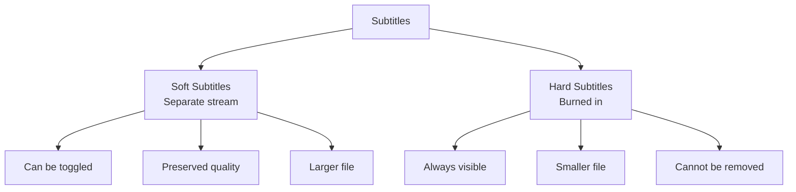

# 4.2 Subtitles and Metadata

## 🎯 Learning Objectives

By the end of this chapter, you will:
- Add subtitles to videos (soft and hard subs)
- Extract subtitles from videos
- Edit and convert subtitle formats
- Manage video metadata

---

## 📝 Subtitle Types



| Type | Description | Use Case |
|------|-------------|----------|
| **Soft** | Embedded as separate stream | DVDs, Blu-ray, MKV |
| **Hard** | Burned into video frames | Social media, compatibility |

---

## 📥 Adding Soft Subtitles

### Embed Subtitle File

```bash
# Add SRT subtitles to MP4
ffmpeg -i video.mp4 -i subtitles.srt \
  -c copy -c:s mov_text \
  output.mp4

# Add to MKV (supports more formats)
ffmpeg -i video.mp4 -i subtitles.srt \
  -c copy -c:s srt \
  output.mkv

# Add ASS/SSA subtitles
ffmpeg -i video.mp4 -i subtitles.ass \
  -c copy -c:s ass \
  output.mkv
```

### Add Multiple Subtitle Tracks

```bash
# Add English and Spanish subtitles
ffmpeg -i video.mp4 -i english.srt -i spanish.srt \
  -map 0:v -map 0:a -map 1 -map 2 \
  -c copy -c:s srt \
  -metadata:s:s:0 language=eng -metadata:s:s:0 title="English" \
  -metadata:s:s:1 language=spa -metadata:s:s:1 title="Spanish" \
  output.mkv
```

### Make Default Subtitle

```bash
ffmpeg -i video.mp4 -i subtitles.srt \
  -c copy -c:s srt \
  -disposition:s:0 default \
  output.mkv
```

---

## 🔥 Burning Subtitles (Hard Subs)

### Burn SRT Subtitles

```bash
# Basic burn-in
ffmpeg -i video.mp4 -vf "subtitles=subtitles.srt" output.mp4

# With styling
ffmpeg -i video.mp4 -vf "subtitles=subtitles.srt:force_style='FontSize=24,FontName=Arial,PrimaryColour=&HFFFFFF'" output.mp4
```

### Burn ASS Subtitles

```bash
# ASS subtitles (preserves styling)
ffmpeg -i video.mp4 -vf "ass=subtitles.ass" output.mp4
```

### Burn Embedded Subtitles

```bash
# Burn subtitles that are already in the file
ffmpeg -i video.mkv -vf "subtitles=video.mkv:si=0" output.mp4
```

### Style Options for SRT

```bash
ffmpeg -i video.mp4 -vf "subtitles=subs.srt:force_style='
  FontName=Arial,
  FontSize=28,
  PrimaryColour=&H00FFFFFF,
  OutlineColour=&H00000000,
  BorderStyle=1,
  Outline=2,
  Shadow=1,
  MarginV=50
'" output.mp4
```

---

## 📤 Extracting Subtitles

### Extract from Video

```bash
# Extract first subtitle track to SRT
ffmpeg -i video.mkv -map 0:s:0 -c:s srt subtitles.srt

# Extract to ASS
ffmpeg -i video.mkv -map 0:s:0 -c:s ass subtitles.ass

# Extract specific track (check with ffprobe first)
ffmpeg -i video.mkv -map 0:s:1 -c:s srt spanish.srt
```

### Check Available Subtitles

```bash
ffprobe -v error -select_streams s \
  -show_entries stream=index,codec_name:stream_tags=language,title \
  video.mkv
```

---

## 🔄 Converting Subtitle Formats

### Format Conversion

```bash
# SRT to ASS
ffmpeg -i subtitles.srt subtitles.ass

# ASS to SRT
ffmpeg -i subtitles.ass subtitles.srt

# VTT to SRT
ffmpeg -i subtitles.vtt subtitles.srt
```

### Common Formats

| Format | Extension | Features |
|--------|-----------|----------|
| SRT | `.srt` | Simple, widely supported |
| ASS/SSA | `.ass` | Rich styling |
| VTT | `.vtt` | Web standard |
| SUB | `.sub` | Legacy format |

---

## 📋 Metadata Management

### View Metadata

```bash
# View all metadata
ffprobe -v error -show_entries format_tags -of json video.mp4

# View stream metadata
ffprobe -v error -show_entries stream_tags -of json video.mp4
```

### Set Global Metadata

```bash
ffmpeg -i input.mp4 \
  -metadata title="My Video Title" \
  -metadata author="Creator Name" \
  -metadata copyright="2024" \
  -metadata comment="Description here" \
  -c copy output.mp4
```

### Set Stream Metadata

```bash
# Set audio track language
ffmpeg -i input.mp4 \
  -metadata:s:a:0 language=eng \
  -metadata:s:a:0 title="English" \
  -c copy output.mp4

# Set video stream title
ffmpeg -i input.mp4 \
  -metadata:s:v:0 title="Main Video" \
  -c copy output.mp4
```

### Remove All Metadata

```bash
ffmpeg -i input.mp4 -map_metadata -1 -c copy output.mp4
```

### Copy Metadata from Another File

```bash
ffmpeg -i input.mp4 -i source_metadata.mp4 \
  -map 0 -map_metadata 1 \
  -c copy output.mp4
```

---

## 🎬 Chapters

### View Chapters

```bash
ffprobe -v error -show_chapters -of json video.mkv
```

### Add Chapters

Create a chapters file in FFmetadata format:

```ini
;FFMETADATA1
title=My Video

[CHAPTER]
TIMEBASE=1/1000
START=0
END=60000
title=Introduction

[CHAPTER]
TIMEBASE=1/1000
START=60000
END=180000
title=Part One

[CHAPTER]
TIMEBASE=1/1000
START=180000
END=300000
title=Conclusion
```

```bash
ffmpeg -i input.mp4 -i chapters.txt \
  -map 0 -map_metadata 1 \
  -c copy output.mp4
```

### Extract Chapters to File

```bash
ffmpeg -i video.mkv -f ffmetadata chapters.txt
```

---

## ✅ Best Practices

> [!TIP]
> **Use MKV for Soft Subs**: MKV supports virtually all subtitle formats; MP4 is limited.

> [!TIP]
> **Burn for Social Media**: Most social platforms don't support soft subtitles; burn them in.

> [!IMPORTANT]
> **Character Encoding**: Ensure subtitle files use UTF-8 encoding to avoid display issues.

> [!WARNING]
> **Hard Subs Are Permanent**: Once burned in, subtitles cannot be removed without quality loss.

---

## 🏋️ Exercises

### Exercise 1: Add Soft Subtitles
Embed an SRT file into a video as a toggleable track.

### Exercise 2: Burn Subtitles
Create a hard-subbed version with custom styling.

### Exercise 3: Metadata
Add title, author, and chapter metadata to a video.

---

## 📝 Summary

| Task | Command |
|------|---------|
| Add soft subs | `-i subs.srt -c:s mov_text` |
| Burn subs | `-vf "subtitles=subs.srt"` |
| Extract subs | `-map 0:s:0 -c:s srt subs.srt` |
| Set metadata | `-metadata title="Title"` |
| Add chapters | `-i chapters.txt -map_metadata 1` |

---

## ➡️ Next Steps

Proceed to [4.3 Synchronization](../4.3-synchronization/) to learn about handling timestamps and sync issues.
