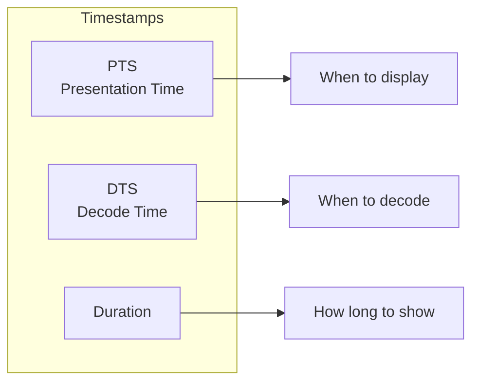

# 4.3 Synchronization and Timestamps

## 🎯 Learning Objectives

By the end of this chapter, you will:
- Understand FFmpeg timestamp concepts
- Fix audio-video sync issues
- Adjust stream delays
- Manipulate presentation timestamps

---

## ⏱️ Understanding Timestamps



### Key Concepts

| Term | Description |
|------|-------------|
| **PTS** | Presentation Timestamp - when to display |
| **DTS** | Decoding Timestamp - when to decode (for B-frames) |
| **Time Base** | Unit of time (e.g., 1/1000 for milliseconds) |
| **Duration** | How long to display the frame |

---

## 🔧 Fixing A/V Sync

### Diagnose Sync Issues

```bash
# Check stream timestamps
ffprobe -v error -show_entries stream=start_time,duration \
  -of csv video.mp4
```

### Delay Audio

```bash
# Delay audio by 500ms (audio plays later)
ffmpeg -i video.mp4 -itsoffset 0.5 -i video.mp4 \
  -map 0:v -map 1:a -c copy output.mp4
```

### Delay Video

```bash
# Delay video by 500ms (video plays later)
ffmpeg -i video.mp4 -itsoffset 0.5 -i video.mp4 \
  -map 1:v -map 0:a -c copy output.mp4
```

### Using Audio Delay Filter

```bash
# Delay audio by 1 second using filter
ffmpeg -i video.mp4 -af "adelay=1000|1000" output.mp4
```

---

## 📐 Timestamp Manipulation

### Reset Timestamps

```bash
# Reset timestamps to start at 0
ffmpeg -i input.mp4 -fflags +genpts output.mp4
```

### Avoid Negative Timestamps

```bash
# Prevent negative timestamps when cutting
ffmpeg -ss 60 -i input.mp4 -t 30 \
  -avoid_negative_ts make_zero \
  -c copy output.mp4
```

### Regenerate Timestamps

```bash
# Generate new PTS values
ffmpeg -i input.mp4 -vf "setpts=PTS-STARTPTS" output.mp4
```

---

## ⏩ Speed and Time Changes

### Change Video Speed (with setpts)

```bash
# 2x speed (faster)
ffmpeg -i input.mp4 -vf "setpts=0.5*PTS" -an output.mp4

# 0.5x speed (slower)
ffmpeg -i input.mp4 -vf "setpts=2.0*PTS" -an output.mp4
```

### Change Audio Speed (with atempo)

```bash
# 2x speed audio (without pitch change)
ffmpeg -i input.mp4 -af "atempo=2.0" output.mp4

# 0.5x speed (chain for values outside 0.5-2.0)
ffmpeg -i input.mp4 -af "atempo=0.5" output.mp4
```

### Synchronized Speed Change

```bash
# 2x speed, both video and audio
ffmpeg -i input.mp4 \
  -vf "setpts=0.5*PTS" \
  -af "atempo=2.0" \
  output.mp4

# 4x speed (chain atempo)
ffmpeg -i input.mp4 \
  -vf "setpts=0.25*PTS" \
  -af "atempo=2.0,atempo=2.0" \
  output.mp4
```

---

## 🔄 Frame Rate and Timestamps

### Change Frame Rate

```bash
# Convert to 30 fps (duplicates/drops frames)
ffmpeg -i input.mp4 -vf "fps=30" output.mp4

# Convert with interpolation (smoother)
ffmpeg -i input.mp4 -vf "minterpolate=fps=60" output.mp4
```

### Force Input Frame Rate

```bash
# Interpret input as different fps
ffmpeg -r 25 -i input.mp4 -c copy output.mp4
```

---

## 📊 Advanced Timestamp Operations

### Constant Frame Rate (CFR)

```bash
# Force constant frame rate
ffmpeg -i input.mp4 -vsync cfr -r 30 output.mp4
```

### Variable Frame Rate (VFR)

```bash
# Preserve variable frame rate
ffmpeg -i input.mp4 -vsync vfr output.mp4
```

### setpts Expressions

| Expression | Result |
|------------|--------|
| `PTS-STARTPTS` | Reset to start at 0 |
| `0.5*PTS` | Double speed |
| `2.0*PTS` | Half speed |
| `PTS+2/TB` | Delay 2 seconds |
| `N/FRAME_RATE/TB` | Based on frame number |

```bash
# Start video at 0
ffmpeg -i input.mp4 -vf "setpts=PTS-STARTPTS" output.mp4

# Add 2 second delay
ffmpeg -i input.mp4 -vf "setpts=PTS+2/TB" output.mp4
```

---

## 🔗 Multi-Stream Synchronization

### Align Multiple Inputs

```bash
# Sync two inputs by adjusting offset
ffmpeg -i video.mp4 -itsoffset 0.5 -i audio.mp3 \
  -map 0:v -map 1:a \
  -c copy output.mp4
```

### Trim to Shortest

```bash
# End when shortest stream ends
ffmpeg -i video.mp4 -i audio.mp3 \
  -c copy -shortest output.mp4
```

### Pad Audio to Match Video

```bash
# Pad audio with silence if shorter
ffmpeg -i video.mp4 -i audio.mp3 \
  -filter_complex "[1:a]apad[a]" \
  -map 0:v -map "[a]" \
  -shortest output.mp4
```

---

## ✅ Best Practices

> [!TIP]
> **Use -itsoffset for Simple Delays**: It's the cleanest way to offset streams.

> [!TIP]
> **Check with ffprobe First**: Diagnose the exact timing issue before fixing.

> [!IMPORTANT]
> **Speed Changes Require Re-encoding**: You cannot use `-c copy` with setpts or atempo.

> [!WARNING]
> **Negative Timestamps**: Use `-avoid_negative_ts make_zero` when cutting to prevent playback issues.

---

## 🏋️ Exercises

### Exercise 1: Fix Audio Delay
A video has audio playing 0.5 seconds too early. Fix it.

### Exercise 2: Speed Change
Create a 2x speed version with synchronized audio.

### Exercise 3: Frame Rate Conversion
Convert a 24fps video to 30fps.

---

## 📝 Summary

| Task | Command |
|------|---------|
| Delay audio | `-itsoffset 0.5 -i input -map 0:v -map 1:a` |
| 2x speed video | `-vf "setpts=0.5*PTS"` |
| 2x speed audio | `-af "atempo=2.0"` |
| Reset timestamps | `-vf "setpts=PTS-STARTPTS"` |
| Fix negative PTS | `-avoid_negative_ts make_zero` |
| Change fps | `-vf "fps=30"` |

---

## ➡️ Next Steps

Proceed to [4.4 Complex Filtergraphs](../4.4-complex-filtergraphs/) to learn advanced multi-stream processing.
