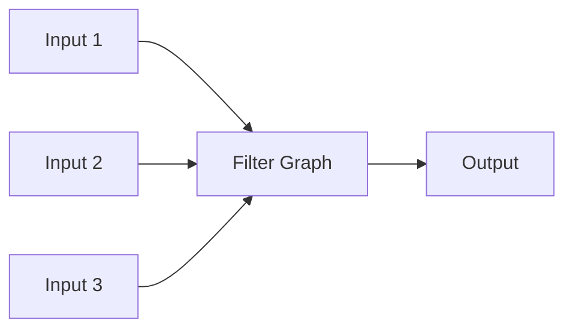
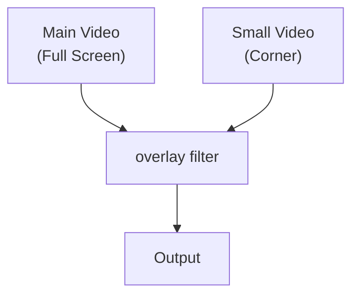
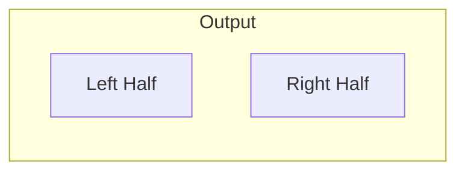
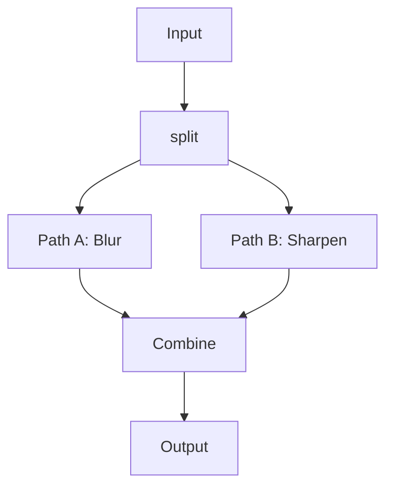

# 4.4 Complex Filtergraphs

## 🎯 Learning Objectives

By the end of this chapter, you will:
- Build multi-input/multi-output filtergraphs
- Combine multiple video sources
- Create picture-in-picture and split-screen effects
- Process multiple streams simultaneously

---

## 🔀 Multi-Input Filtergraphs



### Basic Multi-Input Pattern

```bash
ffmpeg -i main.mp4 -i overlay.png \
  -filter_complex "[0:v][1:v]overlay=10:10[out]" \
  -map "[out]" -map 0:a \
  output.mp4
```

---

## 🖼️ Picture-in-Picture

### Basic PIP



```bash
# Small video in bottom-right corner
ffmpeg -i main.mp4 -i small.mp4 \
  -filter_complex "
    [1:v]scale=320:-1[pip];
    [0:v][pip]overlay=W-w-10:H-h-10[out]
  " \
  -map "[out]" -map 0:a \
  output.mp4
```

### PIP with Border

```bash
ffmpeg -i main.mp4 -i webcam.mp4 \
  -filter_complex "
    [1:v]scale=320:-1,drawbox=x=0:y=0:w=iw:h=ih:color=white:t=3[pip];
    [0:v][pip]overlay=W-w-20:H-h-20[out]
  " \
  -map "[out]" -map 0:a \
  output.mp4
```

### Animated PIP (Fade In)

```bash
ffmpeg -i main.mp4 -i small.mp4 \
  -filter_complex "
    [1:v]scale=320:-1[pip];
    [0:v][pip]overlay=W-w-10:H-h-10:enable='between(t,5,60)'[out]
  " \
  -map "[out]" -map 0:a \
  output.mp4
```

---

## 📐 Split Screen Layouts

### Side by Side



```bash
# Side by side (horizontal)
ffmpeg -i left.mp4 -i right.mp4 \
  -filter_complex "
    [0:v]scale=640:-1[l];
    [1:v]scale=640:-1[r];
    [l][r]hstack[out]
  " \
  -map "[out]" \
  output.mp4
```

### Top and Bottom

```bash
# Vertical stack
ffmpeg -i top.mp4 -i bottom.mp4 \
  -filter_complex "
    [0:v]scale=1280:-1[t];
    [1:v]scale=1280:-1[b];
    [t][b]vstack[out]
  " \
  -map "[out]" \
  output.mp4
```

### 2x2 Grid

```bash
ffmpeg -i v1.mp4 -i v2.mp4 -i v3.mp4 -i v4.mp4 \
  -filter_complex "
    [0:v]scale=640:360[a];
    [1:v]scale=640:360[b];
    [2:v]scale=640:360[c];
    [3:v]scale=640:360[d];
    [a][b]hstack[top];
    [c][d]hstack[bottom];
    [top][bottom]vstack[out]
  " \
  -map "[out]" \
  output.mp4
```

### xstack Filter (Flexible Grid)

```bash
# 2x2 grid using xstack
ffmpeg -i v1.mp4 -i v2.mp4 -i v3.mp4 -i v4.mp4 \
  -filter_complex "
    xstack=inputs=4:layout=0_0|w0_0|0_h0|w0_h0[out]
  " \
  -map "[out]" \
  output.mp4
```

---

## 🔄 Split and Merge

### Process Same Source Differently



```bash
# Split, process differently, combine side-by-side
ffmpeg -i input.mp4 \
  -filter_complex "
    [0:v]split=2[a][b];
    [a]gblur=sigma=5[blurred];
    [b]unsharp=5:5:1.5[sharp];
    [blurred][sharp]hstack[out]
  " \
  -map "[out]" \
  output.mp4
```

### Original and Filtered Comparison

```bash
# Left: original, Right: processed
ffmpeg -i input.mp4 \
  -filter_complex "
    [0:v]split=2[orig][process];
    [process]eq=saturation=2[processed];
    [orig][processed]hstack[out]
  " \
  -map "[out]" \
  output.mp4
```

---

## 🎨 Multiple Overlays

### Logo + Watermark + Text

```bash
ffmpeg -i video.mp4 -i logo.png -i watermark.png \
  -filter_complex "
    [0:v][1:v]overlay=10:10[v1];
    [v1][2:v]overlay=W-w-10:H-h-10[v2];
    [v2]drawtext=text='© 2024':fontsize=24:x=10:y=H-30:fontcolor=white[out]
  " \
  -map "[out]" -map 0:a \
  output.mp4
```

### Timed Overlays

```bash
# Different overlays at different times
ffmpeg -i video.mp4 -i intro.png -i logo.png \
  -filter_complex "
    [0:v][1:v]overlay=0:0:enable='between(t,0,5)'[v1];
    [v1][2:v]overlay=10:10:enable='gt(t,5)'[out]
  " \
  -map "[out]" -map 0:a \
  output.mp4
```

---

## 🔊 Multi-Track Audio

### Mix Audio Sources

```bash
# Mix voice and background music
ffmpeg -i voice.mp4 -i music.mp3 \
  -filter_complex "
    [0:a]volume=1.0[voice];
    [1:a]volume=0.2[music];
    [voice][music]amix=inputs=2[aout]
  " \
  -map 0:v -map "[aout]" \
  output.mp4
```

### Audio from Different Sources

```bash
# Video from input 1, audio from input 2
ffmpeg -i video.mp4 -i better_audio.wav \
  -filter_complex "
    [1:a]aformat=sample_rates=48000[audio]
  " \
  -map 0:v -map "[audio]" \
  output.mp4
```

---

## 📐 Advanced Layouts

### Collage with Padding

```bash
ffmpeg -i v1.mp4 -i v2.mp4 -i v3.mp4 \
  -filter_complex "
    [0:v]scale=400:300,pad=410:310:5:5:black[a];
    [1:v]scale=400:300,pad=410:310:5:5:black[b];
    [2:v]scale=400:300,pad=410:310:5:5:black[c];
    [a][b][c]hstack=inputs=3[out]
  " \
  -map "[out]" \
  output.mp4
```

### Dynamic Layout (Animated)

```bash
# Moving overlay
ffmpeg -i main.mp4 -i small.mp4 \
  -filter_complex "
    [1:v]scale=200:-1[pip];
    [0:v][pip]overlay='100+t*50':100[out]
  " \
  -map "[out]" -map 0:a \
  output.mp4
```

---

## ✅ Best Practices

> [!TIP]
> **Build Incrementally**: Test each filter step before adding more complexity.

> [!TIP]
> **Use Meaningful Labels**: Name streams descriptively: `[blurred]`, `[scaled_pip]`, etc.

> [!IMPORTANT]
> **Always Map Outputs**: Complex filters require explicit `-map` statements.

> [!WARNING]
> **Match Formats**: Ensure all video streams have same pixel format before combining.

---

## 🏋️ Exercises

### Exercise 1: Picture-in-Picture
Create a video with a webcam overlay in the corner.

### Exercise 2: Split Screen
Create a 2x2 grid of 4 different videos.

### Exercise 3: Comparison View
Split a video, apply different color grades to each half, show side-by-side.

---

## 📝 Summary

| Task | Key Filter |
|------|------------|
| PIP | `overlay=W-w-10:H-h-10` |
| Side by side | `hstack` |
| Vertical stack | `vstack` |
| Grid | `xstack` |
| Split stream | `split=2[a][b]` |
| Mix audio | `amix=inputs=2` |

---

## ➡️ Next Steps

Proceed to [4.5 Batch Automation](../4.5-batch-automation/) to learn automated processing workflows.
