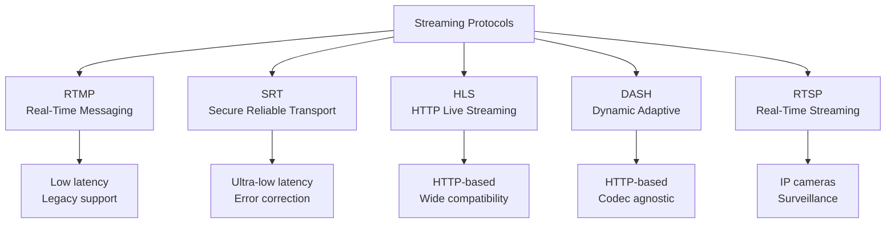
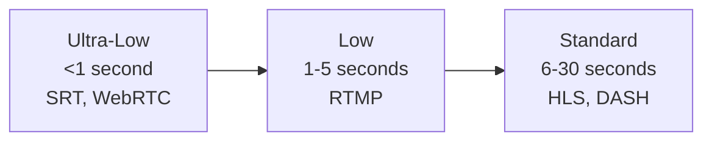

# 5.1 Streaming Protocols Overview

## 🎯 Learning Objectives

By the end of this chapter, you will:
- Understand major streaming protocols
- Know when to use each protocol
- Configure FFmpeg for different protocols
- Choose the right protocol for your use case

---

## 📊 Protocol Comparison



| Protocol | Latency | Typical Use | Port |
|----------|---------|-------------|------|
| RTMP | 1-3s | Ingest to platforms | 1935 |
| SRT | <1s | Contribution feeds | 9000+ |
| HLS | 6-30s | Playback/CDN | 80/443 |
| DASH | 3-30s | Playback/CDN | 80/443 |
| RTSP | 1-2s | IP cameras | 554 |

---

## 📺 RTMP (Real-Time Messaging Protocol)

Industry standard for live streaming ingest.

### Stream to RTMP Server

```bash
# Stream to YouTube Live
ffmpeg -i input.mp4 \
  -c:v libx264 -preset veryfast -b:v 3000k -maxrate 3000k -bufsize 6000k \
  -c:a aac -b:a 128k \
  -f flv rtmp://a.rtmp.youtube.com/live2/YOUR_STREAM_KEY

# Stream to Twitch
ffmpeg -i input.mp4 \
  -c:v libx264 -preset veryfast -b:v 4500k \
  -c:a aac -b:a 160k \
  -f flv rtmp://live.twitch.tv/app/YOUR_STREAM_KEY
```

### Stream from Webcam (Windows)

```bash
ffmpeg -f dshow -i video="Webcam":audio="Microphone" \
  -c:v libx264 -preset veryfast -b:v 2500k \
  -c:a aac -b:a 128k \
  -f flv rtmp://server/live/stream
```

### Receive RTMP (Server)

```bash
# Play incoming RTMP stream
ffplay rtmp://server/live/stream

# Record incoming RTMP stream
ffmpeg -i rtmp://server/live/stream -c copy recording.mp4
```

---

## 🔒 SRT (Secure Reliable Transport)

Modern protocol with low latency and error correction.

### Stream via SRT

```bash
# SRT Caller (sender)
ffmpeg -i input.mp4 \
  -c:v libx264 -preset veryfast -b:v 5000k \
  -c:a aac -b:a 128k \
  -f mpegts srt://server:9000?mode=caller

# SRT Listener (receiver)
ffmpeg -i srt://0.0.0.0:9000?mode=listener \
  -c copy output.ts
```

### SRT with Encryption

```bash
ffmpeg -i input.mp4 \
  -c:v libx264 -b:v 5000k \
  -f mpegts "srt://server:9000?passphrase=secret123&mode=caller"
```

### SRT Parameters

| Parameter | Description |
|-----------|-------------|
| `mode=caller` | Connect to server |
| `mode=listener` | Accept connections |
| `mode=rendezvous` | Peer-to-peer |
| `passphrase=xxx` | Encryption key |
| `latency=200000` | Latency in μs |

---

## 🌐 HTTP Streaming

### HTTP Output

```bash
# Serve via HTTP (requires web server)
ffmpeg -i input.mp4 \
  -c:v libx264 -c:a aac \
  -f mpegts http://localhost:8080/stream
```

### HTTP Input

```bash
# Play HTTP stream
ffplay http://example.com/live/stream.m3u8

# Download and convert
ffmpeg -i http://example.com/stream.mp4 -c copy output.mp4
```

---

## 📹 RTSP (Real-Time Streaming Protocol)

Common for IP cameras and surveillance.

### Receive RTSP Stream

```bash
# Play RTSP stream
ffplay rtsp://camera_ip:554/stream

# Record RTSP to file
ffmpeg -rtsp_transport tcp -i rtsp://camera:554/stream \
  -c copy -t 3600 recording.mp4
```

### RTSP Options

```bash
# Force TCP transport (more reliable)
ffmpeg -rtsp_transport tcp -i rtsp://camera/stream ...

# Set buffer time
ffmpeg -fflags +genpts -rtsp_transport tcp \
  -i rtsp://camera/stream ...
```

---

## ⏱️ Latency Considerations



| Use Case | Recommended Protocol | Expected Latency |
|----------|---------------------|------------------|
| Gaming/Interactive | SRT, WebRTC | <1s |
| Live events | RTMP, Low-latency HLS | 3-6s |
| VOD streaming | HLS, DASH | N/A |
| Surveillance | RTSP | 1-3s |

---

## ✅ Best Practices

> [!TIP]
> **Use RTMP for Ingest**: Most platforms accept RTMP for live stream contribution.

> [!TIP]
> **Use SRT for Contribution**: When you need reliable, low-latency point-to-point streaming.

> [!IMPORTANT]
> **Always Test Latency**: Actual latency depends on encoding settings, network, and CDN configuration.

---

## 📝 Summary

| Protocol | Command Pattern |
|----------|-----------------|
| RTMP out | `-f flv rtmp://server/app/key` |
| SRT out | `-f mpegts srt://server:port` |
| RTSP in | `-rtsp_transport tcp -i rtsp://...` |
| HTTP in | `-i http://server/stream` |

---

## ➡️ Next Steps

Proceed to [5.2 HLS & DASH](../5.2-hls-dash/) to learn adaptive bitrate streaming.
