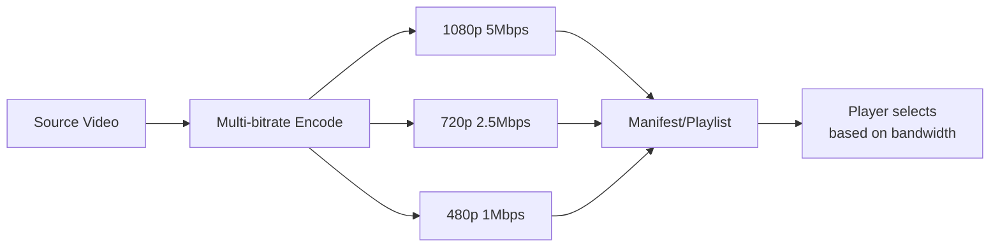

# 5.2 HLS and DASH Streaming

## 🎯 Learning Objectives

By the end of this chapter, you will:
- Create HLS streams with multiple quality levels
- Generate DASH manifests
- Understand adaptive bitrate streaming
- Configure segment durations and playlists

---

## 📊 Adaptive Bitrate Streaming



| Tech | Format | Manifest | Segments |
|------|--------|----------|----------|
| HLS | Apple | .m3u8 | .ts or .fmp4 |
| DASH | MPEG | .mpd | .m4s |

---

## 📺 HLS (HTTP Live Streaming)

### Basic HLS Output

```bash
# Single bitrate HLS
ffmpeg -i input.mp4 \
  -c:v libx264 -c:a aac \
  -f hls -hls_time 6 -hls_list_size 0 \
  output.m3u8
```

### Multi-Bitrate HLS (ABR)

```bash
ffmpeg -i input.mp4 \
  -filter_complex "[0:v]split=3[v1][v2][v3];\
    [v1]scale=1920:1080[v1out];\
    [v2]scale=1280:720[v2out];\
    [v3]scale=854:480[v3out]" \
  -map "[v1out]" -map 0:a -c:v libx264 -b:v 5000k -c:a aac -b:a 192k \
    -f hls -hls_time 6 -hls_playlist_type vod -hls_segment_filename "1080p_%03d.ts" 1080p.m3u8 \
  -map "[v2out]" -map 0:a -c:v libx264 -b:v 2500k -c:a aac -b:a 128k \
    -f hls -hls_time 6 -hls_playlist_type vod -hls_segment_filename "720p_%03d.ts" 720p.m3u8 \
  -map "[v3out]" -map 0:a -c:v libx264 -b:v 1000k -c:a aac -b:a 96k \
    -f hls -hls_time 6 -hls_playlist_type vod -hls_segment_filename "480p_%03d.ts" 480p.m3u8
```

### Master Playlist

Create a master playlist manually:

```m3u8
#EXTM3U
#EXT-X-VERSION:3
#EXT-X-STREAM-INF:BANDWIDTH=5500000,RESOLUTION=1920x1080
1080p.m3u8
#EXT-X-STREAM-INF:BANDWIDTH=2700000,RESOLUTION=1280x720
720p.m3u8
#EXT-X-STREAM-INF:BANDWIDTH=1100000,RESOLUTION=854x480
480p.m3u8
```

### HLS Key Options

| Option | Description |
|--------|-------------|
| `-hls_time 6` | Segment duration (seconds) |
| `-hls_list_size 0` | Keep all segments in playlist |
| `-hls_playlist_type vod` | VOD playlist (complete) |
| `-hls_playlist_type event` | Event playlist (append) |
| `-hls_segment_type fmp4` | Use fMP4 instead of TS |

### HLS with fMP4 Segments

```bash
ffmpeg -i input.mp4 \
  -c:v libx264 -c:a aac \
  -f hls -hls_time 6 \
  -hls_segment_type fmp4 \
  -hls_fmp4_init_filename init.mp4 \
  output.m3u8
```

---

## 📡 DASH (Dynamic Adaptive Streaming over HTTP)

### Basic DASH Output

```bash
ffmpeg -i input.mp4 \
  -c:v libx264 -c:a aac \
  -f dash -seg_duration 4 \
  output.mpd
```

### Multi-Bitrate DASH

```bash
ffmpeg -i input.mp4 \
  -map 0:v -map 0:v -map 0:v -map 0:a \
  -b:v:0 5000k -s:v:0 1920x1080 \
  -b:v:1 2500k -s:v:1 1280x720 \
  -b:v:2 1000k -s:v:2 854x480 \
  -c:v libx264 -c:a aac \
  -f dash -seg_duration 4 \
  -adaptation_sets "id=0,streams=v id=1,streams=a" \
  output.mpd
```

### DASH Key Options

| Option | Description |
|--------|-------------|
| `-seg_duration 4` | Segment duration |
| `-adaptation_sets` | Group streams |
| `-init_seg_name` | Init segment naming |
| `-media_seg_name` | Media segment naming |

---

## ⚡ Low-Latency HLS

```bash
ffmpeg -i input.mp4 \
  -c:v libx264 -c:a aac \
  -f hls \
  -hls_time 2 \
  -hls_list_size 3 \
  -hls_flags delete_segments+append_list \
  -hls_segment_type fmp4 \
  stream.m3u8
```

---

## 📋 Encoding Ladder

Standard streaming ladder:

| Resolution | Bitrate | Use Case |
|------------|---------|----------|
| 1080p | 4500-6000k | Desktop/TV |
| 720p | 2500-4000k | Laptop |
| 480p | 1000-2000k | Mobile |
| 360p | 500-800k | Low bandwidth |

---

## ✅ Best Practices

> [!TIP]
> **Use 6-second segments for VOD**: Good balance between seek precision and overhead.

> [!TIP]
> **Use 2-4 second segments for live**: Lower latency.

> [!IMPORTANT]
> **GOP = Segment Duration**: Set keyframe interval equal to segment duration for clean cuts.

```bash
# Align keyframes to segments
ffmpeg -i input.mp4 \
  -c:v libx264 -g 48 -keyint_min 48 \
  -f hls -hls_time 2 \
  output.m3u8
```

---

## 📝 Summary

| Format | Command |
|--------|---------|
| Basic HLS | `-f hls -hls_time 6 output.m3u8` |
| HLS fMP4 | `-f hls -hls_segment_type fmp4` |
| Basic DASH | `-f dash -seg_duration 4 output.mpd` |
| Multi-bitrate | Use multiple `-map` and `-b:v:N` |

---

## ➡️ Next Steps

Proceed to [5.3 Live Streaming](../5.3-live-streaming/) to learn real-time broadcasting.
