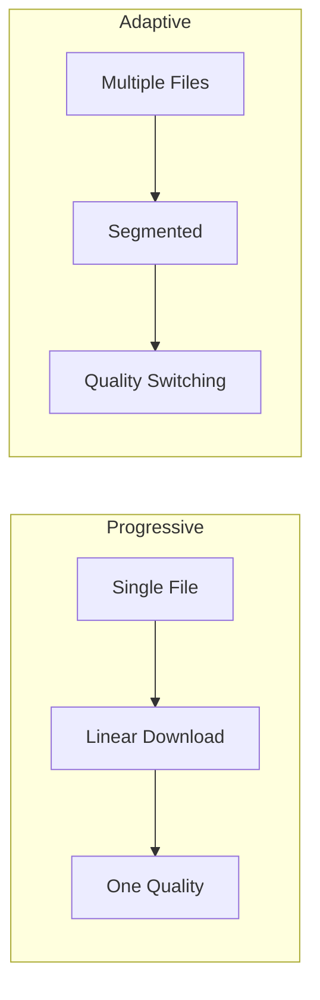
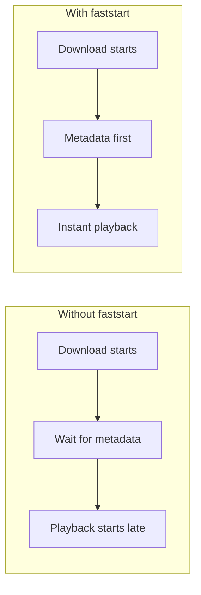

# 5.4 Progressive Download

## 🎯 Learning Objectives

By the end of this chapter, you will:
- Optimize videos for HTTP progressive download
- Use faststart for instant playback
- Configure buffering for smooth delivery
- Optimize for different connection speeds

---

## 📊 Progressive vs Adaptive



| Method | Pros | Cons |
|--------|------|------|
| Progressive | Simple, single file | No quality adaptation |
| Adaptive | Quality switching | Complex, more files |

---

## ⚡ Faststart Optimization

Move metadata to the beginning for instant playback:

```bash
# Add faststart during encoding
ffmpeg -i input.mp4 \
  -c:v libx264 -c:a aac \
  -movflags +faststart \
  output.mp4

# Fix existing file
ffmpeg -i slow_start.mp4 -c copy -movflags +faststart fast_start.mp4
```

### Why Faststart Matters



---

## 🌐 Web Optimization

### Complete Web-Ready Encode

```bash
ffmpeg -i input.mp4 \
  -c:v libx264 -preset slow -crf 23 \
  -c:a aac -b:a 128k \
  -movflags +faststart \
  -pix_fmt yuv420p \
  web_ready.mp4
```

### Key Options

| Option | Purpose |
|--------|---------|
| `-movflags +faststart` | Move moov atom to start |
| `-pix_fmt yuv420p` | Maximum compatibility |
| `-profile:v baseline` | Old device support |

---

## 📱 Mobile Optimization

```bash
# Mobile-optimized (small, compatible)
ffmpeg -i input.mp4 \
  -vf "scale=-2:720" \
  -c:v libx264 -preset medium -crf 26 \
  -profile:v main -level 3.1 \
  -c:a aac -b:a 96k \
  -movflags +faststart \
  mobile.mp4
```

---

## ✅ Best Practices

> [!TIP]
> **Always Use faststart**: It's a free win for user experience.

> [!IMPORTANT]
> **Test on Slow Connections**: Use browser dev tools to simulate slow networks.

---

## 📝 Summary

| Optimization | Command |
|--------------|---------|
| Faststart | `-movflags +faststart` |
| Compatibility | `-pix_fmt yuv420p` |
| Mobile profile | `-profile:v main -level 3.1` |

---

## 🎉 Module 5 Complete!

You've learned:
- Streaming protocols (RTMP, SRT, HLS, DASH)
- Adaptive bitrate streaming
- Live streaming setup
- Progressive download optimization

## ➡️ Next Module

Proceed to [Module 6: Optimization](../../6-optimization/) for hardware acceleration and performance tuning.
