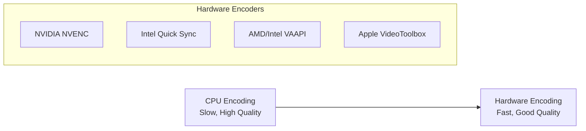

# 6.1 Hardware Acceleration

## 🎯 Learning Objectives

By the end of this chapter, you will:
- Use GPU acceleration for encoding/decoding
- Configure NVENC (NVIDIA), QSV (Intel), VAAPI (Linux)
- Achieve 5-10x faster encoding speeds
- Know when hardware acceleration is beneficial

---

## 🎮 GPU Acceleration Overview



| Technology | Vendor | Platform | Encoder |
|------------|--------|----------|---------|
| NVENC | NVIDIA | All | h264_nvenc, hevc_nvenc |
| QSV | Intel | All | h264_qsv, hevc_qsv |
| VAAPI | AMD/Intel | Linux | h264_vaapi, hevc_vaapi |
| VideoToolbox | Apple | macOS | h264_videotoolbox |

---

## 💚 NVIDIA NVENC

### Check NVENC Support

```bash
ffmpeg -encoders | grep nvenc
# Output: h264_nvenc, hevc_nvenc, av1_nvenc
```

### Basic NVENC Encoding

```bash
# H.264 with NVENC
ffmpeg -i input.mp4 -c:v h264_nvenc -preset fast -b:v 5M output.mp4

# H.265/HEVC with NVENC
ffmpeg -i input.mp4 -c:v hevc_nvenc -preset slow -cq 23 output.mp4
```

### Hardware Decode + Encode

```bash
# Full hardware pipeline (fastest)
ffmpeg -hwaccel cuda -hwaccel_output_format cuda -i input.mp4 \
  -c:v h264_nvenc -preset p4 -b:v 5M output.mp4
```

### NVENC Quality Presets

| Preset | Speed | Quality |
|--------|-------|---------|
| p1 | Fastest | Lowest |
| p4 | Balanced | Good |
| p7 | Slowest | Best |

```bash
# High quality NVENC
ffmpeg -i input.mp4 -c:v h264_nvenc -preset p7 -cq 20 -b:v 0 output.mp4
```

---

## 🔵 Intel Quick Sync (QSV)

### Check QSV Support

```bash
ffmpeg -encoders | grep qsv
```

### Basic QSV Encoding

```bash
# H.264 with QSV
ffmpeg -i input.mp4 -c:v h264_qsv -preset medium -b:v 5M output.mp4

# H.265 with QSV
ffmpeg -i input.mp4 -c:v hevc_qsv -preset medium output.mp4
```

### Full Hardware Pipeline

```bash
ffmpeg -hwaccel qsv -hwaccel_output_format qsv -i input.mp4 \
  -c:v h264_qsv -preset medium output.mp4
```

---

## 🔴 AMD/Intel VAAPI (Linux)

### Check VAAPI Support

```bash
ffmpeg -encoders | grep vaapi
vainfo  # Check VA-API capabilities
```

### VAAPI Encoding

```bash
# Initialize VAAPI device
ffmpeg -vaapi_device /dev/dri/renderD128 -i input.mp4 \
  -vf 'format=nv12,hwupload' \
  -c:v h264_vaapi -b:v 5M output.mp4

# Full hardware decode + encode
ffmpeg -hwaccel vaapi -hwaccel_device /dev/dri/renderD128 \
  -hwaccel_output_format vaapi -i input.mp4 \
  -c:v h264_vaapi output.mp4
```

---

## 🍎 Apple VideoToolbox

### VideoToolbox Encoding (macOS)

```bash
# H.264 with VideoToolbox
ffmpeg -i input.mp4 -c:v h264_videotoolbox -b:v 5M output.mp4

# HEVC with VideoToolbox
ffmpeg -i input.mp4 -c:v hevc_videotoolbox output.mp4
```

---

## ⚡ Performance Comparison

| Encoder | Speed | Quality | Use Case |
|---------|-------|---------|----------|
| libx264 | 1x | Excellent | Final delivery |
| h264_nvenc | 5-10x | Very Good | Fast encoding |
| h264_qsv | 3-5x | Good | Integrated GPU |
| h264_vaapi | 3-5x | Good | Linux |

---

## ✅ Best Practices

> [!TIP]
> **Use Hardware for Preview/Proxy**: Hardware encode for quick previews, software for final delivery.

> [!IMPORTANT]
> **Quality Trade-off**: Hardware encoders are faster but slightly lower quality at same bitrate.

> [!WARNING]
> **Check Compatibility**: Ensure your FFmpeg build includes hardware encoder support.

---

## 📝 Summary

| Platform | Hardware Encode |
|----------|-----------------|
| NVIDIA | `-c:v h264_nvenc` |
| Intel | `-c:v h264_qsv` |
| Linux | `-c:v h264_vaapi` |
| macOS | `-c:v h264_videotoolbox` |

---

## ➡️ Next Steps

Proceed to [6.2 Codec Optimization](../6.2-codec-optimization/) for advanced codec tuning.
