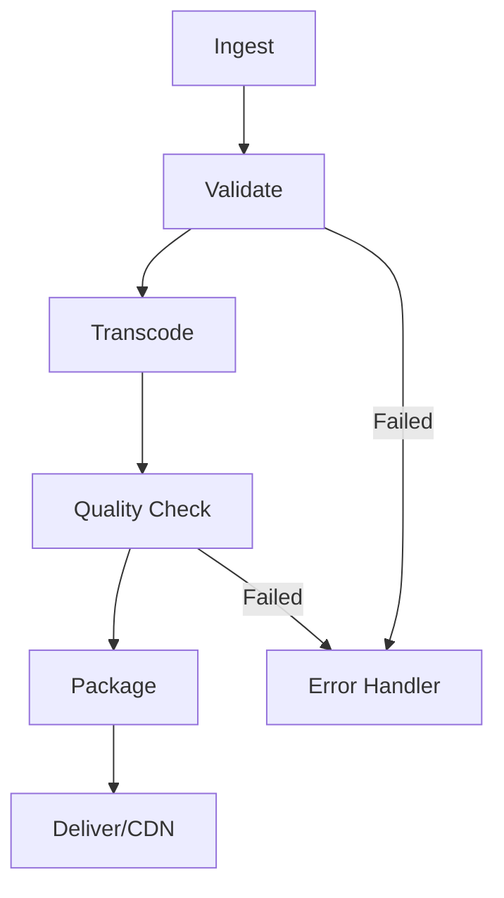

# 7.1 Production Workflows

## 🎯 Learning Objectives

By the end of this chapter, you will:
- Design scalable media processing pipelines
- Implement quality control processes
- Structure FFmpeg for enterprise use
- Plan for failure handling and recovery

---

## 🏗️ Pipeline Architecture



---

## 📥 Ingest Stage

### Validate Input Files

```bash
# Check if file is valid
if ffprobe -v error -select_streams v:0 -show_entries stream=codec_type \
   -of csv=p=0 input.mp4 | grep -q "video"; then
    echo "Valid video file"
else
    echo "Invalid video file"
    exit 1
fi
```

### Extract Technical Metadata

```bash
# Generate detailed report
ffprobe -v error \
  -show_format -show_streams \
  -of json input.mp4 > metadata.json
```

---

## 🔄 Transcoding Pipeline

### Multi-Output Encoding

```bash
# Create multiple renditions
ffmpeg -i input.mp4 \
  -map 0:v -map 0:a -s 1920x1080 -b:v 5000k -c:a aac -b:a 192k rendition_1080p.mp4 \
  -map 0:v -map 0:a -s 1280x720 -b:v 2500k -c:a aac -b:a 128k rendition_720p.mp4 \
  -map 0:v -map 0:a -s 854x480 -b:v 1000k -c:a aac -b:a 96k rendition_480p.mp4
```

### Template-Based Processing

```powershell
# PowerShell template
param(
    [string]$Input,
    [string]$OutputDir
)

$profiles = @(
    @{ name="1080p"; width=1920; height=1080; vbr="5000k"; abr="192k" },
    @{ name="720p"; width=1280; height=720; vbr="2500k"; abr="128k" },
    @{ name="480p"; width=854; height=480; vbr="1000k"; abr="96k" }
)

foreach ($p in $profiles) {
    $output = "$OutputDir/$($p.name).mp4"
    ffmpeg -i $Input -s "$($p.width)x$($p.height)" `
        -b:v $p.vbr -c:a aac -b:a $p.abr $output -y
}
```

---

## ✅ Quality Control

### Automated QC Checks

```bash
# Check output duration matches input
input_duration=$(ffprobe -v error -show_entries format=duration \
  -of default=noprint_wrappers=1:nokey=1 input.mp4)
output_duration=$(ffprobe -v error -show_entries format=duration \
  -of default=noprint_wrappers=1:nokey=1 output.mp4)

if [ "$input_duration" = "$output_duration" ]; then
    echo "Duration check: PASS"
else
    echo "Duration check: FAIL"
fi
```

### VMAF Quality Scoring

```bash
# Calculate VMAF score
ffmpeg -i reference.mp4 -i encoded.mp4 \
  -lavfi "libvmaf=model_path=vmaf_v0.6.1.json" \
  -f null -

# Output: VMAF score: 95.23
```

---

## 📦 Packaging and Delivery

### Generate Streaming Assets

```bash
# Create HLS + DASH package
ffmpeg -i input.mp4 \
  -c:v libx264 -c:a aac \
  -f hls -hls_time 6 -hls_playlist_type vod output.m3u8 \
  -f dash -seg_duration 4 output.mpd
```

---

## ✅ Best Practices

> [!TIP]
> **Log Everything**: Keep detailed logs for debugging and auditing.

> [!IMPORTANT]
> **Validate Outputs**: Always verify output files meet quality standards.

---

## 📝 Summary

| Stage | Key Tasks |
|-------|-----------|
| Ingest | Validate, extract metadata |
| Transcode | Multi-rendition encoding |
| QC | Duration, quality checks |
| Package | HLS/DASH generation |
| Deliver | CDN upload |

---

## ➡️ Next Steps

Proceed to [7.2 Scripting & CI/CD](../7.2-scripting-cicd/) for automation integration.
