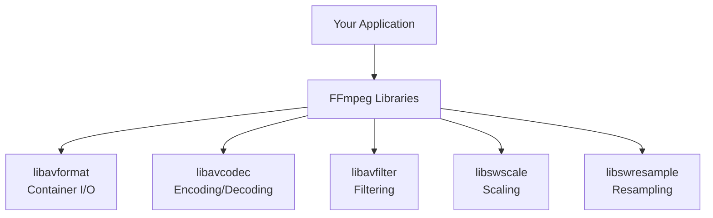

# 7.3 Library Integration (libav*)

## 🎯 Learning Objectives

By the end of this chapter, you will:
- Understand FFmpeg's library architecture
- Use FFmpeg with Python (ffmpeg-python)
- Integrate FFmpeg in applications
- Choose between CLI and library approaches

---

## 📚 FFmpeg Libraries



---

## 🐍 Python Integration

### Using ffmpeg-python

```bash
pip install ffmpeg-python
```

```python
import ffmpeg

# Simple conversion
ffmpeg.input('input.mp4').output('output.avi').run()

# With options
(
    ffmpeg
    .input('input.mp4')
    .output('output.mp4', vcodec='libx264', crf=23)
    .run()
)

# Complex filter
(
    ffmpeg
    .input('input.mp4')
    .filter('scale', 1280, 720)
    .filter('eq', brightness=0.1)
    .output('output.mp4')
    .run()
)
```

### Get Video Info

```python
import ffmpeg

probe = ffmpeg.probe('input.mp4')
video_info = next(s for s in probe['streams'] if s['codec_type'] == 'video')

print(f"Resolution: {video_info['width']}x{video_info['height']}")
print(f"Duration: {probe['format']['duration']}")
```

---

## 🔧 Node.js Integration

### Using fluent-ffmpeg

```bash
npm install fluent-ffmpeg
```

```javascript
const ffmpeg = require('fluent-ffmpeg');

// Simple conversion
ffmpeg('input.mp4')
  .output('output.avi')
  .on('end', () => console.log('Done!'))
  .run();

// With options
ffmpeg('input.mp4')
  .videoCodec('libx264')
  .size('1280x720')
  .output('output.mp4')
  .on('progress', (progress) => {
    console.log(`Progress: ${progress.percent}%`);
  })
  .run();
```

---

## ⚡ When to Use Each Approach

| Approach | Use When |
|----------|----------|
| CLI (command line) | Scripts, batch processing, simple tasks |
| Wrapper libraries | Application integration, progress tracking |
| Direct libav* | Maximum control, custom applications |

---

## ✅ Best Practices

> [!TIP]
> **Start with Wrappers**: ffmpeg-python and fluent-ffmpeg are easier than direct library use.

> [!IMPORTANT]
> **Handle Errors**: Always implement error handling for encoding failures.

---

## 📝 Summary

| Language | Library |
|----------|---------|
| Python | `ffmpeg-python` |
| Node.js | `fluent-ffmpeg` |
| Go | `goav` |
| C/C++ | Direct libav* |

---

## ➡️ Next Steps

Proceed to [7.4 Builds & Licensing](../7.4-builds-licensing/) for the final chapter.
