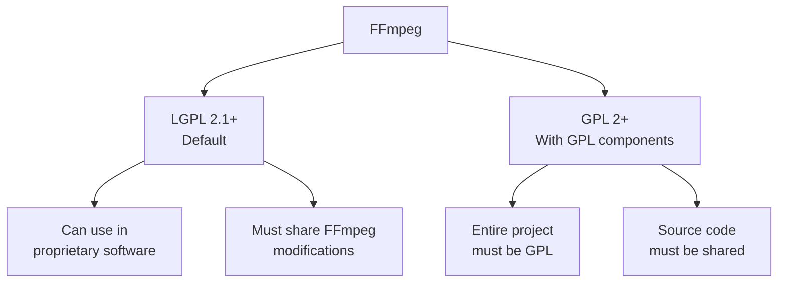

# 7.4 Custom Builds and Licensing

## 🎯 Learning Objectives

By the end of this chapter, you will:
- Understand FFmpeg licensing (GPL, LGPL)
- Know when different licenses apply
- Build custom FFmpeg configurations
- Make informed licensing decisions

---

## ⚖️ FFmpeg Licensing



### License Triggers

| Component | License | Impact |
|-----------|---------|--------|
| Core FFmpeg | LGPL | Permissive |
| x264 | GPL | Triggers GPL |
| x265 | GPL | Triggers GPL |
| libfdk-aac | Non-free | Special restriction |

---

## 🔨 Building FFmpeg

### Check Current Build

```bash
ffmpeg -buildconf
```

### Basic Compilation (Linux)

```bash
# Clone source
git clone https://git.ffmpeg.org/ffmpeg.git
cd ffmpeg

# Configure (LGPL only)
./configure --enable-shared --disable-gpl

# Configure with GPL components
./configure --enable-gpl --enable-libx264 --enable-libx265

# Build
make -j$(nproc)
sudo make install
```

### Common Configure Options

| Option | Effect |
|--------|--------|
| `--enable-gpl` | Enable GPL components |
| `--enable-nonfree` | Enable non-free components |
| `--enable-libx264` | H.264 encoder |
| `--enable-libx265` | H.265 encoder |
| `--disable-encoders` | No encoders |
| `--enable-small` | Smaller binary |

---

## 📋 Commercial Use Guidelines

### LGPL Build (Safe for Commercial)

```bash
./configure \
  --disable-gpl \
  --disable-nonfree \
  --enable-shared
```

### GPL Build (Open Source Only)

```bash
./configure \
  --enable-gpl \
  --enable-libx264 \
  --enable-libx265
```

---

## ✅ Best Practices

> [!WARNING]
> **Consult Legal**: For commercial use, always get legal advice on licensing.

> [!IMPORTANT]
> **Check Your Build**: Use `ffmpeg -buildconf` to see what's included.

---

## 📝 Summary

| License | Commercial Use | Requirements |
|---------|----------------|--------------|
| LGPL | ✅ Yes | Share FFmpeg changes |
| GPL | ⚠️ With restrictions | Open source entire project |
| Non-free | ❌ Varies | May prohibit redistribution |

---

## 🎉 Congratulations!

You have completed the FFmpeg Learning Curriculum!

### What You've Learned

- **Module 1**: FFmpeg fundamentals
- **Module 2**: Basic operations
- **Module 3**: Intermediate techniques
- **Module 4**: Advanced processing
- **Module 5**: Streaming
- **Module 6**: Optimization
- **Module 7**: Professional applications

### Next Steps

- Practice with real projects
- Explore the [official FFmpeg documentation](https://ffmpeg.org/documentation.html)
- Join the FFmpeg community
- Contribute to open-source media projects

**Happy encoding!** 🎬
