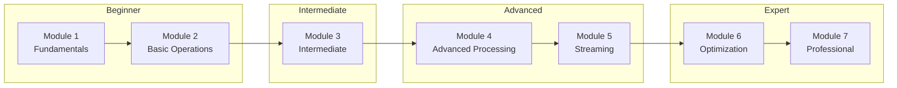

# FFmpeg Learning Curriculum

A comprehensive FFmpeg learning path from beginner to advanced, covering multimedia processing, streaming, optimization, and professional workflows.

## 📚 Curriculum Overview

| Module | Title | Chapters | Level |
|--------|-------|----------|-------|
| 1 | [Fundamentals](./1-fundamentals/) | 5 | 🟢 Beginner |
| 2 | [Basic Operations](./2-basic-operations/) | 5 | 🟢 Beginner |
| 3 | [Intermediate Techniques](./3-intermediate/) | 6 | 🟡 Intermediate |
| 4 | [Advanced Processing](./4-advanced-processing/) | 5 | 🟠 Advanced |
| 5 | [Streaming & Distribution](./5-streaming/) | 4 | 🟠 Advanced |
| 6 | [Performance & Optimization](./6-optimization/) | 4 | 🔴 Expert |
| 7 | [Professional Applications](./7-professional/) | 4 | 🔴 Expert |

---

## 🎯 Learning Path

---

## 📖 Module Details

### Module 1: FFmpeg Fundamentals
- [1.1 Introduction to FFmpeg](./1-fundamentals/1.1-introduction/)
- [1.2 Installation and Setup](./1-fundamentals/1.2-installation/)
- [1.3 Core Multimedia Concepts](./1-fundamentals/1.3-multimedia-concepts/)
- [1.4 Command Line Basics](./1-fundamentals/1.4-command-line-basics/)
- [1.5 Using ffprobe and ffplay](./1-fundamentals/1.5-ffprobe-ffplay/)

### Module 2: Basic Operations
- [2.1 Format Conversion](./2-basic-operations/2.1-format-conversion/)
- [2.2 Audio Extraction and Merging](./2-basic-operations/2.2-audio-extraction/)
- [2.3 Trimming and Cutting](./2-basic-operations/2.3-trimming-cutting/)
- [2.4 Resizing and Scaling](./2-basic-operations/2.4-resizing-scaling/)
- [2.5 Basic Compression](./2-basic-operations/2.5-compression/)

### Module 3: Intermediate Techniques
- [3.1 FFmpeg Architecture Deep Dive](./3-intermediate/3.1-architecture/)
- [3.2 Transcoding vs Remuxing](./3-intermediate/3.2-transcoding-remuxing/)
- [3.3 Advanced Encoding Options](./3-intermediate/3.3-encoding-options/)
- [3.4 Filter Graphs Introduction](./3-intermediate/3.4-filter-graphs/)
- [3.5 Video Filters](./3-intermediate/3.5-video-filters/)
- [3.6 Audio Filters](./3-intermediate/3.6-audio-filters/)

### Module 4: Advanced Media Processing
- [4.1 Concatenation Techniques](./4-advanced-processing/4.1-concatenation/)
- [4.2 Subtitles and Metadata](./4-advanced-processing/4.2-subtitles-metadata/)
- [4.3 Synchronization and Timestamps](./4-advanced-processing/4.3-synchronization/)
- [4.4 Complex Filtergraphs](./4-advanced-processing/4.4-complex-filtergraphs/)
- [4.5 Batch Processing and Automation](./4-advanced-processing/4.5-batch-automation/)

### Module 5: Streaming and Distribution
- [5.1 Streaming Protocols Overview](./5-streaming/5.1-protocols/)
- [5.2 HLS and DASH Streaming](./5-streaming/5.2-hls-dash/)
- [5.3 Live Streaming](./5-streaming/5.3-live-streaming/)
- [5.4 Progressive Download](./5-streaming/5.4-progressive-download/)

### Module 6: Performance and Optimization
- [6.1 Hardware Acceleration](./6-optimization/6.1-hardware-acceleration/)
- [6.2 Advanced Codec Optimization](./6-optimization/6.2-codec-optimization/)
- [6.3 Performance Tuning](./6-optimization/6.3-performance-tuning/)
- [6.4 Troubleshooting Guide](./6-optimization/6.4-troubleshooting/)

### Module 7: Professional Applications
- [7.1 Production Workflows](./7-professional/7.1-production-workflows/)
- [7.2 Scripting and CI/CD Integration](./7-professional/7.2-scripting-cicd/)
- [7.3 Library Integration (libav*)](./7-professional/7.3-library-integration/)
- [7.4 Custom Builds and Licensing](./7-professional/7.4-builds-licensing/)

---

## 🛠️ Prerequisites

- Basic command line knowledge
- A computer with FFmpeg installed (covered in Module 1)
- Sample media files for practice

## 📋 How to Use This Curriculum

1. **Start from Module 1** if you're new to FFmpeg
2. **Each chapter** contains:
   - Concept explanations
   - Diagrams for visual learning
   - Practical code examples
   - Best practices
   - Exercises
3. **Practice** with the provided commands on your own media files
4. **Progress sequentially** for the best learning experience

---

## 🔗 Quick Reference

| Tool | Purpose |
|------|---------|
| `ffmpeg` | Main tool for transcoding and processing |
| `ffprobe` | Analyze media files and extract information |
| `ffplay` | Simple media player for quick previews |

---

## 📄 License

This learning material is provided for educational purposes.
